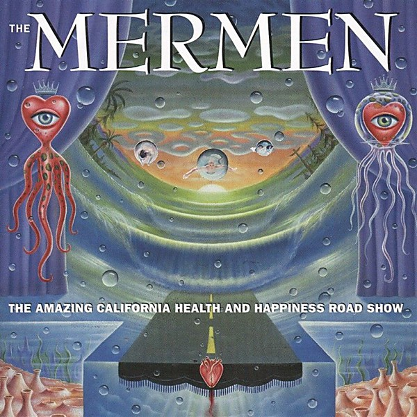

# The Amazing California Health and Happiness Road Show

By **The Mermen**

## Album Data

- **Catalog:** Beets
- **Format:** Digital, Album
- **Album:** The Amazing California Health and Happiness Road Show
- **Artist:** The Mermen
- **Albumartist:** The Mermen
- **Genre:** Surf Rock
- **MusicBrainz Album Artist ID:** [30ca33c0-a703-425a-8d96-599e38732409](https://musicbrainz.org/artist/30ca33c0-a703-425a-8d96-599e38732409)
- **MusicBrainz Album ID:** [22d3fdaf-dcaf-4b6c-a824-da6fd0d4edbe](https://musicbrainz.org/release/22d3fdaf-dcaf-4b6c-a824-da6fd0d4edbe)
- **MusicBrainz Release Group ID:** [4b4d9c12-251c-3607-be0c-094874080f4f](https://musicbrainz.org/release-group/4b4d9c12-251c-3607-be0c-094874080f4f)
- **Year:** 2000
- **Catalog #:** 
- **Label:** V2
- **Total Tracks:** 14

## Album Tracks

### Track 01 - Unto the Resplendent

- **Artist:** The Mermen
- **Format:** ALAC
- **Genre:** Surf Rock
- **Length:** 5:42
- **MusicBrainz Track ID:** [67cd8536-defe-4d0e-b45f-c8f165922e43](https://musicbrainz.org/recording/67cd8536-defe-4d0e-b45f-c8f165922e43)
- **Title:** Unto the Resplendent
- **Track:** 01
- **Year:** 2000

### Track 02 - White Trash Raga

- **Artist:** The Mermen
- **Format:** ALAC
- **Genre:** Surf Rock
- **Length:** 5:21
- **MusicBrainz Track ID:** [e73e50ef-10a5-44a9-b42c-7c64466cc1dd](https://musicbrainz.org/recording/e73e50ef-10a5-44a9-b42c-7c64466cc1dd)
- **Title:** White Trash Raga
- **Track:** 02
- **Year:** 2000

### Track 03 - Merry Go Round

- **Artist:** The Mermen
- **Format:** ALAC
- **Genre:** Surf Rock
- **Length:** 4:42
- **MusicBrainz Track ID:** [ab739bfb-4e18-40b1-bcb6-656854071e1d](https://musicbrainz.org/recording/ab739bfb-4e18-40b1-bcb6-656854071e1d)
- **Title:** Merry Go Round
- **Track:** 03
- **Year:** 2000

### Track 04 - Miki's Lush Beehive

- **Artist:** The Mermen
- **Format:** ALAC
- **Genre:** Surf Rock
- **Length:** 4:38
- **MusicBrainz Track ID:** [f5030e47-2391-4111-a5b7-de4dada405e5](https://musicbrainz.org/recording/f5030e47-2391-4111-a5b7-de4dada405e5)
- **Title:** Miki's Lush Beehive
- **Track:** 04
- **Year:** 2000

### Track 05 - Sway

- **Artist:** The Mermen
- **Format:** ALAC
- **Genre:** Surf Rock
- **Length:** 4:45
- **MusicBrainz Track ID:** [0c284abd-38b6-4255-ab75-293d31c98427](https://musicbrainz.org/recording/0c284abd-38b6-4255-ab75-293d31c98427)
- **Title:** Sway
- **Track:** 05
- **Year:** 2000

### Track 06 - Walking the Peach

- **Artist:** The Mermen
- **Format:** ALAC
- **Genre:** Surf Rock
- **Length:** 4:22
- **MusicBrainz Track ID:** [9c0de71c-be68-4f76-9121-deecf6d88c27](https://musicbrainz.org/recording/9c0de71c-be68-4f76-9121-deecf6d88c27)
- **Title:** Walking the Peach
- **Track:** 06
- **Year:** 2000

### Track 07 - Emmylou Rides Clarence West and Then South

- **Artist:** The Mermen
- **Format:** ALAC
- **Genre:** Surf Rock
- **Length:** 5:32
- **MusicBrainz Track ID:** [9273421a-3a49-4e6d-a4e9-b9647f800f34](https://musicbrainz.org/recording/9273421a-3a49-4e6d-a4e9-b9647f800f34)
- **Title:** Emmylou Rides Clarence West and Then South
- **Track:** 07
- **Year:** 2000

### Track 08 - To Be Naked and French Is Always Hard

- **Artist:** The Mermen
- **Format:** ALAC
- **Genre:** Surf Rock
- **Length:** 4:48
- **MusicBrainz Track ID:** [c82f154c-0715-4383-bab6-aa8c575a2fcd](https://musicbrainz.org/recording/c82f154c-0715-4383-bab6-aa8c575a2fcd)
- **Title:** To Be Naked and French Is Always Hard
- **Track:** 08
- **Year:** 2000

### Track 09 - Bare White

- **Artist:** The Mermen
- **Format:** ALAC
- **Genre:** Surf Rock
- **Length:** 3:50
- **MusicBrainz Track ID:** [85a3fd1d-460a-45a7-a3fc-62c198f4c3c2](https://musicbrainz.org/recording/85a3fd1d-460a-45a7-a3fc-62c198f4c3c2)
- **Title:** Bare White
- **Track:** 09
- **Year:** 2000

### Track 10 - Little Stinky Kitty

- **Artist:** The Mermen
- **Format:** ALAC
- **Genre:** Surf Rock
- **Length:** 3:51
- **MusicBrainz Track ID:** [b8dacc04-30b0-40d9-ad39-0f09d72aa7ce](https://musicbrainz.org/recording/b8dacc04-30b0-40d9-ad39-0f09d72aa7ce)
- **Title:** Little Stinky Kitty
- **Track:** 10
- **Year:** 2000

### Track 11 - Sponge Cookie

- **Artist:** The Mermen
- **Format:** ALAC
- **Genre:** Surf Rock
- **Length:** 6:09
- **MusicBrainz Track ID:** [8523bdaa-d1c0-40ab-8025-3fc9b415579f](https://musicbrainz.org/recording/8523bdaa-d1c0-40ab-8025-3fc9b415579f)
- **Title:** Sponge Cookie
- **Track:** 11
- **Year:** 2000

### Track 12 - Heart Beatitude

- **Artist:** The Mermen
- **Format:** ALAC
- **Genre:** Surf Rock
- **Length:** 3:39
- **MusicBrainz Track ID:** [6784419e-22d0-4a83-93b9-6b4b231db315](https://musicbrainz.org/recording/6784419e-22d0-4a83-93b9-6b4b231db315)
- **Title:** Heart Beatitude
- **Track:** 12
- **Year:** 2000

### Track 13 - Burn Intro

- **Artist:** The Mermen
- **Format:** ALAC
- **Genre:** Surf Rock
- **Length:** 3:03
- **MusicBrainz Track ID:** [4707db0c-a932-4555-9772-245a13b82d19](https://musicbrainz.org/recording/4707db0c-a932-4555-9772-245a13b82d19)
- **Title:** Burn Intro
- **Track:** 13
- **Year:** 2000

### Track 14 - Burn

- **Artist:** The Mermen
- **Format:** ALAC
- **Genre:** Surf Rock
- **Length:** 13:43
- **MusicBrainz Track ID:** [aec90026-0aa3-4d52-a2e6-71f3eeaaf229](https://musicbrainz.org/recording/aec90026-0aa3-4d52-a2e6-71f3eeaaf229)
- **Title:** Burn
- **Track:** 14
- **Year:** 2000

