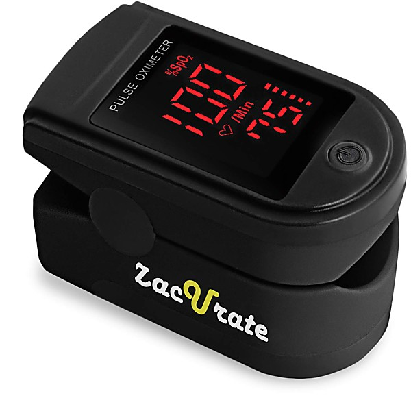

# The Meters 6-21-75 The Boarding House

By **The Meters**

## Album Data

- **Catalog:** Beets
- **Format:** Digital, Album
- **Album:** The Meters 6-21-75 The Boarding House
- **Artist:** The Meters
- **Albumartist:** The Meters
- **Genre:** Soul
- **MusicBrainz Album Artist ID:** 
- **MusicBrainz Album ID:** 
- **MusicBrainz Release Group ID:** 
- **Year:** 1975
- **Catalog #:** 
- **Label:** 
- **Total Tracks:** 10

## Album Tracks

### Track 02 - Love The One You're With

- **Artist:** The Meters
- **Format:** MP3
- **Genre:** Soul
- **Length:** 4:10
- **MusicBrainz Track ID:** 
- **Title:** Love The One You're With
- **Track:** 02
- **Year:** 1975

### Track 03 - Africa

- **Artist:** The Meters
- **Format:** MP3
- **Genre:** Soul
- **Length:** 4:39
- **MusicBrainz Track ID:** 
- **Title:** Africa
- **Track:** 03
- **Year:** 1975

### Track 04 - Talkin' 'Bout New Orleans

- **Artist:** The Meters
- **Format:** MP3
- **Genre:** Soul
- **Length:** 3:59
- **MusicBrainz Track ID:** 
- **Title:** Talkin' 'Bout New Orleans
- **Track:** 04
- **Year:** 1975

### Track 05 - People Get Ready

- **Artist:** The Meters
- **Format:** MP3
- **Genre:** Soul
- **Length:** 4:25
- **MusicBrainz Track ID:** 
- **Title:** People Get Ready
- **Track:** 05
- **Year:** 1975

### Track 06 - People Say

- **Artist:** The Meters
- **Format:** MP3
- **Genre:** Soul
- **Length:** 6:11
- **MusicBrainz Track ID:** 
- **Title:** People Say
- **Track:** 06
- **Year:** 1975

### Track 07 - Ain't No Use

- **Artist:** The Meters
- **Format:** MP3
- **Genre:** Soul
- **Length:** 11:39
- **MusicBrainz Track ID:** 
- **Title:** Ain't No Use
- **Track:** 07
- **Year:** 1975

### Track 08 - Cissy Strut

- **Artist:** The Meters
- **Format:** MP3
- **Genre:** Soul
- **Length:** 2:37
- **MusicBrainz Track ID:** 
- **Title:** Cissy Strut
- **Track:** 08
- **Year:** 1975

### Track 10 - Chug Chug Chug-A-Lug

- **Artist:** The Meters
- **Format:** MP3
- **Genre:** Soul
- **Length:** 5:56
- **MusicBrainz Track ID:** 
- **Title:** Chug Chug Chug-A-Lug
- **Track:** 10
- **Year:** 1975

### Track 01 - Fire On The Bayou

- **Artist:** The Meters
- **Format:** MP3
- **Genre:** Soul
- **Length:** 5:53
- **MusicBrainz Track ID:** 
- **Title:** Fire On The Bayou
- **Track:** 01
- **Year:** 1975

## See also

- [Roon: Fire on the Bayou](../../Roon/The_Meters/Fire_on_the_Bayou.md)
- [Roon: Look-Ka Py Py](../../Roon/The_Meters/Look-Ka_Py_Py.md)
- [Roon: Rejuvenation](../../Roon/The_Meters/Rejuvenation.md)
- [Roon: The Meters](../../Roon/The_Meters/The_Meters.md)
