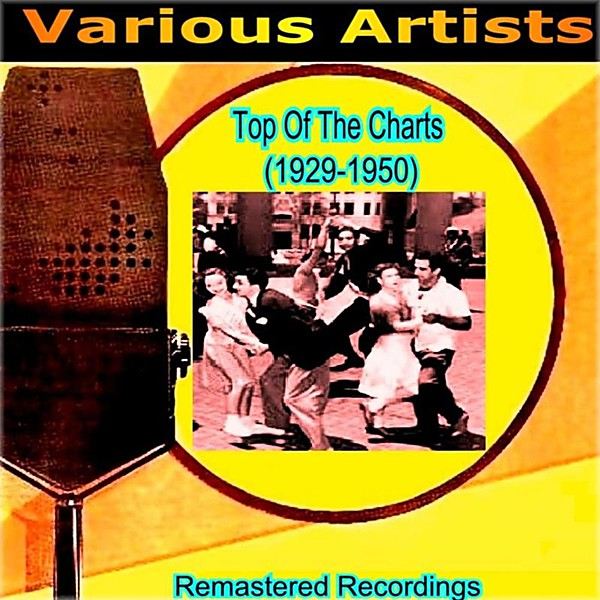

# 1950

By **The Mills Brothers**

## Album Data

- **Catalog:** Beets
- **Format:** Digital, Album
- **Album:** 1950
- **Artist:** The Mills Brothers
- **Albumartist:** The Mills Brothers
- **Genre:** Vocal Jazz
- **MusicBrainz Album Artist ID:** 
- **MusicBrainz Album ID:** 
- **MusicBrainz Release Group ID:** 
- **Year:** 1950
- **Catalog #:** 
- **Label:** 
- **Total Tracks:** 00

## Album Tracks

### Track 00 - Nevertheless (1950)

- **Artist:** The Mills Brothers
- **Format:** ALAC
- **Genre:** Vocal Jazz
- **Length:** 2:49
- **MusicBrainz Track ID:** 
- **Title:** Nevertheless (1950)
- **Track:** 00
- **Year:** 1950

## See also

- [Vinyl: I Had To Call You Up To Say I'm Sorry](../../Vinyl/The_Mills_Brothers/I_Had_To_Call_You_Up_To_Say_Im_Sorry.md)
- [Vinyl: ](../../Vinyl/The_Mills_Brothers/The_Mills_Brothers.md)
