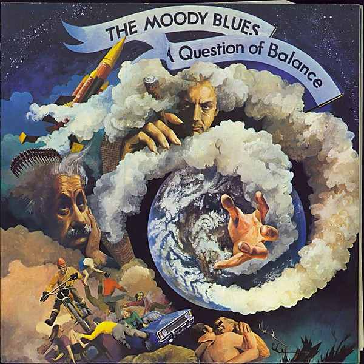

# A Question of Balance

By **The Moody Blues**

## Album Data

- **Catalog:** Beets
- **Format:** Digital, Album
- **Album:** A Question of Balance
- **Artist:** The Moody Blues
- **Albumartist:** The Moody Blues
- **Genre:** Psychedelic Rock
- **MusicBrainz Album Artist ID:** [774666d2-2064-4d6c-856c-f8cda0aaf9f0](https://musicbrainz.org/artist/774666d2-2064-4d6c-856c-f8cda0aaf9f0)
- **MusicBrainz Album ID:** [a680eff1-6475-4120-8af7-1ad74467103b](https://musicbrainz.org/release/a680eff1-6475-4120-8af7-1ad74467103b)
- **MusicBrainz Release Group ID:** [0966cda2-dc93-3cb8-b67d-2db9ebbc60ef](https://musicbrainz.org/release-group/0966cda2-dc93-3cb8-b67d-2db9ebbc60ef)
- **Year:** 2008
- **Catalog #:** B0011207-02
- **Label:** Threshold Records
- **Total Tracks:** 11

## Album Tracks

### Track 01 - Procession

- **Artist:** The Moody Blues
- **Format:** ALAC
- **Genre:** Progressive Rock
- **Length:** 4:40
- **MusicBrainz Track ID:** [2faffc72-76de-495d-9f22-c51ac9b24f2e](https://musicbrainz.org/recording/2faffc72-76de-495d-9f22-c51ac9b24f2e)
- **Title:** Procession
- **Track:** 01
- **Year:** 2008

### Track 02 - The Story in Your Eyes

- **Artist:** The Moody Blues
- **Format:** ALAC
- **Genre:** Progressive Rock
- **Length:** 2:56
- **MusicBrainz Track ID:** [00a34e20-61b3-4951-a116-c44a61c36f13](https://musicbrainz.org/recording/00a34e20-61b3-4951-a116-c44a61c36f13)
- **Title:** The Story in Your Eyes
- **Track:** 02
- **Year:** 2008

### Track 03 - Our Guessing Game

- **Artist:** The Moody Blues
- **Format:** ALAC
- **Genre:** Progressive Rock
- **Length:** 3:34
- **MusicBrainz Track ID:** [62ac2c52-7df1-499c-a3c1-cf9cc85ac47f](https://musicbrainz.org/recording/62ac2c52-7df1-499c-a3c1-cf9cc85ac47f)
- **Title:** Our Guessing Game
- **Track:** 03
- **Year:** 2008

### Track 04 - Emily’s Song

- **Artist:** The Moody Blues
- **Format:** ALAC
- **Genre:** Soft Rock
- **Length:** 3:42
- **MusicBrainz Track ID:** [972185dd-2e16-4a42-b797-b5bfe06e7ba9](https://musicbrainz.org/recording/972185dd-2e16-4a42-b797-b5bfe06e7ba9)
- **Title:** Emily’s Song
- **Track:** 04
- **Year:** 2008

### Track 05 - After You Came

- **Artist:** The Moody Blues
- **Format:** ALAC
- **Genre:** Progressive Rock
- **Length:** 4:38
- **MusicBrainz Track ID:** [537dab4f-a75c-4650-a405-71a30e15607c](https://musicbrainz.org/recording/537dab4f-a75c-4650-a405-71a30e15607c)
- **Title:** After You Came
- **Track:** 05
- **Year:** 2008

### Track 06 - One More Time to Live

- **Artist:** The Moody Blues
- **Format:** ALAC
- **Genre:** Progressive Rock
- **Length:** 5:41
- **MusicBrainz Track ID:** [0d780692-e653-4c06-b8ce-1edefc4f8419](https://musicbrainz.org/recording/0d780692-e653-4c06-b8ce-1edefc4f8419)
- **Title:** One More Time to Live
- **Track:** 06
- **Year:** 2008

### Track 07 - Nice to Be Here

- **Artist:** The Moody Blues
- **Format:** ALAC
- **Genre:** Progressive Rock
- **Length:** 4:23
- **MusicBrainz Track ID:** [daff405a-a41a-43c0-8646-e84f425e9294](https://musicbrainz.org/recording/daff405a-a41a-43c0-8646-e84f425e9294)
- **Title:** Nice to Be Here
- **Track:** 07
- **Year:** 2008

### Track 08 - You Can Never Go Home

- **Artist:** The Moody Blues
- **Format:** ALAC
- **Genre:** Progressive Rock
- **Length:** 4:14
- **MusicBrainz Track ID:** [8ae2d2cd-6a1f-442a-820f-baa4b87702af](https://musicbrainz.org/recording/8ae2d2cd-6a1f-442a-820f-baa4b87702af)
- **Title:** You Can Never Go Home
- **Track:** 08
- **Year:** 2008

### Track 09 - My Song

- **Artist:** The Moody Blues
- **Format:** ALAC
- **Genre:** Progressive Rock
- **Length:** 6:24
- **MusicBrainz Track ID:** [001144bc-5c33-4de0-85eb-0990ffc638e6](https://musicbrainz.org/recording/001144bc-5c33-4de0-85eb-0990ffc638e6)
- **Title:** My Song
- **Track:** 09
- **Year:** 2008

### Track 10 - The Story in Your Eyes (original version)

- **Artist:** The Moody Blues
- **Format:** ALAC
- **Genre:** Soft Rock
- **Length:** 3:33
- **MusicBrainz Track ID:** [52d791f3-732d-4e62-ae8f-0e2c55b1a824](https://musicbrainz.org/recording/52d791f3-732d-4e62-ae8f-0e2c55b1a824)
- **Title:** The Story in Your Eyes (original version)
- **Track:** 10
- **Year:** 2008

### Track 11 - The Dreamer

- **Artist:** The Moody Blues
- **Format:** ALAC
- **Genre:** Soft Rock
- **Length:** 3:42
- **MusicBrainz Track ID:** [8837e51d-5d28-4fe0-8ab9-3bda7dbe53f9](https://musicbrainz.org/recording/8837e51d-5d28-4fe0-8ab9-3bda7dbe53f9)
- **Title:** The Dreamer
- **Track:** 11
- **Year:** 2008

## See also

- [Days Of Future Passed](Days_Of_Future_Passed.md)
- [Every Good Boy Deserves Favour](Every_Good_Boy_Deserves_Favour.md)
- [In Search of the Lost Chord](In_Search_of_the_Lost_Chord.md)
- [In Search Of The Lost Chord](In_Search_Of_The_Lost_Chord.md)
- [Long Distance Voyager](Long_Distance_Voyager.md)
- [Lovely to See You Disc 2](Lovely_to_See_You_Disc_2.md)
- [On the Threshold of a Dream](On_the_Threshold_of_a_Dream.md)
- [Seventh Sojourn](Seventh_Sojourn.md)
- [Time Traveller Disc 1](Time_Traveller_Disc_1.md)
- [Time Traveller Disc 2](Time_Traveller_Disc_2.md)
- [Time Traveller Disc 3](Time_Traveller_Disc_3.md)
- [Time Traveller Disc 4](Time_Traveller_Disc_4.md)
- [To Our Children's Children's Children](To_Our_Childrens_Childrens_Children.md)
- [Unknown Album (7/19/2005 9](Unknown_Album_7-19-2005_9.md)
- [CD: A Question Of Balance](../../CD/The_Moody_Blues/A_Question_Of_Balance.md)
- [CD: Days Of Future Passed](../../CD/The_Moody_Blues/Days_Of_Future_Passed.md)
- [CD: Every Good Boy Deserves Favour](../../CD/The_Moody_Blues/Every_Good_Boy_Deserves_Favour.md)
- [CD: In Search Of The Lost Chord](../../CD/The_Moody_Blues/In_Search_Of_The_Lost_Chord.md)
- [CD: Long Distance Voyager](../../CD/The_Moody_Blues/Long_Distance_Voyager.md)
- [CD: On The Threshold Of A Dream](../../CD/The_Moody_Blues/On_The_Threshold_Of_A_Dream.md)
- [CD: ](../../CD/The_Moody_Blues/The_Moody_Blues.md)
- [CD: Time Traveller (Disc 1)](../../CD/The_Moody_Blues/Time_Traveller_Disc_1.md)
- [CD: Time Traveller (Disc 2)](../../CD/The_Moody_Blues/Time_Traveller_Disc_2.md)
- [CD: Time Traveller (Disc 3)](../../CD/The_Moody_Blues/Time_Traveller_Disc_3.md)
- [CD: Time Traveller (Disc 4)](../../CD/The_Moody_Blues/Time_Traveller_Disc_4.md)
- [CD: To Our Children's Children's Children](../../CD/The_Moody_Blues/To_Our_Childrens_Childrens_Children.md)
- [Roon: A Question Of Balance](../../Roon/The_Moody_Blues/A_Question_Of_Balance.md)
- [Roon: Days Of Future Passed (Deluxe Version)](../../Roon/The_Moody_Blues/Days_Of_Future_Passed_Deluxe_Version.md)
- [Roon: Every Good Boy Deserves Favour](../../Roon/The_Moody_Blues/Every_Good_Boy_Deserves_Favour.md)
- [Roon: In Search Of The Lost Chord (50th Anniversary Deluxe Edition) (50th Anniversary Edition / Deluxe)](../../Roon/The_Moody_Blues/In_Search_Of_The_Lost_Chord_50th_Anniversary_Deluxe_Edition_50th_Anniversary_Edition_-_Deluxe.md)
- [Roon: Long Distance Voyager (Expanded)](../../Roon/The_Moody_Blues/Long_Distance_Voyager_Expanded.md)
- [Roon: On The Threshold Of A Dream](../../Roon/The_Moody_Blues/On_The_Threshold_Of_A_Dream.md)
- [Roon: Seventh Sojourn](../../Roon/The_Moody_Blues/Seventh_Sojourn.md)
- [Roon: The Other Side Of Life](../../Roon/The_Moody_Blues/The_Other_Side_Of_Life.md)
- [Roon: The Present](../../Roon/The_Moody_Blues/The_Present.md)
- [Roon: This Is The Moody Blues](../../Roon/The_Moody_Blues/This_Is_The_Moody_Blues.md)
- [Roon: To Our Children's Children's Children](../../Roon/The_Moody_Blues/To_Our_Childrens_Childrens_Children.md)
- [Vinyl: A Question Of Balance](../../Vinyl/The_Moody_Blues/A_Question_Of_Balance.md)
- [Vinyl: In Search Of The Lost Chord](../../Vinyl/The_Moody_Blues/In_Search_Of_The_Lost_Chord.md)
- [Vinyl: On The Threshold Of A Dream](../../Vinyl/The_Moody_Blues/On_The_Threshold_Of_A_Dream.md)
- [Vinyl: Seventh Sojourn](../../Vinyl/The_Moody_Blues/Seventh_Sojourn.md)
- [Vinyl: ](../../Vinyl/The_Moody_Blues/The_Moody_Blues.md)
