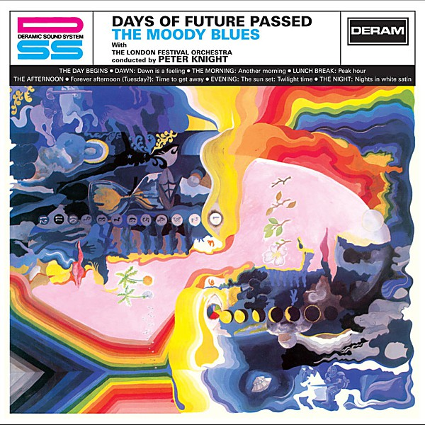

# Days Of Future Passed

By **The Moody Blues**

## Album Data

- **Catalog:** Beets
- **Format:** Digital, Album
- **Album:** Days Of Future Passed
- **Artist:** The Moody Blues
- **Albumartist:** The Moody Blues
- **Genre:** Psychedelic Rock
- **MusicBrainz Album Artist ID:** 
- **MusicBrainz Album ID:** 
- **MusicBrainz Release Group ID:** 
- **Year:** 1967
- **Catalog #:** 
- **Label:** 
- **Total Tracks:** 00

## Album Tracks

### Track 01 - Departure

- **Artist:** The Moody Blues
- **Format:** AAC
- **Genre:** Psychedelic Rock
- **Length:** 0:48
- **MusicBrainz Track ID:** 
- **Title:** Departure
- **Track:** 01
- **Year:** 0000

### Track 01 - Departure

- **Artist:** The Moody Blues
- **Format:** ALAC
- **Genre:** Psychedelic Rock
- **Length:** 0:45
- **MusicBrainz Track ID:** 
- **Title:** Departure
- **Track:** 01
- **Year:** 0000

### Track 02 - Ride My See-Saw

- **Artist:** The Moody Blues
- **Format:** AAC
- **Genre:** Psychedelic Rock
- **Length:** 3:44
- **MusicBrainz Track ID:** 
- **Title:** Ride My See-Saw
- **Track:** 02
- **Year:** 0000

### Track 02 - Ride My See-Saw

- **Artist:** The Moody Blues
- **Format:** ALAC
- **Genre:** Psychedelic Rock
- **Length:** 3:39
- **MusicBrainz Track ID:** 
- **Title:** Ride My See-Saw
- **Track:** 02
- **Year:** 0000

### Track 03 - Dr. Livingstone, I Presume

- **Artist:** The Moody Blues
- **Format:** AAC
- **Genre:** Soft Rock
- **Length:** 2:59
- **MusicBrainz Track ID:** 
- **Title:** Dr. Livingstone, I Presume
- **Track:** 03
- **Year:** 0000

### Track 03 - Dr. Livingstone, I Presume

- **Artist:** The Moody Blues
- **Format:** ALAC
- **Genre:** Soft Rock
- **Length:** 2:58
- **MusicBrainz Track ID:** 
- **Title:** Dr. Livingstone, I Presume
- **Track:** 03
- **Year:** 0000

### Track 04 - House Of Four Doors

- **Artist:** The Moody Blues
- **Format:** AAC
- **Genre:** Psychedelic Rock
- **Length:** 4:18
- **MusicBrainz Track ID:** 
- **Title:** House Of Four Doors
- **Track:** 04
- **Year:** 0000

### Track 05 - Legend Of A Mind

- **Artist:** The Moody Blues
- **Format:** AAC
- **Genre:** Psychedelic Rock
- **Length:** 6:47
- **MusicBrainz Track ID:** 
- **Title:** Legend Of A Mind
- **Track:** 05
- **Year:** 0000

### Track 05 - Legend Of A Mind

- **Artist:** The Moody Blues
- **Format:** ALAC
- **Genre:** Psychedelic Rock
- **Length:** 6:36
- **MusicBrainz Track ID:** 
- **Title:** Legend Of A Mind
- **Track:** 05
- **Year:** 0000

### Track 06 - House Of Four Doors (Part 2)

- **Artist:** The Moody Blues
- **Format:** AAC
- **Genre:** Psychedelic Rock
- **Length:** 1:50
- **MusicBrainz Track ID:** 
- **Title:** House Of Four Doors (Part 2)
- **Track:** 06
- **Year:** 0000

### Track 06 - House Of Four Doors (Part 2)

- **Artist:** The Moody Blues
- **Format:** ALAC
- **Genre:** Psychedelic Rock
- **Length:** 1:47
- **MusicBrainz Track ID:** 
- **Title:** House Of Four Doors (Part 2)
- **Track:** 06
- **Year:** 0000

### Track 07 - Voices In The Sky

- **Artist:** The Moody Blues
- **Format:** AAC
- **Genre:** Psychedelic Rock
- **Length:** 3:37
- **MusicBrainz Track ID:** 
- **Title:** Voices In The Sky
- **Track:** 07
- **Year:** 0000

### Track 07 - Voices In The Sky

- **Artist:** The Moody Blues
- **Format:** ALAC
- **Genre:** Psychedelic Rock
- **Length:** 3:28
- **MusicBrainz Track ID:** 
- **Title:** Voices In The Sky
- **Track:** 07
- **Year:** 0000

### Track 08 - The Best Way To Travel

- **Artist:** The Moody Blues
- **Format:** AAC
- **Genre:** Acid Rock
- **Length:** 3:17
- **MusicBrainz Track ID:** 
- **Title:** The Best Way To Travel
- **Track:** 08
- **Year:** 0000

### Track 08 - The Best Way To Travel

- **Artist:** The Moody Blues
- **Format:** ALAC
- **Genre:** Acid Rock
- **Length:** 3:14
- **MusicBrainz Track ID:** 
- **Title:** The Best Way To Travel
- **Track:** 08
- **Year:** 0000

### Track 09 - Visions Of Paradise

- **Artist:** The Moody Blues
- **Format:** AAC
- **Genre:** Psychedelic Rock
- **Length:** 4:21
- **MusicBrainz Track ID:** 
- **Title:** Visions Of Paradise
- **Track:** 09
- **Year:** 0000

### Track 09 - Visions Of Paradise

- **Artist:** The Moody Blues
- **Format:** ALAC
- **Genre:** Psychedelic Rock
- **Length:** 4:15
- **MusicBrainz Track ID:** 
- **Title:** Visions Of Paradise
- **Track:** 09
- **Year:** 0000

### Track 10 - The Actor

- **Artist:** The Moody Blues
- **Format:** AAC
- **Genre:** Psychedelic Rock
- **Length:** 3:12
- **MusicBrainz Track ID:** 
- **Title:** The Actor
- **Track:** 10
- **Year:** 0000

### Track 10 - The Actor

- **Artist:** The Moody Blues
- **Format:** ALAC
- **Genre:** Psychedelic Rock
- **Length:** 4:39
- **MusicBrainz Track ID:** 
- **Title:** The Actor
- **Track:** 10
- **Year:** 0000

### Track 11 - The Word

- **Artist:** The Moody Blues
- **Format:** AAC
- **Genre:** Progressive Rock
- **Length:** 1:33
- **MusicBrainz Track ID:** 
- **Title:** The Word
- **Track:** 11
- **Year:** 0000

### Track 11 - The Word

- **Artist:** The Moody Blues
- **Format:** ALAC
- **Genre:** Progressive Rock
- **Length:** 0:48
- **MusicBrainz Track ID:** 
- **Title:** The Word
- **Track:** 11
- **Year:** 0000

### Track 12 - Om

- **Artist:** The Moody Blues
- **Format:** AAC
- **Genre:** Raga Rock
- **Length:** 6:49
- **MusicBrainz Track ID:** 
- **Title:** Om
- **Track:** 12
- **Year:** 0000

### Track 12 - Om

- **Artist:** The Moody Blues
- **Format:** ALAC
- **Genre:** Raga Rock
- **Length:** 5:52
- **MusicBrainz Track ID:** 
- **Title:** Om
- **Track:** 12
- **Year:** 0000

### Track 04 - House Of Four Doors (Part 1)

- **Artist:** The Moody Blues
- **Format:** ALAC
- **Genre:** Psychedelic Rock
- **Length:** 4:13
- **MusicBrainz Track ID:** 
- **Title:** House Of Four Doors (Part 1)
- **Track:** 04
- **Year:** 2008

### Track 13 - Simple Game

- **Artist:** The Moody Blues
- **Format:** ALAC
- **Genre:** Psychedelic Rock
- **Length:** 3:28
- **MusicBrainz Track ID:** 
- **Title:** Simple Game
- **Track:** 13
- **Year:** 2008

### Track 14 - The Best Way To Travel

- **Artist:** The Moody Blues
- **Format:** ALAC
- **Genre:** Acid Rock
- **Length:** 4:05
- **MusicBrainz Track ID:** 
- **Title:** The Best Way To Travel
- **Track:** 14
- **Year:** 2008

### Track 15 - Visions Of Paradise

- **Artist:** The Moody Blues
- **Format:** ALAC
- **Genre:** Psychedelic Rock
- **Length:** 4:32
- **MusicBrainz Track ID:** 
- **Title:** Visions Of Paradise
- **Track:** 15
- **Year:** 2008

### Track 16 - What Am I Doing Here

- **Artist:** The Moody Blues
- **Format:** ALAC
- **Genre:** Progressive Rock
- **Length:** 3:55
- **MusicBrainz Track ID:** 
- **Title:** What Am I Doing Here
- **Track:** 16
- **Year:** 2008

### Track 17 - The Word

- **Artist:** The Moody Blues
- **Format:** ALAC
- **Genre:** Progressive Rock
- **Length:** 1:04
- **MusicBrainz Track ID:** 
- **Title:** The Word
- **Track:** 17
- **Year:** 2008

### Track 18 - Om

- **Artist:** The Moody Blues
- **Format:** ALAC
- **Genre:** Raga Rock
- **Length:** 6:09
- **MusicBrainz Track ID:** 
- **Title:** Om
- **Track:** 18
- **Year:** 2008

### Track 19 - Dr. Livingstone, I Presume

- **Artist:** The Moody Blues
- **Format:** ALAC
- **Genre:** Soft Rock
- **Length:** 0:17
- **MusicBrainz Track ID:** 
- **Title:** Dr. Livingstone, I Presume
- **Track:** 19
- **Year:** 2008

## See also

- [A Question of Balance](A_Question_of_Balance.md)
- [Every Good Boy Deserves Favour](Every_Good_Boy_Deserves_Favour.md)
- [In Search of the Lost Chord](In_Search_of_the_Lost_Chord.md)
- [In Search Of The Lost Chord](In_Search_Of_The_Lost_Chord.md)
- [Long Distance Voyager](Long_Distance_Voyager.md)
- [Lovely to See You Disc 2](Lovely_to_See_You_Disc_2.md)
- [On the Threshold of a Dream](On_the_Threshold_of_a_Dream.md)
- [Seventh Sojourn](Seventh_Sojourn.md)
- [Time Traveller Disc 1](Time_Traveller_Disc_1.md)
- [Time Traveller Disc 2](Time_Traveller_Disc_2.md)
- [Time Traveller Disc 3](Time_Traveller_Disc_3.md)
- [Time Traveller Disc 4](Time_Traveller_Disc_4.md)
- [To Our Children's Children's Children](To_Our_Childrens_Childrens_Children.md)
- [Unknown Album (7/19/2005 9](Unknown_Album_7-19-2005_9.md)
- [CD: A Question Of Balance](../../CD/The_Moody_Blues/A_Question_Of_Balance.md)
- [CD: Days Of Future Passed](../../CD/The_Moody_Blues/Days_Of_Future_Passed.md)
- [CD: Every Good Boy Deserves Favour](../../CD/The_Moody_Blues/Every_Good_Boy_Deserves_Favour.md)
- [CD: In Search Of The Lost Chord](../../CD/The_Moody_Blues/In_Search_Of_The_Lost_Chord.md)
- [CD: Long Distance Voyager](../../CD/The_Moody_Blues/Long_Distance_Voyager.md)
- [CD: On The Threshold Of A Dream](../../CD/The_Moody_Blues/On_The_Threshold_Of_A_Dream.md)
- [CD: ](../../CD/The_Moody_Blues/The_Moody_Blues.md)
- [CD: Time Traveller (Disc 1)](../../CD/The_Moody_Blues/Time_Traveller_Disc_1.md)
- [CD: Time Traveller (Disc 2)](../../CD/The_Moody_Blues/Time_Traveller_Disc_2.md)
- [CD: Time Traveller (Disc 3)](../../CD/The_Moody_Blues/Time_Traveller_Disc_3.md)
- [CD: Time Traveller (Disc 4)](../../CD/The_Moody_Blues/Time_Traveller_Disc_4.md)
- [CD: To Our Children's Children's Children](../../CD/The_Moody_Blues/To_Our_Childrens_Childrens_Children.md)
- [Roon: A Question Of Balance](../../Roon/The_Moody_Blues/A_Question_Of_Balance.md)
- [Roon: Days Of Future Passed (Deluxe Version)](../../Roon/The_Moody_Blues/Days_Of_Future_Passed_Deluxe_Version.md)
- [Roon: Every Good Boy Deserves Favour](../../Roon/The_Moody_Blues/Every_Good_Boy_Deserves_Favour.md)
- [Roon: In Search Of The Lost Chord (50th Anniversary Deluxe Edition) (50th Anniversary Edition / Deluxe)](../../Roon/The_Moody_Blues/In_Search_Of_The_Lost_Chord_50th_Anniversary_Deluxe_Edition_50th_Anniversary_Edition_-_Deluxe.md)
- [Roon: Long Distance Voyager (Expanded)](../../Roon/The_Moody_Blues/Long_Distance_Voyager_Expanded.md)
- [Roon: On The Threshold Of A Dream](../../Roon/The_Moody_Blues/On_The_Threshold_Of_A_Dream.md)
- [Roon: Seventh Sojourn](../../Roon/The_Moody_Blues/Seventh_Sojourn.md)
- [Roon: The Other Side Of Life](../../Roon/The_Moody_Blues/The_Other_Side_Of_Life.md)
- [Roon: The Present](../../Roon/The_Moody_Blues/The_Present.md)
- [Roon: This Is The Moody Blues](../../Roon/The_Moody_Blues/This_Is_The_Moody_Blues.md)
- [Roon: To Our Children's Children's Children](../../Roon/The_Moody_Blues/To_Our_Childrens_Childrens_Children.md)
- [Vinyl: A Question Of Balance](../../Vinyl/The_Moody_Blues/A_Question_Of_Balance.md)
- [Vinyl: In Search Of The Lost Chord](../../Vinyl/The_Moody_Blues/In_Search_Of_The_Lost_Chord.md)
- [Vinyl: On The Threshold Of A Dream](../../Vinyl/The_Moody_Blues/On_The_Threshold_Of_A_Dream.md)
- [Vinyl: Seventh Sojourn](../../Vinyl/The_Moody_Blues/Seventh_Sojourn.md)
- [Vinyl: ](../../Vinyl/The_Moody_Blues/The_Moody_Blues.md)
