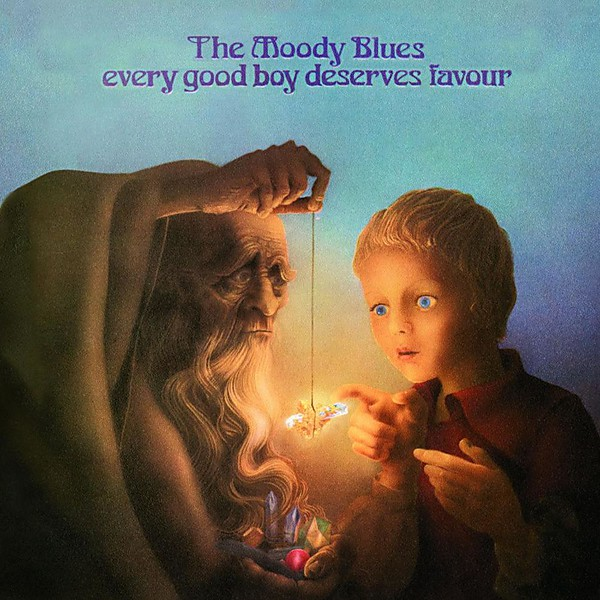

# Every Good Boy Deserves Favour

By **The Moody Blues**

## Album Data

- **Catalog:** Beets
- **Format:** Digital, Album
- **Album:** Every Good Boy Deserves Favour
- **Artist:** The Moody Blues
- **Albumartist:** The Moody Blues
- **Genre:** Soft Rock
- **MusicBrainz Album Artist ID:** [774666d2-2064-4d6c-856c-f8cda0aaf9f0](https://musicbrainz.org/artist/774666d2-2064-4d6c-856c-f8cda0aaf9f0)
- **MusicBrainz Album ID:** [5466cd64-5b0a-469c-a7b6-f41b4bf610a9](https://musicbrainz.org/release/5466cd64-5b0a-469c-a7b6-f41b4bf610a9)
- **MusicBrainz Release Group ID:** [29e6cb66-b7ce-35bc-84a0-180f1c941d5f](https://musicbrainz.org/release-group/29e6cb66-b7ce-35bc-84a0-180f1c941d5f)
- **Year:** 2008
- **Catalog #:** UDCD 576
- **Label:** Mobile Fidelity Sound Lab
- **Total Tracks:** 12

## Album Tracks

### Track 01 - Departure

- **Artist:** The Moody Blues
- **Format:** MP3
- **Genre:** Psychedelic Rock
- **Length:** 0:45
- **MusicBrainz Track ID:** [fb02f78a-37a8-43c5-9043-c0d724d74918](https://musicbrainz.org/recording/fb02f78a-37a8-43c5-9043-c0d724d74918)
- **Title:** Departure
- **Track:** 01
- **Year:** 1993

### Track 02 - Ride My See‐Saw

- **Artist:** The Moody Blues
- **Format:** MP3
- **Genre:** Psychedelic Rock
- **Length:** 3:39
- **MusicBrainz Track ID:** [dfe2365f-ffae-4aac-af2d-5d4c0bfbc3d8](https://musicbrainz.org/recording/dfe2365f-ffae-4aac-af2d-5d4c0bfbc3d8)
- **Title:** Ride My See‐Saw
- **Track:** 02
- **Year:** 1993

### Track 03 - Dr. Livingstone, I Presume

- **Artist:** The Moody Blues
- **Format:** MP3
- **Genre:** Soft Rock
- **Length:** 2:58
- **MusicBrainz Track ID:** [de6b2ee6-5868-4804-8699-2d9425089bfc](https://musicbrainz.org/recording/de6b2ee6-5868-4804-8699-2d9425089bfc)
- **Title:** Dr. Livingstone, I Presume
- **Track:** 03
- **Year:** 1993

### Track 04 - House of Four Doors

- **Artist:** The Moody Blues
- **Format:** MP3
- **Genre:** Psychedelic Rock
- **Length:** 4:13
- **MusicBrainz Track ID:** [3f7999bd-827b-4063-bac8-5cf732dd178c](https://musicbrainz.org/recording/3f7999bd-827b-4063-bac8-5cf732dd178c)
- **Title:** House of Four Doors
- **Track:** 04
- **Year:** 1993

### Track 05 - Legend of a Mind

- **Artist:** The Moody Blues
- **Format:** MP3
- **Genre:** Psychedelic Rock
- **Length:** 6:36
- **MusicBrainz Track ID:** [8542af00-4ddc-41f3-9dba-4409dc577e74](https://musicbrainz.org/recording/8542af00-4ddc-41f3-9dba-4409dc577e74)
- **Title:** Legend of a Mind
- **Track:** 05
- **Year:** 1993

### Track 06 - House of Four Doors, Part 2

- **Artist:** The Moody Blues
- **Format:** MP3
- **Genre:** Psychedelic Rock
- **Length:** 1:47
- **MusicBrainz Track ID:** [f3ba2796-4125-4e4e-8d5b-d54ee41755a2](https://musicbrainz.org/recording/f3ba2796-4125-4e4e-8d5b-d54ee41755a2)
- **Title:** House of Four Doors, Part 2
- **Track:** 06
- **Year:** 1993

### Track 07 - Voices in the Sky

- **Artist:** The Moody Blues
- **Format:** MP3
- **Genre:** Psychedelic Rock
- **Length:** 3:28
- **MusicBrainz Track ID:** [f49b1575-8f0d-4b54-9721-a3d963864e7e](https://musicbrainz.org/recording/f49b1575-8f0d-4b54-9721-a3d963864e7e)
- **Title:** Voices in the Sky
- **Track:** 07
- **Year:** 1993

### Track 08 - The Best Way to Travel

- **Artist:** The Moody Blues
- **Format:** MP3
- **Genre:** Acid Rock
- **Length:** 3:14
- **MusicBrainz Track ID:** [11be319e-896b-44e5-a106-8074654317e1](https://musicbrainz.org/recording/11be319e-896b-44e5-a106-8074654317e1)
- **Title:** The Best Way to Travel
- **Track:** 08
- **Year:** 1993

### Track 09 - Visions of Paradise

- **Artist:** The Moody Blues
- **Format:** MP3
- **Genre:** Psychedelic Rock
- **Length:** 4:15
- **MusicBrainz Track ID:** [aaa3e1d2-54e9-4d0b-848b-318522d235ab](https://musicbrainz.org/recording/aaa3e1d2-54e9-4d0b-848b-318522d235ab)
- **Title:** Visions of Paradise
- **Track:** 09
- **Year:** 1993

### Track 10 - The Actor

- **Artist:** The Moody Blues
- **Format:** MP3
- **Genre:** Psychedelic Rock
- **Length:** 4:39
- **MusicBrainz Track ID:** [f5543207-9ba2-4882-8d00-114dc093140a](https://musicbrainz.org/recording/f5543207-9ba2-4882-8d00-114dc093140a)
- **Title:** The Actor
- **Track:** 10
- **Year:** 1993

### Track 11 - The Word

- **Artist:** The Moody Blues
- **Format:** MP3
- **Genre:** Progressive Rock
- **Length:** 0:49
- **MusicBrainz Track ID:** [8e24c950-74da-42cb-aa83-275ea472320b](https://musicbrainz.org/recording/8e24c950-74da-42cb-aa83-275ea472320b)
- **Title:** The Word
- **Track:** 11
- **Year:** 1993

### Track 12 - Om

- **Artist:** The Moody Blues
- **Format:** MP3
- **Genre:** Raga Rock
- **Length:** 5:50
- **MusicBrainz Track ID:** [bf3606e2-1212-41f8-8353-41fbfb130f78](https://musicbrainz.org/recording/bf3606e2-1212-41f8-8353-41fbfb130f78)
- **Title:** Om
- **Track:** 12
- **Year:** 1993

## See also

- [A Question of Balance](A_Question_of_Balance.md)
- [Days Of Future Passed](Days_Of_Future_Passed.md)
- [In Search of the Lost Chord](In_Search_of_the_Lost_Chord.md)
- [In Search Of The Lost Chord](In_Search_Of_The_Lost_Chord.md)
- [Long Distance Voyager](Long_Distance_Voyager.md)
- [Lovely to See You Disc 2](Lovely_to_See_You_Disc_2.md)
- [On the Threshold of a Dream](On_the_Threshold_of_a_Dream.md)
- [Seventh Sojourn](Seventh_Sojourn.md)
- [Time Traveller Disc 1](Time_Traveller_Disc_1.md)
- [Time Traveller Disc 2](Time_Traveller_Disc_2.md)
- [Time Traveller Disc 3](Time_Traveller_Disc_3.md)
- [Time Traveller Disc 4](Time_Traveller_Disc_4.md)
- [To Our Children's Children's Children](To_Our_Childrens_Childrens_Children.md)
- [Unknown Album (7/19/2005 9](Unknown_Album_7-19-2005_9.md)
- [CD: A Question Of Balance](../../CD/The_Moody_Blues/A_Question_Of_Balance.md)
- [CD: Days Of Future Passed](../../CD/The_Moody_Blues/Days_Of_Future_Passed.md)
- [CD: Every Good Boy Deserves Favour](../../CD/The_Moody_Blues/Every_Good_Boy_Deserves_Favour.md)
- [CD: In Search Of The Lost Chord](../../CD/The_Moody_Blues/In_Search_Of_The_Lost_Chord.md)
- [CD: Long Distance Voyager](../../CD/The_Moody_Blues/Long_Distance_Voyager.md)
- [CD: On The Threshold Of A Dream](../../CD/The_Moody_Blues/On_The_Threshold_Of_A_Dream.md)
- [CD: ](../../CD/The_Moody_Blues/The_Moody_Blues.md)
- [CD: Time Traveller (Disc 1)](../../CD/The_Moody_Blues/Time_Traveller_Disc_1.md)
- [CD: Time Traveller (Disc 2)](../../CD/The_Moody_Blues/Time_Traveller_Disc_2.md)
- [CD: Time Traveller (Disc 3)](../../CD/The_Moody_Blues/Time_Traveller_Disc_3.md)
- [CD: Time Traveller (Disc 4)](../../CD/The_Moody_Blues/Time_Traveller_Disc_4.md)
- [CD: To Our Children's Children's Children](../../CD/The_Moody_Blues/To_Our_Childrens_Childrens_Children.md)
- [Roon: A Question Of Balance](../../Roon/The_Moody_Blues/A_Question_Of_Balance.md)
- [Roon: Days Of Future Passed (Deluxe Version)](../../Roon/The_Moody_Blues/Days_Of_Future_Passed_Deluxe_Version.md)
- [Roon: Every Good Boy Deserves Favour](../../Roon/The_Moody_Blues/Every_Good_Boy_Deserves_Favour.md)
- [Roon: In Search Of The Lost Chord (50th Anniversary Deluxe Edition) (50th Anniversary Edition / Deluxe)](../../Roon/The_Moody_Blues/In_Search_Of_The_Lost_Chord_50th_Anniversary_Deluxe_Edition_50th_Anniversary_Edition_-_Deluxe.md)
- [Roon: Long Distance Voyager (Expanded)](../../Roon/The_Moody_Blues/Long_Distance_Voyager_Expanded.md)
- [Roon: On The Threshold Of A Dream](../../Roon/The_Moody_Blues/On_The_Threshold_Of_A_Dream.md)
- [Roon: Seventh Sojourn](../../Roon/The_Moody_Blues/Seventh_Sojourn.md)
- [Roon: The Other Side Of Life](../../Roon/The_Moody_Blues/The_Other_Side_Of_Life.md)
- [Roon: The Present](../../Roon/The_Moody_Blues/The_Present.md)
- [Roon: This Is The Moody Blues](../../Roon/The_Moody_Blues/This_Is_The_Moody_Blues.md)
- [Roon: To Our Children's Children's Children](../../Roon/The_Moody_Blues/To_Our_Childrens_Childrens_Children.md)
- [Vinyl: A Question Of Balance](../../Vinyl/The_Moody_Blues/A_Question_Of_Balance.md)
- [Vinyl: In Search Of The Lost Chord](../../Vinyl/The_Moody_Blues/In_Search_Of_The_Lost_Chord.md)
- [Vinyl: On The Threshold Of A Dream](../../Vinyl/The_Moody_Blues/On_The_Threshold_Of_A_Dream.md)
- [Vinyl: Seventh Sojourn](../../Vinyl/The_Moody_Blues/Seventh_Sojourn.md)
- [Vinyl: ](../../Vinyl/The_Moody_Blues/The_Moody_Blues.md)
