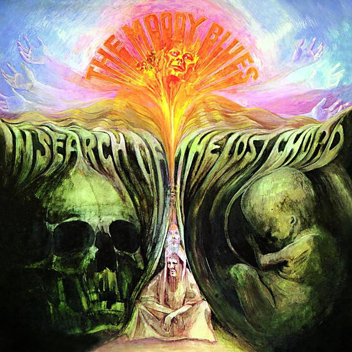

# In Search of the Lost Chord

By **The Moody Blues**

## Album Data

- **Catalog:** Beets
- **Format:** Digital, Album
- **Album:** In Search of the Lost Chord
- **Artist:** The Moody Blues
- **Albumartist:** The Moody Blues
- **Genre:** Psychedelic Rock
- **MusicBrainz Album Artist ID:** [774666d2-2064-4d6c-856c-f8cda0aaf9f0](https://musicbrainz.org/artist/774666d2-2064-4d6c-856c-f8cda0aaf9f0)
- **MusicBrainz Album ID:** [a5d4202d-a80d-3c6a-8ec7-5362290787a6](https://musicbrainz.org/release/a5d4202d-a80d-3c6a-8ec7-5362290787a6)
- **MusicBrainz Release Group ID:** [e817037c-2c6b-34be-a860-b51957f7e82a](https://musicbrainz.org/release-group/e817037c-2c6b-34be-a860-b51957f7e82a)
- **Year:** 1993
- **Catalog #:** 820 105-2
- **Label:** Threshold Records
- **Total Tracks:** 10

## Album Tracks

### Track 01 - The Voice

- **Artist:** The Moody Blues
- **Format:** ALAC
- **Genre:** Soft Rock
- **Length:** 5:22
- **MusicBrainz Track ID:** [f5cfec99-f907-4c91-92bf-bae363c7c3cb](https://musicbrainz.org/recording/f5cfec99-f907-4c91-92bf-bae363c7c3cb)
- **Title:** The Voice
- **Track:** 01
- **Year:** 1987

### Track 02 - Talking Out of Turn

- **Artist:** The Moody Blues
- **Format:** ALAC
- **Genre:** Soft Rock
- **Length:** 7:19
- **MusicBrainz Track ID:** [969547c7-31a0-4733-b1a5-eb4178a1ec79](https://musicbrainz.org/recording/969547c7-31a0-4733-b1a5-eb4178a1ec79)
- **Title:** Talking Out of Turn
- **Track:** 02
- **Year:** 1987

### Track 03 - Gemini Dream

- **Artist:** The Moody Blues
- **Format:** ALAC
- **Genre:** Soft Rock
- **Length:** 4:10
- **MusicBrainz Track ID:** [14c44844-d1dc-4170-9eeb-c22ba0cd976c](https://musicbrainz.org/recording/14c44844-d1dc-4170-9eeb-c22ba0cd976c)
- **Title:** Gemini Dream
- **Track:** 03
- **Year:** 1987

### Track 04 - In My World

- **Artist:** The Moody Blues
- **Format:** ALAC
- **Genre:** Soft Rock
- **Length:** 7:22
- **MusicBrainz Track ID:** [b83d17c2-4200-42d9-b011-c66831943deb](https://musicbrainz.org/recording/b83d17c2-4200-42d9-b011-c66831943deb)
- **Title:** In My World
- **Track:** 04
- **Year:** 1987

### Track 05 - Meanwhile

- **Artist:** The Moody Blues
- **Format:** ALAC
- **Genre:** Soft Rock
- **Length:** 4:08
- **MusicBrainz Track ID:** [6a73c47f-6ff2-40b2-ab1b-9f900cbd5fee](https://musicbrainz.org/recording/6a73c47f-6ff2-40b2-ab1b-9f900cbd5fee)
- **Title:** Meanwhile
- **Track:** 05
- **Year:** 1987

### Track 06 - 22,000 Days

- **Artist:** The Moody Blues
- **Format:** ALAC
- **Genre:** Soft Rock
- **Length:** 5:26
- **MusicBrainz Track ID:** [c6b713a3-cd05-4ac6-80cc-62f3d6d2b98c](https://musicbrainz.org/recording/c6b713a3-cd05-4ac6-80cc-62f3d6d2b98c)
- **Title:** 22,000 Days
- **Track:** 06
- **Year:** 1987

### Track 07 - Nervous

- **Artist:** The Moody Blues
- **Format:** ALAC
- **Genre:** Soft Rock
- **Length:** 5:46
- **MusicBrainz Track ID:** [eecf7183-4672-480f-a77b-1e1702203dcf](https://musicbrainz.org/recording/eecf7183-4672-480f-a77b-1e1702203dcf)
- **Title:** Nervous
- **Track:** 07
- **Year:** 1987

### Track 08 - Painted Smile

- **Artist:** The Moody Blues
- **Format:** ALAC
- **Genre:** Soft Rock
- **Length:** 3:19
- **MusicBrainz Track ID:** [75512c01-a94e-47a1-b1a5-7dd29a48776a](https://musicbrainz.org/recording/75512c01-a94e-47a1-b1a5-7dd29a48776a)
- **Title:** Painted Smile
- **Track:** 08
- **Year:** 1987

### Track 09 - Reflective Smile

- **Artist:** The Moody Blues
- **Format:** ALAC
- **Genre:** Soft Rock
- **Length:** 0:36
- **MusicBrainz Track ID:** [2f1f31a8-9801-4ca0-a052-d9826c8148cf](https://musicbrainz.org/recording/2f1f31a8-9801-4ca0-a052-d9826c8148cf)
- **Title:** Reflective Smile
- **Track:** 09
- **Year:** 1987

### Track 10 - Veteran Cosmic Rocker

- **Artist:** The Moody Blues
- **Format:** ALAC
- **Genre:** Soft Rock
- **Length:** 3:18
- **MusicBrainz Track ID:** [4ecb3f40-ac8e-4e0b-8975-396f87357750](https://musicbrainz.org/recording/4ecb3f40-ac8e-4e0b-8975-396f87357750)
- **Title:** Veteran Cosmic Rocker
- **Track:** 10
- **Year:** 1987

