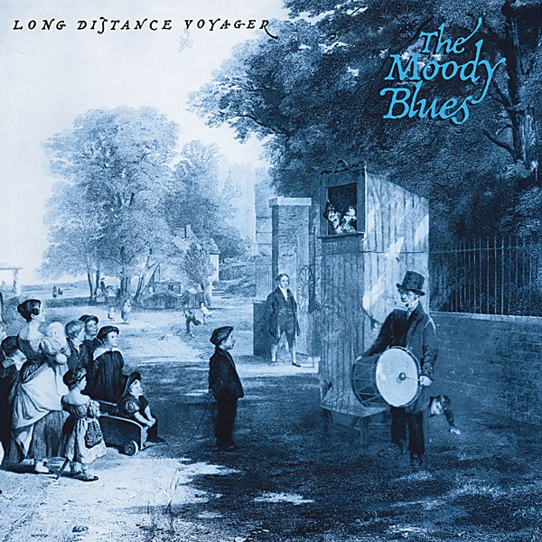

# Long Distance Voyager

By **The Moody Blues**

## Album Data

- **Catalog:** Beets
- **Format:** Digital, Album
- **Album:** Long Distance Voyager
- **Artist:** The Moody Blues
- **Albumartist:** The Moody Blues
- **Genre:** Soft Rock
- **MusicBrainz Album Artist ID:** [774666d2-2064-4d6c-856c-f8cda0aaf9f0](https://musicbrainz.org/artist/774666d2-2064-4d6c-856c-f8cda0aaf9f0)
- **MusicBrainz Album ID:** [582ad1d3-755c-3005-8f32-fa86158468a5](https://musicbrainz.org/release/582ad1d3-755c-3005-8f32-fa86158468a5)
- **MusicBrainz Release Group ID:** [82114846-169c-3907-bba3-ddd22db508ec](https://musicbrainz.org/release-group/82114846-169c-3907-bba3-ddd22db508ec)
- **Year:** 1987
- **Catalog #:** B0011209-02
- **Label:** Deram
- **Total Tracks:** 22

## Album Tracks

### Track 01 - In the Beginning

- **Artist:** The Moody Blues
- **Format:** ALAC
- **Genre:** Soft Rock
- **Length:** 2:08
- **MusicBrainz Track ID:** [936c1f0e-d0f7-48d0-b521-a66264a4f646](https://musicbrainz.org/recording/936c1f0e-d0f7-48d0-b521-a66264a4f646)
- **Title:** In the Beginning
- **Track:** 01
- **Year:** 2008

### Track 02 - Lovely to See You

- **Artist:** The Moody Blues
- **Format:** ALAC
- **Genre:** Soft Rock
- **Length:** 2:34
- **MusicBrainz Track ID:** [8ecb37ed-dd11-43ca-a82c-feee627646a3](https://musicbrainz.org/recording/8ecb37ed-dd11-43ca-a82c-feee627646a3)
- **Title:** Lovely to See You
- **Track:** 02
- **Year:** 2008

### Track 03 - Dear Diary

- **Artist:** The Moody Blues
- **Format:** ALAC
- **Genre:** Soft Rock
- **Length:** 3:56
- **MusicBrainz Track ID:** [292c21f5-dcad-4568-8e1e-96dcf78f16d4](https://musicbrainz.org/recording/292c21f5-dcad-4568-8e1e-96dcf78f16d4)
- **Title:** Dear Diary
- **Track:** 03
- **Year:** 2008

### Track 04 - Send Me No Wine

- **Artist:** The Moody Blues
- **Format:** ALAC
- **Genre:** Soft Rock
- **Length:** 2:20
- **MusicBrainz Track ID:** [be75ebf6-49d2-4a00-9f23-aa28d33426a9](https://musicbrainz.org/recording/be75ebf6-49d2-4a00-9f23-aa28d33426a9)
- **Title:** Send Me No Wine
- **Track:** 04
- **Year:** 2008

### Track 05 - To Share Our Love

- **Artist:** The Moody Blues
- **Format:** ALAC
- **Genre:** Soft Rock
- **Length:** 2:54
- **MusicBrainz Track ID:** [636801da-0395-4083-a602-5b56685a3dfa](https://musicbrainz.org/recording/636801da-0395-4083-a602-5b56685a3dfa)
- **Title:** To Share Our Love
- **Track:** 05
- **Year:** 2008

### Track 06 - So Deep Within You

- **Artist:** The Moody Blues
- **Format:** ALAC
- **Genre:** Soft Rock
- **Length:** 3:07
- **MusicBrainz Track ID:** [50c4b522-8a64-4ed6-952e-50211c8f29ab](https://musicbrainz.org/recording/50c4b522-8a64-4ed6-952e-50211c8f29ab)
- **Title:** So Deep Within You
- **Track:** 06
- **Year:** 2008

### Track 07 - Never Comes the Day

- **Artist:** The Moody Blues
- **Format:** ALAC
- **Genre:** Psychedelic Pop
- **Length:** 4:43
- **MusicBrainz Track ID:** [2661caba-b466-448e-98df-6a0e345bf394](https://musicbrainz.org/recording/2661caba-b466-448e-98df-6a0e345bf394)
- **Title:** Never Comes the Day
- **Track:** 07
- **Year:** 2008

### Track 08 - Lazy Day

- **Artist:** The Moody Blues
- **Format:** ALAC
- **Genre:** Soft Rock
- **Length:** 2:43
- **MusicBrainz Track ID:** [3a207811-18b7-41e0-9351-5ec86d25e830](https://musicbrainz.org/recording/3a207811-18b7-41e0-9351-5ec86d25e830)
- **Title:** Lazy Day
- **Track:** 08
- **Year:** 2008

### Track 09 - Are You Sitting Comfortably

- **Artist:** The Moody Blues
- **Format:** ALAC
- **Genre:** Soft Rock
- **Length:** 3:29
- **MusicBrainz Track ID:** [62dba069-07b9-4d8f-bb60-079a7e1d5a8a](https://musicbrainz.org/recording/62dba069-07b9-4d8f-bb60-079a7e1d5a8a)
- **Title:** Are You Sitting Comfortably
- **Track:** 09
- **Year:** 2008

### Track 10 - The Dream

- **Artist:** The Moody Blues
- **Format:** ALAC
- **Genre:** Soft Rock
- **Length:** 0:58
- **MusicBrainz Track ID:** [2e30ff65-119e-44b9-be2c-f61aa23464a6](https://musicbrainz.org/recording/2e30ff65-119e-44b9-be2c-f61aa23464a6)
- **Title:** The Dream
- **Track:** 10
- **Year:** 2008

### Track 11 - Have You Heard, Part 1

- **Artist:** The Moody Blues
- **Format:** ALAC
- **Genre:** Psychedelic Rock
- **Length:** 1:28
- **MusicBrainz Track ID:** [81878b8b-e344-4fa9-8374-2584eaebe938](https://musicbrainz.org/recording/81878b8b-e344-4fa9-8374-2584eaebe938)
- **Title:** Have You Heard, Part 1
- **Track:** 11
- **Year:** 2008

### Track 12 - The Voyage

- **Artist:** The Moody Blues
- **Format:** ALAC
- **Genre:** Soft Rock
- **Length:** 4:11
- **MusicBrainz Track ID:** [27f7fa69-33d5-4599-9dc9-6a7d83c55b2d](https://musicbrainz.org/recording/27f7fa69-33d5-4599-9dc9-6a7d83c55b2d)
- **Title:** The Voyage
- **Track:** 12
- **Year:** 2008

### Track 13 - Have You Heard, Part 2

- **Artist:** The Moody Blues
- **Format:** ALAC
- **Genre:** Psychedelic Rock
- **Length:** 2:31
- **MusicBrainz Track ID:** [7ce2ac1e-16b7-4c79-aca8-1108a4770def](https://musicbrainz.org/recording/7ce2ac1e-16b7-4c79-aca8-1108a4770def)
- **Title:** Have You Heard, Part 2
- **Track:** 13
- **Year:** 2008

### Track 14 - In the Beginning (full version)

- **Artist:** The Moody Blues
- **Format:** ALAC
- **Genre:** Progressive Rock
- **Length:** 3:28
- **MusicBrainz Track ID:** [ebdfeac8-1f38-4dcc-a484-feb618b3ecd0](https://musicbrainz.org/recording/ebdfeac8-1f38-4dcc-a484-feb618b3ecd0)
- **Title:** In the Beginning (full version)
- **Track:** 14
- **Year:** 2008

### Track 15 - So Deep Within You (extended version)

- **Artist:** The Moody Blues
- **Format:** ALAC
- **Genre:** Psychedelic Rock
- **Length:** 3:29
- **MusicBrainz Track ID:** [d1faa263-9340-4aef-a7ce-97b83812dd73](https://musicbrainz.org/recording/d1faa263-9340-4aef-a7ce-97b83812dd73)
- **Title:** So Deep Within You (extended version)
- **Track:** 15
- **Year:** 2008

### Track 16 - Dear Diary (alternate vocal mix)

- **Artist:** The Moody Blues
- **Format:** ALAC
- **Genre:** Psychedelic Rock
- **Length:** 4:05
- **MusicBrainz Track ID:** [5926cff7-998d-49f0-802f-f3be6acbe531](https://musicbrainz.org/recording/5926cff7-998d-49f0-802f-f3be6acbe531)
- **Title:** Dear Diary (alternate vocal mix)
- **Track:** 16
- **Year:** 2008

### Track 17 - Have You Heard (original take)

- **Artist:** The Moody Blues
- **Format:** ALAC
- **Genre:** Progressive Rock
- **Length:** 3:52
- **MusicBrainz Track ID:** [052e536e-8e7c-446d-931a-4f66e4930209](https://musicbrainz.org/recording/052e536e-8e7c-446d-931a-4f66e4930209)
- **Title:** Have You Heard (original take)
- **Track:** 17
- **Year:** 2008

### Track 18 - The Voyage (original take)

- **Artist:** The Moody Blues
- **Format:** ALAC
- **Genre:** Progressive Rock
- **Length:** 4:19
- **MusicBrainz Track ID:** [f6f975e8-489c-4aac-a361-527f8d3ac6d0](https://musicbrainz.org/recording/f6f975e8-489c-4aac-a361-527f8d3ac6d0)
- **Title:** The Voyage (original take)
- **Track:** 18
- **Year:** 2008

### Track 19 - Lovely to See You (live)

- **Artist:** The Moody Blues
- **Format:** ALAC
- **Genre:** Psychedelic Rock
- **Length:** 2:26
- **MusicBrainz Track ID:** [fd8e70db-4ed8-4dd9-8b0b-323d93e410ed](https://musicbrainz.org/recording/fd8e70db-4ed8-4dd9-8b0b-323d93e410ed)
- **Title:** Lovely to See You (live)
- **Track:** 19
- **Year:** 2008

### Track 20 - Send Me No Wine (live)

- **Artist:** The Moody Blues
- **Format:** ALAC
- **Genre:** Psychedelic Rock
- **Length:** 2:40
- **MusicBrainz Track ID:** [fdd4325e-3948-427f-909a-d5ca7a723a7d](https://musicbrainz.org/recording/fdd4325e-3948-427f-909a-d5ca7a723a7d)
- **Title:** Send Me No Wine (live)
- **Track:** 20
- **Year:** 2008

### Track 21 - So Deep Within You (live)

- **Artist:** The Moody Blues
- **Format:** ALAC
- **Genre:** Psychedelic Rock
- **Length:** 3:08
- **MusicBrainz Track ID:** [82c61d83-f7b9-4cd1-9fd9-687a74b65608](https://musicbrainz.org/recording/82c61d83-f7b9-4cd1-9fd9-687a74b65608)
- **Title:** So Deep Within You (live)
- **Track:** 21
- **Year:** 2008

### Track 22 - Are You Sitting Comfortably (live)

- **Artist:** The Moody Blues
- **Format:** ALAC
- **Genre:** Psychedelic Rock
- **Length:** 3:38
- **MusicBrainz Track ID:** [68e068e3-4c25-419e-8f49-44c5057001b1](https://musicbrainz.org/recording/68e068e3-4c25-419e-8f49-44c5057001b1)
- **Title:** Are You Sitting Comfortably (live)
- **Track:** 22
- **Year:** 2008

## See also

- [A Question of Balance](A_Question_of_Balance.md)
- [Days Of Future Passed](Days_Of_Future_Passed.md)
- [Every Good Boy Deserves Favour](Every_Good_Boy_Deserves_Favour.md)
- [In Search of the Lost Chord](In_Search_of_the_Lost_Chord.md)
- [In Search Of The Lost Chord](In_Search_Of_The_Lost_Chord.md)
- [Lovely to See You Disc 2](Lovely_to_See_You_Disc_2.md)
- [On the Threshold of a Dream](On_the_Threshold_of_a_Dream.md)
- [Seventh Sojourn](Seventh_Sojourn.md)
- [Time Traveller Disc 1](Time_Traveller_Disc_1.md)
- [Time Traveller Disc 2](Time_Traveller_Disc_2.md)
- [Time Traveller Disc 3](Time_Traveller_Disc_3.md)
- [Time Traveller Disc 4](Time_Traveller_Disc_4.md)
- [To Our Children's Children's Children](To_Our_Childrens_Childrens_Children.md)
- [Unknown Album (7/19/2005 9](Unknown_Album_7-19-2005_9.md)
- [CD: A Question Of Balance](../../CD/The_Moody_Blues/A_Question_Of_Balance.md)
- [CD: Days Of Future Passed](../../CD/The_Moody_Blues/Days_Of_Future_Passed.md)
- [CD: Every Good Boy Deserves Favour](../../CD/The_Moody_Blues/Every_Good_Boy_Deserves_Favour.md)
- [CD: In Search Of The Lost Chord](../../CD/The_Moody_Blues/In_Search_Of_The_Lost_Chord.md)
- [CD: Long Distance Voyager](../../CD/The_Moody_Blues/Long_Distance_Voyager.md)
- [CD: On The Threshold Of A Dream](../../CD/The_Moody_Blues/On_The_Threshold_Of_A_Dream.md)
- [CD: ](../../CD/The_Moody_Blues/The_Moody_Blues.md)
- [CD: Time Traveller (Disc 1)](../../CD/The_Moody_Blues/Time_Traveller_Disc_1.md)
- [CD: Time Traveller (Disc 2)](../../CD/The_Moody_Blues/Time_Traveller_Disc_2.md)
- [CD: Time Traveller (Disc 3)](../../CD/The_Moody_Blues/Time_Traveller_Disc_3.md)
- [CD: Time Traveller (Disc 4)](../../CD/The_Moody_Blues/Time_Traveller_Disc_4.md)
- [CD: To Our Children's Children's Children](../../CD/The_Moody_Blues/To_Our_Childrens_Childrens_Children.md)
- [Roon: A Question Of Balance](../../Roon/The_Moody_Blues/A_Question_Of_Balance.md)
- [Roon: Days Of Future Passed (Deluxe Version)](../../Roon/The_Moody_Blues/Days_Of_Future_Passed_Deluxe_Version.md)
- [Roon: Every Good Boy Deserves Favour](../../Roon/The_Moody_Blues/Every_Good_Boy_Deserves_Favour.md)
- [Roon: In Search Of The Lost Chord (50th Anniversary Deluxe Edition) (50th Anniversary Edition / Deluxe)](../../Roon/The_Moody_Blues/In_Search_Of_The_Lost_Chord_50th_Anniversary_Deluxe_Edition_50th_Anniversary_Edition_-_Deluxe.md)
- [Roon: Long Distance Voyager (Expanded)](../../Roon/The_Moody_Blues/Long_Distance_Voyager_Expanded.md)
- [Roon: On The Threshold Of A Dream](../../Roon/The_Moody_Blues/On_The_Threshold_Of_A_Dream.md)
- [Roon: Seventh Sojourn](../../Roon/The_Moody_Blues/Seventh_Sojourn.md)
- [Roon: The Other Side Of Life](../../Roon/The_Moody_Blues/The_Other_Side_Of_Life.md)
- [Roon: The Present](../../Roon/The_Moody_Blues/The_Present.md)
- [Roon: This Is The Moody Blues](../../Roon/The_Moody_Blues/This_Is_The_Moody_Blues.md)
- [Roon: To Our Children's Children's Children](../../Roon/The_Moody_Blues/To_Our_Childrens_Childrens_Children.md)
- [Vinyl: A Question Of Balance](../../Vinyl/The_Moody_Blues/A_Question_Of_Balance.md)
- [Vinyl: In Search Of The Lost Chord](../../Vinyl/The_Moody_Blues/In_Search_Of_The_Lost_Chord.md)
- [Vinyl: On The Threshold Of A Dream](../../Vinyl/The_Moody_Blues/On_The_Threshold_Of_A_Dream.md)
- [Vinyl: Seventh Sojourn](../../Vinyl/The_Moody_Blues/Seventh_Sojourn.md)
- [Vinyl: ](../../Vinyl/The_Moody_Blues/The_Moody_Blues.md)
