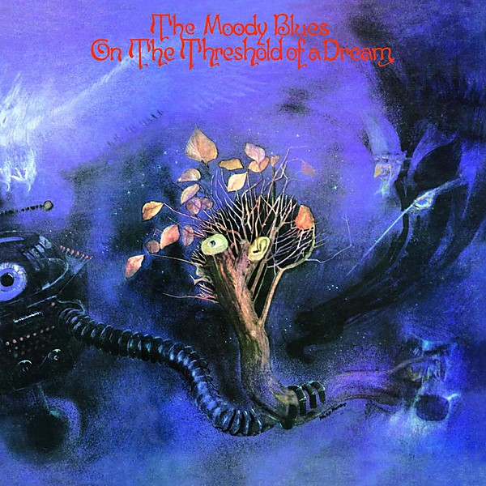

# On the Threshold of a Dream

By **The Moody Blues**

## Album Data

- **Catalog:** Beets
- **Format:** Digital, Album
- **Album:** On the Threshold of a Dream
- **Artist:** The Moody Blues
- **Albumartist:** The Moody Blues
- **Genre:** Psychedelic Rock
- **MusicBrainz Album Artist ID:** [774666d2-2064-4d6c-856c-f8cda0aaf9f0](https://musicbrainz.org/artist/774666d2-2064-4d6c-856c-f8cda0aaf9f0)
- **MusicBrainz Album ID:** [60f3d7ef-84a5-46c6-aef8-95800f4f0229](https://musicbrainz.org/release/60f3d7ef-84a5-46c6-aef8-95800f4f0229)
- **MusicBrainz Release Group ID:** [3957cdfb-3d3d-3821-8e19-7e9b49585311](https://musicbrainz.org/release-group/3957cdfb-3d3d-3821-8e19-7e9b49585311)
- **Year:** 2008
- **Catalog #:** 42284 4773-2
- **Label:** Threshold Records
- **Total Tracks:** 08

## Album Tracks

### Track 01 - Lost in a Lost World

- **Artist:** The Moody Blues
- **Format:** MP3
- **Genre:** Acid Rock
- **Length:** 4:41
- **MusicBrainz Track ID:** [68b8687e-5b67-4dbb-aba9-bdd450bc709a](https://musicbrainz.org/recording/68b8687e-5b67-4dbb-aba9-bdd450bc709a)
- **Title:** Lost in a Lost World
- **Track:** 01
- **Year:** 1997

### Track 02 - New Horizons

- **Artist:** The Moody Blues
- **Format:** MP3
- **Genre:** Soft Rock
- **Length:** 5:10
- **MusicBrainz Track ID:** [70729da8-ae39-4639-988b-af93daf89779](https://musicbrainz.org/recording/70729da8-ae39-4639-988b-af93daf89779)
- **Title:** New Horizons
- **Track:** 02
- **Year:** 1997

### Track 03 - For My Lady

- **Artist:** The Moody Blues
- **Format:** MP3
- **Genre:** Soft Rock
- **Length:** 3:57
- **MusicBrainz Track ID:** [1291792f-bc15-47d7-8cf4-9a175315740b](https://musicbrainz.org/recording/1291792f-bc15-47d7-8cf4-9a175315740b)
- **Title:** For My Lady
- **Track:** 03
- **Year:** 1997

### Track 04 - Isn’t Life Strange

- **Artist:** The Moody Blues
- **Format:** MP3
- **Genre:** Soft Rock
- **Length:** 6:10
- **MusicBrainz Track ID:** [912267ce-4f68-4d24-89a0-8310d02fd4bd](https://musicbrainz.org/recording/912267ce-4f68-4d24-89a0-8310d02fd4bd)
- **Title:** Isn’t Life Strange
- **Track:** 04
- **Year:** 1997

### Track 05 - You and Me

- **Artist:** The Moody Blues
- **Format:** MP3
- **Genre:** Soft Rock
- **Length:** 4:20
- **MusicBrainz Track ID:** [7fbc8e9d-fbcc-487c-8ea6-a42c8425b75c](https://musicbrainz.org/recording/7fbc8e9d-fbcc-487c-8ea6-a42c8425b75c)
- **Title:** You and Me
- **Track:** 05
- **Year:** 1997

### Track 06 - The Land of Make-Believe

- **Artist:** The Moody Blues
- **Format:** MP3
- **Genre:** Progressive Rock
- **Length:** 4:51
- **MusicBrainz Track ID:** [ce96d1af-97b4-418e-b3e2-3dcbb289f53d](https://musicbrainz.org/recording/ce96d1af-97b4-418e-b3e2-3dcbb289f53d)
- **Title:** The Land of Make-Believe
- **Track:** 06
- **Year:** 1997

### Track 07 - When You’re a Free Man

- **Artist:** The Moody Blues
- **Format:** MP3
- **Genre:** Soft Rock
- **Length:** 6:05
- **MusicBrainz Track ID:** [97fd4df2-4657-48a0-ad92-1e9a8f0c4ecc](https://musicbrainz.org/recording/97fd4df2-4657-48a0-ad92-1e9a8f0c4ecc)
- **Title:** When You’re a Free Man
- **Track:** 07
- **Year:** 1997

### Track 08 - I’m Just a Singer (in a Rock and Roll Band)

- **Artist:** The Moody Blues
- **Format:** MP3
- **Genre:** Soft Rock
- **Length:** 4:17
- **MusicBrainz Track ID:** [3772e75a-183c-4ca2-a5c3-7cb295464511](https://musicbrainz.org/recording/3772e75a-183c-4ca2-a5c3-7cb295464511)
- **Title:** I’m Just a Singer (in a Rock and Roll Band)
- **Track:** 08
- **Year:** 1997

## See also

- [A Question of Balance](A_Question_of_Balance.md)
- [Days Of Future Passed](Days_Of_Future_Passed.md)
- [Every Good Boy Deserves Favour](Every_Good_Boy_Deserves_Favour.md)
- [In Search of the Lost Chord](In_Search_of_the_Lost_Chord.md)
- [In Search Of The Lost Chord](In_Search_Of_The_Lost_Chord.md)
- [Long Distance Voyager](Long_Distance_Voyager.md)
- [Lovely to See You Disc 2](Lovely_to_See_You_Disc_2.md)
- [Seventh Sojourn](Seventh_Sojourn.md)
- [Time Traveller Disc 1](Time_Traveller_Disc_1.md)
- [Time Traveller Disc 2](Time_Traveller_Disc_2.md)
- [Time Traveller Disc 3](Time_Traveller_Disc_3.md)
- [Time Traveller Disc 4](Time_Traveller_Disc_4.md)
- [To Our Children's Children's Children](To_Our_Childrens_Childrens_Children.md)
- [Unknown Album (7/19/2005 9](Unknown_Album_7-19-2005_9.md)
- [CD: A Question Of Balance](../../CD/The_Moody_Blues/A_Question_Of_Balance.md)
- [CD: Days Of Future Passed](../../CD/The_Moody_Blues/Days_Of_Future_Passed.md)
- [CD: Every Good Boy Deserves Favour](../../CD/The_Moody_Blues/Every_Good_Boy_Deserves_Favour.md)
- [CD: In Search Of The Lost Chord](../../CD/The_Moody_Blues/In_Search_Of_The_Lost_Chord.md)
- [CD: Long Distance Voyager](../../CD/The_Moody_Blues/Long_Distance_Voyager.md)
- [CD: On The Threshold Of A Dream](../../CD/The_Moody_Blues/On_The_Threshold_Of_A_Dream.md)
- [CD: ](../../CD/The_Moody_Blues/The_Moody_Blues.md)
- [CD: Time Traveller (Disc 1)](../../CD/The_Moody_Blues/Time_Traveller_Disc_1.md)
- [CD: Time Traveller (Disc 2)](../../CD/The_Moody_Blues/Time_Traveller_Disc_2.md)
- [CD: Time Traveller (Disc 3)](../../CD/The_Moody_Blues/Time_Traveller_Disc_3.md)
- [CD: Time Traveller (Disc 4)](../../CD/The_Moody_Blues/Time_Traveller_Disc_4.md)
- [CD: To Our Children's Children's Children](../../CD/The_Moody_Blues/To_Our_Childrens_Childrens_Children.md)
- [Roon: A Question Of Balance](../../Roon/The_Moody_Blues/A_Question_Of_Balance.md)
- [Roon: Days Of Future Passed (Deluxe Version)](../../Roon/The_Moody_Blues/Days_Of_Future_Passed_Deluxe_Version.md)
- [Roon: Every Good Boy Deserves Favour](../../Roon/The_Moody_Blues/Every_Good_Boy_Deserves_Favour.md)
- [Roon: In Search Of The Lost Chord (50th Anniversary Deluxe Edition) (50th Anniversary Edition / Deluxe)](../../Roon/The_Moody_Blues/In_Search_Of_The_Lost_Chord_50th_Anniversary_Deluxe_Edition_50th_Anniversary_Edition_-_Deluxe.md)
- [Roon: Long Distance Voyager (Expanded)](../../Roon/The_Moody_Blues/Long_Distance_Voyager_Expanded.md)
- [Roon: On The Threshold Of A Dream](../../Roon/The_Moody_Blues/On_The_Threshold_Of_A_Dream.md)
- [Roon: Seventh Sojourn](../../Roon/The_Moody_Blues/Seventh_Sojourn.md)
- [Roon: The Other Side Of Life](../../Roon/The_Moody_Blues/The_Other_Side_Of_Life.md)
- [Roon: The Present](../../Roon/The_Moody_Blues/The_Present.md)
- [Roon: This Is The Moody Blues](../../Roon/The_Moody_Blues/This_Is_The_Moody_Blues.md)
- [Roon: To Our Children's Children's Children](../../Roon/The_Moody_Blues/To_Our_Childrens_Childrens_Children.md)
- [Vinyl: A Question Of Balance](../../Vinyl/The_Moody_Blues/A_Question_Of_Balance.md)
- [Vinyl: In Search Of The Lost Chord](../../Vinyl/The_Moody_Blues/In_Search_Of_The_Lost_Chord.md)
- [Vinyl: On The Threshold Of A Dream](../../Vinyl/The_Moody_Blues/On_The_Threshold_Of_A_Dream.md)
- [Vinyl: Seventh Sojourn](../../Vinyl/The_Moody_Blues/Seventh_Sojourn.md)
- [Vinyl: ](../../Vinyl/The_Moody_Blues/The_Moody_Blues.md)
