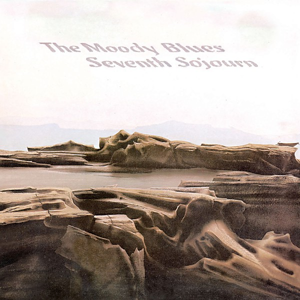

# Seventh Sojourn

By **The Moody Blues**

## Album Data

- **Catalog:** Beets
- **Format:** Digital, Album
- **Album:** Seventh Sojourn
- **Artist:** The Moody Blues
- **Albumartist:** The Moody Blues
- **Genre:** Soft Rock
- **MusicBrainz Album Artist ID:** [774666d2-2064-4d6c-856c-f8cda0aaf9f0](https://musicbrainz.org/artist/774666d2-2064-4d6c-856c-f8cda0aaf9f0)
- **MusicBrainz Album ID:** [c66d1e7c-d392-4571-b0d6-784a8249ecb6](https://musicbrainz.org/release/c66d1e7c-d392-4571-b0d6-784a8249ecb6)
- **MusicBrainz Release Group ID:** [7b836b4d-c07d-35ee-a5a0-9efac69be452](https://musicbrainz.org/release-group/7b836b4d-c07d-35ee-a5a0-9efac69be452)
- **Year:** 1997
- **Catalog #:** B0011212-02
- **Label:** UMe
- **Total Tracks:** 18

## Album Tracks

### Track 01 - Higher And Higher

- **Artist:** The Moody Blues
- **Format:** ALAC
- **Genre:** Soft Rock
- **Length:** 4:06
- **MusicBrainz Track ID:** [116ff6bc-3ddf-4ed6-a139-fa703dc659ca](https://musicbrainz.org/recording/116ff6bc-3ddf-4ed6-a139-fa703dc659ca)
- **Title:** Higher And Higher
- **Track:** 01
- **Year:** 2008

### Track 02 - The Eyes Of A Child - Part 1

- **Artist:** The Moody Blues
- **Format:** ALAC
- **Genre:** Space Rock
- **Length:** 3:23
- **MusicBrainz Track ID:** [4bb908d7-4054-4cc2-a3f6-ae13a9e391dd](https://musicbrainz.org/recording/4bb908d7-4054-4cc2-a3f6-ae13a9e391dd)
- **Title:** The Eyes Of A Child - Part 1
- **Track:** 02
- **Year:** 2008

### Track 03 - Floating

- **Artist:** The Moody Blues
- **Format:** ALAC
- **Genre:** Space Rock
- **Length:** 2:58
- **MusicBrainz Track ID:** [92e2ef34-5ef1-40a3-b30d-cfaa603eeee8](https://musicbrainz.org/recording/92e2ef34-5ef1-40a3-b30d-cfaa603eeee8)
- **Title:** Floating
- **Track:** 03
- **Year:** 2008

### Track 04 - The Eyes Of A Child - Part 2

- **Artist:** The Moody Blues
- **Format:** ALAC
- **Genre:** Space Rock
- **Length:** 1:23
- **MusicBrainz Track ID:** [b813ac59-683f-46e3-992d-45c1db83e168](https://musicbrainz.org/recording/b813ac59-683f-46e3-992d-45c1db83e168)
- **Title:** The Eyes Of A Child - Part 2
- **Track:** 04
- **Year:** 2008

### Track 05 - I Never Thought I'd Live To Be A Hundred

- **Artist:** The Moody Blues
- **Format:** ALAC
- **Genre:** Soft Rock
- **Length:** 1:05
- **MusicBrainz Track ID:** [29941f29-25d2-4628-ad4a-76915b16b645](https://musicbrainz.org/recording/29941f29-25d2-4628-ad4a-76915b16b645)
- **Title:** I Never Thought I'd Live To Be A Hundred
- **Track:** 05
- **Year:** 2008

### Track 06 - Beyond

- **Artist:** The Moody Blues
- **Format:** ALAC
- **Genre:** Space Rock
- **Length:** 2:58
- **MusicBrainz Track ID:** [b0e34f67-882e-48bd-ab4a-c74517e85072](https://musicbrainz.org/recording/b0e34f67-882e-48bd-ab4a-c74517e85072)
- **Title:** Beyond
- **Track:** 06
- **Year:** 2008

### Track 07 - Out And In

- **Artist:** The Moody Blues
- **Format:** ALAC
- **Genre:** Soft Rock
- **Length:** 3:49
- **MusicBrainz Track ID:** [4ab5dd52-0f39-4a41-beb8-a563c0d9c783](https://musicbrainz.org/recording/4ab5dd52-0f39-4a41-beb8-a563c0d9c783)
- **Title:** Out And In
- **Track:** 07
- **Year:** 2008

### Track 08 - Gypsy

- **Artist:** The Moody Blues
- **Format:** ALAC
- **Genre:** Space Rock
- **Length:** 3:33
- **MusicBrainz Track ID:** [0ebb0bcb-afa0-481e-87b4-aefd2a76c83e](https://musicbrainz.org/recording/0ebb0bcb-afa0-481e-87b4-aefd2a76c83e)
- **Title:** Gypsy
- **Track:** 08
- **Year:** 2008

### Track 09 - Eternity Road

- **Artist:** The Moody Blues
- **Format:** ALAC
- **Genre:** Soft Rock
- **Length:** 4:19
- **MusicBrainz Track ID:** [11f20980-773a-44e4-a209-3109b9fe4b0e](https://musicbrainz.org/recording/11f20980-773a-44e4-a209-3109b9fe4b0e)
- **Title:** Eternity Road
- **Track:** 09
- **Year:** 2008

### Track 10 - Candle Of Life

- **Artist:** The Moody Blues
- **Format:** ALAC
- **Genre:** Progressive Rock
- **Length:** 4:14
- **MusicBrainz Track ID:** [e7a7d6ce-22bc-4920-b61e-a5f5b3dfd914](https://musicbrainz.org/recording/e7a7d6ce-22bc-4920-b61e-a5f5b3dfd914)
- **Title:** Candle Of Life
- **Track:** 10
- **Year:** 2008

### Track 11 - Sun Is Still Shining

- **Artist:** The Moody Blues
- **Format:** ALAC
- **Genre:** Space Rock
- **Length:** 3:39
- **MusicBrainz Track ID:** [3b29d843-035d-4ecf-ab50-d46b8fbdd0c3](https://musicbrainz.org/recording/3b29d843-035d-4ecf-ab50-d46b8fbdd0c3)
- **Title:** Sun Is Still Shining
- **Track:** 11
- **Year:** 2008

### Track 12 - I Never Thought I'd Live To Be A Million

- **Artist:** The Moody Blues
- **Format:** ALAC
- **Genre:** Soft Rock
- **Length:** 0:33
- **MusicBrainz Track ID:** [c5c6804a-9d87-4e51-96bf-0b74b780c3a9](https://musicbrainz.org/recording/c5c6804a-9d87-4e51-96bf-0b74b780c3a9)
- **Title:** I Never Thought I'd Live To Be A Million
- **Track:** 12
- **Year:** 2008

### Track 13 - Watching And Waiting

- **Artist:** The Moody Blues
- **Format:** ALAC
- **Genre:** Progressive Rock
- **Length:** 4:20
- **MusicBrainz Track ID:** [7498876b-17b2-49d2-a906-8b70f53be933](https://musicbrainz.org/recording/7498876b-17b2-49d2-a906-8b70f53be933)
- **Title:** Watching And Waiting
- **Track:** 13
- **Year:** 2008

### Track 14 - Gypsy (Alternate Version)

- **Artist:** The Moody Blues
- **Format:** ALAC
- **Genre:** Space Rock
- **Length:** 4:18
- **MusicBrainz Track ID:** [dc35ae3d-d82b-48cb-a6b1-86f966a39651](https://musicbrainz.org/recording/dc35ae3d-d82b-48cb-a6b1-86f966a39651)
- **Title:** Gypsy (Alternate Version)
- **Track:** 14
- **Year:** 2008

### Track 15 - Candle Of Life (Alternate Version)

- **Artist:** The Moody Blues
- **Format:** ALAC
- **Genre:** Space Rock
- **Length:** 4:58
- **MusicBrainz Track ID:** [f94c6018-06d5-46b4-99ce-2219314795be](https://musicbrainz.org/recording/f94c6018-06d5-46b4-99ce-2219314795be)
- **Title:** Candle Of Life (Alternate Version)
- **Track:** 15
- **Year:** 2008

### Track 16 - Sun Is Still Shining (Extended Version)

- **Artist:** The Moody Blues
- **Format:** ALAC
- **Genre:** Space Rock
- **Length:** 4:06
- **MusicBrainz Track ID:** [0bdb25f4-3c66-4f1e-8ad6-a04217cb28fc](https://musicbrainz.org/recording/0bdb25f4-3c66-4f1e-8ad6-a04217cb28fc)
- **Title:** Sun Is Still Shining (Extended Version)
- **Track:** 16
- **Year:** 2008

### Track 17 - Have You Heard / The Voyage / Have You Heard - Part 2 (Live)

- **Artist:** The Moody Blues
- **Format:** ALAC
- **Genre:** Space Rock
- **Length:** 5:50
- **MusicBrainz Track ID:** [94b58314-7480-4846-ba9f-d3b67b15a6a6](https://musicbrainz.org/recording/94b58314-7480-4846-ba9f-d3b67b15a6a6)
- **Title:** Have You Heard / The Voyage / Have You Heard - Part 2 (Live)
- **Track:** 17
- **Year:** 2008

### Track 18 - Legend Of A Mind (Live)

- **Artist:** The Moody Blues
- **Format:** ALAC
- **Genre:** Space Rock
- **Length:** 4:33
- **MusicBrainz Track ID:** [01010c11-5d26-4de4-ac2d-d2cf4324e0b3](https://musicbrainz.org/recording/01010c11-5d26-4de4-ac2d-d2cf4324e0b3)
- **Title:** Legend Of A Mind (Live)
- **Track:** 18
- **Year:** 2008

## See also

- [A Question of Balance](A_Question_of_Balance.md)
- [Days Of Future Passed](Days_Of_Future_Passed.md)
- [Every Good Boy Deserves Favour](Every_Good_Boy_Deserves_Favour.md)
- [In Search of the Lost Chord](In_Search_of_the_Lost_Chord.md)
- [In Search Of The Lost Chord](In_Search_Of_The_Lost_Chord.md)
- [Long Distance Voyager](Long_Distance_Voyager.md)
- [Lovely to See You Disc 2](Lovely_to_See_You_Disc_2.md)
- [On the Threshold of a Dream](On_the_Threshold_of_a_Dream.md)
- [Time Traveller Disc 1](Time_Traveller_Disc_1.md)
- [Time Traveller Disc 2](Time_Traveller_Disc_2.md)
- [Time Traveller Disc 3](Time_Traveller_Disc_3.md)
- [Time Traveller Disc 4](Time_Traveller_Disc_4.md)
- [To Our Children's Children's Children](To_Our_Childrens_Childrens_Children.md)
- [Unknown Album (7/19/2005 9](Unknown_Album_7-19-2005_9.md)
- [CD: A Question Of Balance](../../CD/The_Moody_Blues/A_Question_Of_Balance.md)
- [CD: Days Of Future Passed](../../CD/The_Moody_Blues/Days_Of_Future_Passed.md)
- [CD: Every Good Boy Deserves Favour](../../CD/The_Moody_Blues/Every_Good_Boy_Deserves_Favour.md)
- [CD: In Search Of The Lost Chord](../../CD/The_Moody_Blues/In_Search_Of_The_Lost_Chord.md)
- [CD: Long Distance Voyager](../../CD/The_Moody_Blues/Long_Distance_Voyager.md)
- [CD: On The Threshold Of A Dream](../../CD/The_Moody_Blues/On_The_Threshold_Of_A_Dream.md)
- [CD: ](../../CD/The_Moody_Blues/The_Moody_Blues.md)
- [CD: Time Traveller (Disc 1)](../../CD/The_Moody_Blues/Time_Traveller_Disc_1.md)
- [CD: Time Traveller (Disc 2)](../../CD/The_Moody_Blues/Time_Traveller_Disc_2.md)
- [CD: Time Traveller (Disc 3)](../../CD/The_Moody_Blues/Time_Traveller_Disc_3.md)
- [CD: Time Traveller (Disc 4)](../../CD/The_Moody_Blues/Time_Traveller_Disc_4.md)
- [CD: To Our Children's Children's Children](../../CD/The_Moody_Blues/To_Our_Childrens_Childrens_Children.md)
- [Roon: A Question Of Balance](../../Roon/The_Moody_Blues/A_Question_Of_Balance.md)
- [Roon: Days Of Future Passed (Deluxe Version)](../../Roon/The_Moody_Blues/Days_Of_Future_Passed_Deluxe_Version.md)
- [Roon: Every Good Boy Deserves Favour](../../Roon/The_Moody_Blues/Every_Good_Boy_Deserves_Favour.md)
- [Roon: In Search Of The Lost Chord (50th Anniversary Deluxe Edition) (50th Anniversary Edition / Deluxe)](../../Roon/The_Moody_Blues/In_Search_Of_The_Lost_Chord_50th_Anniversary_Deluxe_Edition_50th_Anniversary_Edition_-_Deluxe.md)
- [Roon: Long Distance Voyager (Expanded)](../../Roon/The_Moody_Blues/Long_Distance_Voyager_Expanded.md)
- [Roon: On The Threshold Of A Dream](../../Roon/The_Moody_Blues/On_The_Threshold_Of_A_Dream.md)
- [Roon: Seventh Sojourn](../../Roon/The_Moody_Blues/Seventh_Sojourn.md)
- [Roon: The Other Side Of Life](../../Roon/The_Moody_Blues/The_Other_Side_Of_Life.md)
- [Roon: The Present](../../Roon/The_Moody_Blues/The_Present.md)
- [Roon: This Is The Moody Blues](../../Roon/The_Moody_Blues/This_Is_The_Moody_Blues.md)
- [Roon: To Our Children's Children's Children](../../Roon/The_Moody_Blues/To_Our_Childrens_Childrens_Children.md)
- [Vinyl: A Question Of Balance](../../Vinyl/The_Moody_Blues/A_Question_Of_Balance.md)
- [Vinyl: In Search Of The Lost Chord](../../Vinyl/The_Moody_Blues/In_Search_Of_The_Lost_Chord.md)
- [Vinyl: On The Threshold Of A Dream](../../Vinyl/The_Moody_Blues/On_The_Threshold_Of_A_Dream.md)
- [Vinyl: Seventh Sojourn](../../Vinyl/The_Moody_Blues/Seventh_Sojourn.md)
- [Vinyl: ](../../Vinyl/The_Moody_Blues/The_Moody_Blues.md)
