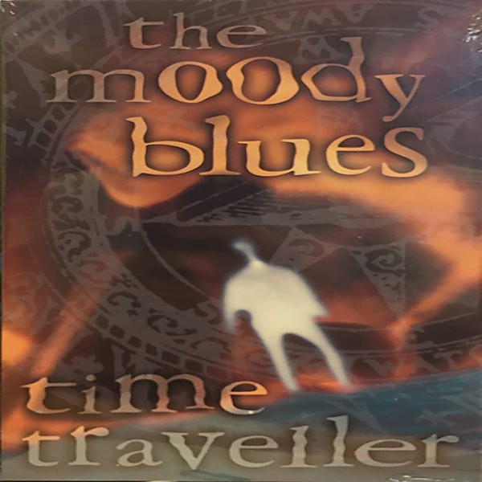

# Time Traveller Disc 4

By **The Moody Blues**

## Album Data

- **Catalog:** Beets
- **Format:** Digital, Album
- **Album:** Time Traveller Disc 4
- **Artist:** The Moody Blues
- **Albumartist:** The Moody Blues
- **Genre:** Psychedelic Rock
- **MusicBrainz Album Artist ID:** 
- **MusicBrainz Album ID:** 
- **MusicBrainz Release Group ID:** 
- **Year:** 1994
- **Catalog #:** 
- **Label:** 
- **Total Tracks:** 00

## Album Tracks

### Track 01 - For My Lady

- **Artist:** The Moody Blues
- **Format:** MP3
- **Genre:** Soft Rock
- **Length:** 3:53
- **MusicBrainz Track ID:** 
- **Title:** For My Lady
- **Track:** 01
- **Year:** 0000

### Track 02 - The Story In Your Eyes

- **Artist:** The Moody Blues
- **Format:** MP3
- **Genre:** Progressive Rock
- **Length:** 2:44
- **MusicBrainz Track ID:** 
- **Title:** The Story In Your Eyes
- **Track:** 02
- **Year:** 0000

### Track 03 - Melancholy Man

- **Artist:** The Moody Blues
- **Format:** MP3
- **Genre:** Soft Rock
- **Length:** 5:04
- **MusicBrainz Track ID:** 
- **Title:** Melancholy Man
- **Track:** 03
- **Year:** 0000

### Track 04 - Nights In White Satin

- **Artist:** The Moody Blues
- **Format:** MP3
- **Genre:** Progressive Rock
- **Length:** 4:32
- **MusicBrainz Track ID:** 
- **Title:** Nights In White Satin
- **Track:** 04
- **Year:** 0000

### Track 05 - Nights In White Satin (rest of song)

- **Artist:** The Moody Blues
- **Format:** MP3
- **Genre:** Psychedelic Rock
- **Length:** 2:36
- **MusicBrainz Track ID:** 
- **Title:** Nights In White Satin (rest of song)
- **Track:** 05
- **Year:** 0000

