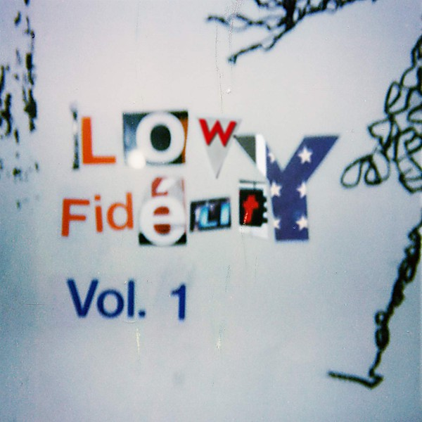

# Paradise Recording Demo

By **The Moops**

## Album Data

- **Catalog:** Beets
- **Format:** Digital, Album
- **Album:** Paradise Recording Demo
- **Artist:** The Moops
- **Albumartist:** The Moops
- **Genre:** Rock
- **MusicBrainz Album Artist ID:** 
- **MusicBrainz Album ID:** 
- **MusicBrainz Release Group ID:** 
- **Year:** 0000
- **Catalog #:** 
- **Label:** 
- **Total Tracks:** 00

## Album Tracks

### Track 01 - Track 1

- **Artist:** The Moops
- **Format:** MP3
- **Genre:** Rock
- **Length:** 2:56
- **MusicBrainz Track ID:** 
- **Title:** Track 1
- **Track:** 01
- **Year:** 0000

### Track 02 - Track 2

- **Artist:** The Moops
- **Format:** MP3
- **Genre:** Rock
- **Length:** 2:45
- **MusicBrainz Track ID:** 
- **Title:** Track 2
- **Track:** 02
- **Year:** 0000

### Track 03 - Track 3

- **Artist:** The Moops
- **Format:** MP3
- **Genre:** Rock
- **Length:** 5:14
- **MusicBrainz Track ID:** 
- **Title:** Track 3
- **Track:** 03
- **Year:** 0000

### Track 04 - Track 4

- **Artist:** The Moops
- **Format:** MP3
- **Genre:** Rock
- **Length:** 4:03
- **MusicBrainz Track ID:** 
- **Title:** Track 4
- **Track:** 04
- **Year:** 0000

### Track 05 - Track 5

- **Artist:** The Moops
- **Format:** MP3
- **Genre:** Rock
- **Length:** 5:07
- **MusicBrainz Track ID:** 
- **Title:** Track 5
- **Track:** 05
- **Year:** 0000

### Track 06 - Track 6

- **Artist:** The Moops
- **Format:** MP3
- **Genre:** Rock
- **Length:** 4:13
- **MusicBrainz Track ID:** 
- **Title:** Track 6
- **Track:** 06
- **Year:** 0000

