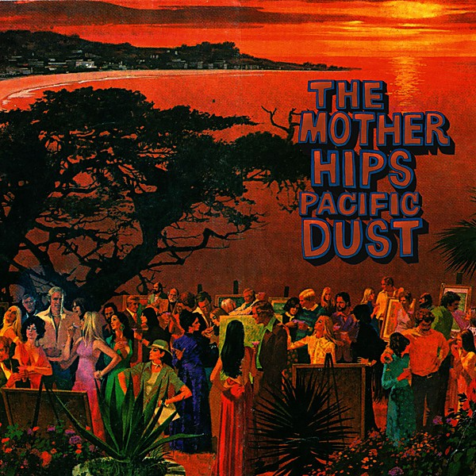

# Pacific Dust

By **The Mother Hips**

## Album Data

- **Catalog:** Beets
- **Format:** Digital, Album
- **Album:** Pacific Dust
- **Artist:** The Mother Hips
- **Albumartist:** The Mother Hips
- **Genre:** Rock
- **MusicBrainz Album Artist ID:** [ae97dec5-cbbc-40be-b4d6-6673b660b3d3](https://musicbrainz.org/artist/ae97dec5-cbbc-40be-b4d6-6673b660b3d3)
- **MusicBrainz Album ID:** [f755698e-3b2b-4545-ab0b-2eaec0ed70b7](https://musicbrainz.org/release/f755698e-3b2b-4545-ab0b-2eaec0ed70b7)
- **MusicBrainz Release Group ID:** [0bcfcb16-cb00-4d0e-afee-91b41471e2a4](https://musicbrainz.org/release-group/0bcfcb16-cb00-4d0e-afee-91b41471e2a4)
- **Year:** 2009
- **Catalog #:** 
- **Label:** Camera Records
- **Total Tracks:** 11

## Album Tracks

### Track 01 - White Falcon Fuzz

- **Artist:** The Mother Hips
- **Format:** AAC
- **Genre:** Rock
- **Length:** 4:18
- **MusicBrainz Track ID:** [2e9d272d-daa9-4740-93a3-bcf340bd9ca9](https://musicbrainz.org/recording/2e9d272d-daa9-4740-93a3-bcf340bd9ca9)
- **Title:** White Falcon Fuzz
- **Track:** 01
- **Year:** 2009

### Track 02 - Third Floor Story

- **Artist:** The Mother Hips
- **Format:** AAC
- **Genre:** Rock
- **Length:** 3:08
- **MusicBrainz Track ID:** [1c1340f3-3a52-416e-be63-6f9da17a0684](https://musicbrainz.org/recording/1c1340f3-3a52-416e-be63-6f9da17a0684)
- **Title:** Third Floor Story
- **Track:** 02
- **Year:** 2009

### Track 03 - Jess OXOX

- **Artist:** The Mother Hips
- **Format:** AAC
- **Genre:** Rock
- **Length:** 3:36
- **MusicBrainz Track ID:** [84c394bb-eef0-4dcf-9ba5-a264b2f26985](https://musicbrainz.org/recording/84c394bb-eef0-4dcf-9ba5-a264b2f26985)
- **Title:** Jess OXOX
- **Track:** 03
- **Year:** 2009

### Track 04 - The Lion and the Bull

- **Artist:** The Mother Hips
- **Format:** AAC
- **Genre:** Rock
- **Length:** 3:07
- **MusicBrainz Track ID:** [cd9d4f23-9d33-4248-83e2-7e321cb6b23f](https://musicbrainz.org/recording/cd9d4f23-9d33-4248-83e2-7e321cb6b23f)
- **Title:** The Lion and the Bull
- **Track:** 04
- **Year:** 2009

### Track 05 - One Way Out

- **Artist:** The Mother Hips
- **Format:** AAC
- **Genre:** Rock
- **Length:** 3:34
- **MusicBrainz Track ID:** [9106baca-2312-4df4-b5a1-2e9475e8a262](https://musicbrainz.org/recording/9106baca-2312-4df4-b5a1-2e9475e8a262)
- **Title:** One Way Out
- **Track:** 05
- **Year:** 2009

### Track 06 - All in Favor

- **Artist:** The Mother Hips
- **Format:** AAC
- **Genre:** Rock
- **Length:** 4:09
- **MusicBrainz Track ID:** [657a6982-0774-4f65-8dbe-2551493da70b](https://musicbrainz.org/recording/657a6982-0774-4f65-8dbe-2551493da70b)
- **Title:** All in Favor
- **Track:** 06
- **Year:** 2009

### Track 07 - Pacific Dust

- **Artist:** The Mother Hips
- **Format:** AAC
- **Genre:** Rock
- **Length:** 6:06
- **MusicBrainz Track ID:** [f66643c3-9c45-4213-8366-d932cca4e8fd](https://musicbrainz.org/recording/f66643c3-9c45-4213-8366-d932cca4e8fd)
- **Title:** Pacific Dust
- **Track:** 07
- **Year:** 2009

### Track 08 - Young Charles Ives

- **Artist:** The Mother Hips
- **Format:** AAC
- **Genre:** Rock
- **Length:** 4:40
- **MusicBrainz Track ID:** [95f5d4d6-24b3-4dea-9c48-f2b5e2fe563d](https://musicbrainz.org/recording/95f5d4d6-24b3-4dea-9c48-f2b5e2fe563d)
- **Title:** Young Charles Ives
- **Track:** 08
- **Year:** 2009

### Track 09 - Are You Free

- **Artist:** The Mother Hips
- **Format:** AAC
- **Genre:** Rock
- **Length:** 3:27
- **MusicBrainz Track ID:** [6cab5078-42d8-4905-bf4d-d2d52b8b77fa](https://musicbrainz.org/recording/6cab5078-42d8-4905-bf4d-d2d52b8b77fa)
- **Title:** Are You Free
- **Track:** 09
- **Year:** 2009

### Track 10 - Bandit Boy

- **Artist:** The Mother Hips
- **Format:** AAC
- **Genre:** Rock
- **Length:** 3:33
- **MusicBrainz Track ID:** [acf24a36-6f53-4110-a1ca-560be5fdf619](https://musicbrainz.org/recording/acf24a36-6f53-4110-a1ca-560be5fdf619)
- **Title:** Bandit Boy
- **Track:** 10
- **Year:** 2009

### Track 11 - Cheer Up Champ

- **Artist:** The Mother Hips
- **Format:** AAC
- **Genre:** Rock
- **Length:** 7:37
- **MusicBrainz Track ID:** [13ca1206-f948-45f0-9b5a-85a254ad165e](https://musicbrainz.org/recording/13ca1206-f948-45f0-9b5a-85a254ad165e)
- **Title:** Cheer Up Champ
- **Track:** 11
- **Year:** 2009

## See also

- [Behind Beyond](Behind_Beyond.md)
