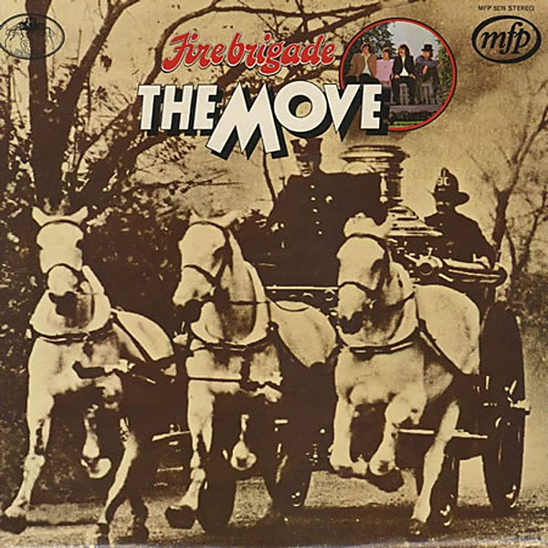

# Fire Brigade

By **The Move**

## Album Data

- **Catalog:** Beets
- **Format:** Digital, Album
- **Album:** Fire Brigade
- **Artist:** The Move
- **Albumartist:** The Move
- **Genre:** Psychedelic Rock
- **MusicBrainz Album Artist ID:** [2a3adca8-59ea-4180-beae-015eebf03328](https://musicbrainz.org/artist/2a3adca8-59ea-4180-beae-015eebf03328)
- **MusicBrainz Album ID:** [26b6abb1-088c-4b26-a314-370712e00611](https://musicbrainz.org/release/26b6abb1-088c-4b26-a314-370712e00611)
- **MusicBrainz Release Group ID:** [c36286b7-8d69-4556-86e7-26f911734196](https://musicbrainz.org/release-group/c36286b7-8d69-4556-86e7-26f911734196)
- **Year:** 1972
- **Catalog #:** ST-658
- **Label:** Capitol Records
- **Total Tracks:** 07

## Album Tracks

### Track 01 - Looking On

- **Artist:** The Move
- **Format:** MP3
- **Genre:** Psychedelic Rock
- **Length:** 7:54
- **MusicBrainz Track ID:** [e8047c5e-c0ca-4e91-bc10-e766e2a523aa](https://musicbrainz.org/recording/e8047c5e-c0ca-4e91-bc10-e766e2a523aa)
- **Title:** Looking On
- **Track:** 01
- **Year:** 1970

### Track 02 - Turkish Tram Conductor Blues

- **Artist:** The Move
- **Format:** MP3
- **Genre:** Hard Rock
- **Length:** 4:56
- **MusicBrainz Track ID:** [2d0e3004-d676-41d5-b92e-97e07580941c](https://musicbrainz.org/recording/2d0e3004-d676-41d5-b92e-97e07580941c)
- **Title:** Turkish Tram Conductor Blues
- **Track:** 02
- **Year:** 1970

### Track 03 - What?

- **Artist:** The Move
- **Format:** MP3
- **Genre:** Acid Rock
- **Length:** 6:49
- **MusicBrainz Track ID:** [6eff4311-780b-47d4-a210-c21254f296dd](https://musicbrainz.org/recording/6eff4311-780b-47d4-a210-c21254f296dd)
- **Title:** What?
- **Track:** 03
- **Year:** 1970

### Track 04 - When Alice Comes Back to the Farm

- **Artist:** The Move
- **Format:** MP3
- **Genre:** Acid Rock
- **Length:** 3:47
- **MusicBrainz Track ID:** [52d6b9d5-c3c0-4f2b-b457-4940b9620608](https://musicbrainz.org/recording/52d6b9d5-c3c0-4f2b-b457-4940b9620608)
- **Title:** When Alice Comes Back to the Farm
- **Track:** 04
- **Year:** 1970

### Track 05 - Open Up Said the World at the Door

- **Artist:** The Move
- **Format:** MP3
- **Genre:** Progressive Rock
- **Length:** 7:21
- **MusicBrainz Track ID:** [d95fdfcf-153c-4c97-a081-246b3376a8dd](https://musicbrainz.org/recording/d95fdfcf-153c-4c97-a081-246b3376a8dd)
- **Title:** Open Up Said the World at the Door
- **Track:** 05
- **Year:** 1970

### Track 06 - Brontosaurus

- **Artist:** The Move
- **Format:** MP3
- **Genre:** Acid Rock
- **Length:** 4:35
- **MusicBrainz Track ID:** [26c41053-0800-4a7f-abf2-15e103fe0a4b](https://musicbrainz.org/recording/26c41053-0800-4a7f-abf2-15e103fe0a4b)
- **Title:** Brontosaurus
- **Track:** 06
- **Year:** 1970

### Track 07 - Feel Too Good

- **Artist:** The Move
- **Format:** MP3
- **Genre:** Acid Rock
- **Length:** 9:48
- **MusicBrainz Track ID:** [6aabe166-a42c-4f85-866e-a5e06a1e5ff2](https://musicbrainz.org/recording/6aabe166-a42c-4f85-866e-a5e06a1e5ff2)
- **Title:** Feel Too Good
- **Track:** 07
- **Year:** 1970

## See also

- [Live at the Fillmore 1969](Live_at_the_Fillmore_1969.md)
- [Looking On](Looking_On.md)
- [Message From the Country](Message_From_the_Country.md)
- [Roon: Shazam](../../Roon/The_Move/Shazam.md)
- [Vinyl: Fire Brigade](../../Vinyl/The_Move/Fire_Brigade.md)
- [Vinyl: Looking On](../../Vinyl/The_Move/Looking_On.md)
- [Vinyl: ](../../Vinyl/The_Move/The_Move.md)
