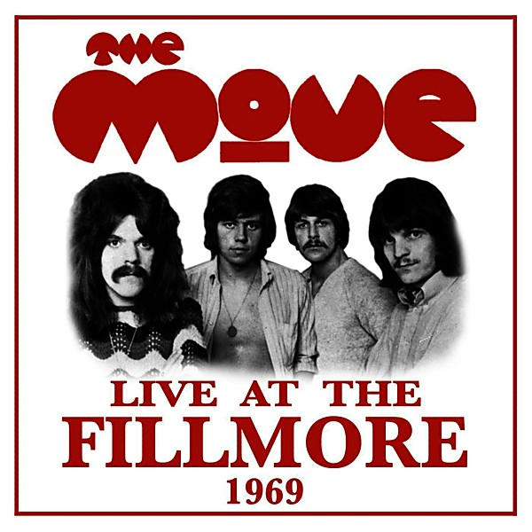

# Live at the Fillmore 1969

By **The Move**

## Album Data

- **Catalog:** Beets
- **Format:** Digital, Album
- **Album:** Live at the Fillmore 1969
- **Artist:** The Move
- **Albumartist:** The Move
- **Genre:** Psychedelic Rock
- **MusicBrainz Album Artist ID:** 
- **MusicBrainz Album ID:** 
- **MusicBrainz Release Group ID:** 
- **Year:** 1969
- **Catalog #:** 
- **Label:** 
- **Total Tracks:** 00

## Album Tracks

### Track 01 - Open My Eyes

- **Artist:** The Move
- **Format:** MP3
- **Genre:** Psychedelic Rock
- **Length:** 6:58
- **MusicBrainz Track ID:** 
- **Title:** Open My Eyes
- **Track:** 01
- **Year:** 1969

### Track 02 - Don't Make My Baby Blue

- **Artist:** The Move
- **Format:** MP3
- **Genre:** Psychedelic Rock
- **Length:** 5:36
- **MusicBrainz Track ID:** 
- **Title:** Don't Make My Baby Blue
- **Track:** 02
- **Year:** 1969

### Track 03 - Cherry Blossom Clinic Revisited

- **Artist:** The Move
- **Format:** MP3
- **Genre:** Psychedelic Rock
- **Length:** 8:13
- **MusicBrainz Track ID:** 
- **Title:** Cherry Blossom Clinic Revisited
- **Track:** 03
- **Year:** 1969

### Track 04 - The Last Thing on My Mind

- **Artist:** The Move
- **Format:** MP3
- **Genre:** Rock
- **Length:** 8:14
- **MusicBrainz Track ID:** 
- **Title:** The Last Thing on My Mind
- **Track:** 04
- **Year:** 1969

### Track 05 - I Can Hear the Grass Grow

- **Artist:** The Move
- **Format:** MP3
- **Genre:** Psychedelic Rock
- **Length:** 10:37
- **MusicBrainz Track ID:** 
- **Title:** I Can Hear the Grass Grow
- **Track:** 05
- **Year:** 1969

### Track 06 - Fields of People

- **Artist:** The Move
- **Format:** MP3
- **Genre:** Psychedelic Rock
- **Length:** 16:42
- **MusicBrainz Track ID:** 
- **Title:** Fields of People
- **Track:** 06
- **Year:** 1969

### Track 07 - Goin' Back

- **Artist:** The Move
- **Format:** MP3
- **Genre:** Psychedelic Rock
- **Length:** 6:32
- **MusicBrainz Track ID:** 
- **Title:** Goin' Back
- **Track:** 07
- **Year:** 1969

### Track 08 - Hello Susie

- **Artist:** The Move
- **Format:** MP3
- **Genre:** Hard Rock
- **Length:** 6:13
- **MusicBrainz Track ID:** 
- **Title:** Hello Susie
- **Track:** 08
- **Year:** 1969

### Track 09 - Under the Ice

- **Artist:** The Move
- **Format:** MP3
- **Genre:** Psychedelic Rock
- **Length:** 14:41
- **MusicBrainz Track ID:** 
- **Title:** Under the Ice
- **Track:** 09
- **Year:** 1969

## See also

- [Fire Brigade](Fire_Brigade.md)
- [Looking On](Looking_On.md)
- [Message From the Country](Message_From_the_Country.md)
- [Roon: Shazam](../../Roon/The_Move/Shazam.md)
- [Vinyl: Fire Brigade](../../Vinyl/The_Move/Fire_Brigade.md)
- [Vinyl: Looking On](../../Vinyl/The_Move/Looking_On.md)
- [Vinyl: ](../../Vinyl/The_Move/The_Move.md)
