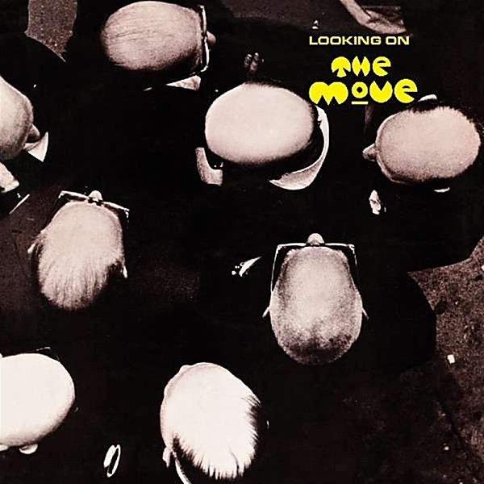

# Looking On

By **The Move**

## Album Data

- **Catalog:** Beets
- **Format:** Digital, Album
- **Album:** Looking On
- **Artist:** The Move
- **Albumartist:** The Move
- **Genre:** Psychedelic Rock
- **MusicBrainz Album Artist ID:** [2a3adca8-59ea-4180-beae-015eebf03328](https://musicbrainz.org/artist/2a3adca8-59ea-4180-beae-015eebf03328)
- **MusicBrainz Album ID:** [2d1b23e5-e3d2-3de5-b520-f7b25f23f910](https://musicbrainz.org/release/2d1b23e5-e3d2-3de5-b520-f7b25f23f910)
- **MusicBrainz Release Group ID:** [043ebd5a-0aed-35b8-b1b4-08a10be1d4fd](https://musicbrainz.org/release-group/043ebd5a-0aed-35b8-b1b4-08a10be1d4fd)
- **Year:** 1970
- **Catalog #:** BGOCD238
- **Label:** Beat Goes On Records
- **Total Tracks:** 10

## Album Tracks

### Track 01 - Message From the Country

- **Artist:** The Move
- **Format:** ALAC
- **Genre:** Psychedelic Rock
- **Length:** 4:52
- **MusicBrainz Track ID:** [0a0aa8a7-9576-46bd-93de-19c2cc4faea1](https://musicbrainz.org/recording/0a0aa8a7-9576-46bd-93de-19c2cc4faea1)
- **Title:** Message From the Country
- **Track:** 01
- **Year:** 1994

### Track 02 - Ella James

- **Artist:** The Move
- **Format:** ALAC
- **Genre:** Power Pop
- **Length:** 3:17
- **MusicBrainz Track ID:** [799b2309-6970-4dc7-912d-e9454d6b53fe](https://musicbrainz.org/recording/799b2309-6970-4dc7-912d-e9454d6b53fe)
- **Title:** Ella James
- **Track:** 02
- **Year:** 1994

### Track 03 - No Time

- **Artist:** The Move
- **Format:** ALAC
- **Genre:** Acid Rock
- **Length:** 3:44
- **MusicBrainz Track ID:** [bf90d2c5-e80f-460d-951e-7d528f52399c](https://musicbrainz.org/recording/bf90d2c5-e80f-460d-951e-7d528f52399c)
- **Title:** No Time
- **Track:** 03
- **Year:** 1994

### Track 04 - Don’t Mess Me Up

- **Artist:** The Move
- **Format:** ALAC
- **Genre:** Rock
- **Length:** 3:15
- **MusicBrainz Track ID:** [615c0621-b49b-43a1-81df-c60d655c9896](https://musicbrainz.org/recording/615c0621-b49b-43a1-81df-c60d655c9896)
- **Title:** Don’t Mess Me Up
- **Track:** 04
- **Year:** 1994

### Track 05 - Until Your Mama’s Gone

- **Artist:** The Move
- **Format:** ALAC
- **Genre:** Rock
- **Length:** 5:08
- **MusicBrainz Track ID:** [526ff281-452a-4072-8ae7-0a21df9873eb](https://musicbrainz.org/recording/526ff281-452a-4072-8ae7-0a21df9873eb)
- **Title:** Until Your Mama’s Gone
- **Track:** 05
- **Year:** 1994

### Track 06 - It Wasn’t My Idea to Dance

- **Artist:** The Move
- **Format:** ALAC
- **Genre:** Rock
- **Length:** 5:33
- **MusicBrainz Track ID:** [97c879da-01f3-4dcc-b482-5e3dbf86435b](https://musicbrainz.org/recording/97c879da-01f3-4dcc-b482-5e3dbf86435b)
- **Title:** It Wasn’t My Idea to Dance
- **Track:** 06
- **Year:** 1994

### Track 07 - The Minister

- **Artist:** The Move
- **Format:** ALAC
- **Genre:** Power Metal
- **Length:** 4:33
- **MusicBrainz Track ID:** [2ff3b339-b9c8-46da-a324-337b14ca4954](https://musicbrainz.org/recording/2ff3b339-b9c8-46da-a324-337b14ca4954)
- **Title:** The Minister
- **Track:** 07
- **Year:** 1994

### Track 08 - Ben Crawley Steel Company

- **Artist:** The Move
- **Format:** ALAC
- **Genre:** Country
- **Length:** 3:07
- **MusicBrainz Track ID:** [6307d0f4-608b-4e2d-b847-fea8f126aedd](https://musicbrainz.org/recording/6307d0f4-608b-4e2d-b847-fea8f126aedd)
- **Title:** Ben Crawley Steel Company
- **Track:** 08
- **Year:** 1994

### Track 09 - The Words of Aaron

- **Artist:** The Move
- **Format:** ALAC
- **Genre:** Art Rock
- **Length:** 5:31
- **MusicBrainz Track ID:** [8f41e08a-b126-48c5-892a-a6bbcb6f8405](https://musicbrainz.org/recording/8f41e08a-b126-48c5-892a-a6bbcb6f8405)
- **Title:** The Words of Aaron
- **Track:** 09
- **Year:** 1994

### Track 10 - My Marge

- **Artist:** The Move
- **Format:** ALAC
- **Genre:** Rock
- **Length:** 2:00
- **MusicBrainz Track ID:** [f1270bf1-1e14-416a-ae94-cdd0f9c74a2f](https://musicbrainz.org/recording/f1270bf1-1e14-416a-ae94-cdd0f9c74a2f)
- **Title:** My Marge
- **Track:** 10
- **Year:** 1994

## See also

- [Fire Brigade](Fire_Brigade.md)
- [Live at the Fillmore 1969](Live_at_the_Fillmore_1969.md)
- [Message From the Country](Message_From_the_Country.md)
- [Roon: Shazam](../../Roon/The_Move/Shazam.md)
- [Vinyl: Fire Brigade](../../Vinyl/The_Move/Fire_Brigade.md)
- [Vinyl: Looking On](../../Vinyl/The_Move/Looking_On.md)
- [Vinyl: ](../../Vinyl/The_Move/The_Move.md)
