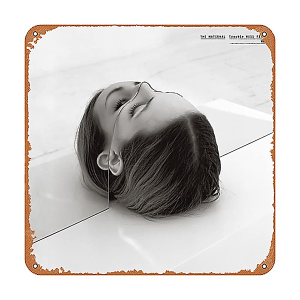

# Trouble Will Find Me

By **The National**

## Album Data

- **Catalog:** Beets
- **Format:** Digital, Album
- **Album:** Trouble Will Find Me
- **Artist:** The National
- **Albumartist:** The National
- **Genre:** Indie Rock
- **MusicBrainz Album Artist ID:** [664c3e0e-42d8-48c1-b209-1efca19c0325](https://musicbrainz.org/artist/664c3e0e-42d8-48c1-b209-1efca19c0325)
- **MusicBrainz Album ID:** [41bba3ad-daeb-4f58-803c-21905fdfe961](https://musicbrainz.org/release/41bba3ad-daeb-4f58-803c-21905fdfe961)
- **MusicBrainz Release Group ID:** [a5a2875f-41cb-4c48-9a72-e845d224db96](https://musicbrainz.org/release-group/a5a2875f-41cb-4c48-9a72-e845d224db96)
- **Year:** 2013
- **Catalog #:** EAD3315A
- **Label:** 4AD
- **Total Tracks:** 13

## Album Tracks

### Track 01 - I Should Live in Salt

- **Artist:** The National
- **Format:** AAC
- **Genre:** Orchestral
- **Length:** 4:08
- **MusicBrainz Track ID:** [11c2f2dc-80f4-4d19-8d19-ab5195bf322f](https://musicbrainz.org/recording/11c2f2dc-80f4-4d19-8d19-ab5195bf322f)
- **Title:** I Should Live in Salt
- **Track:** 01
- **Year:** 2013

### Track 02 - Demons

- **Artist:** The National
- **Format:** AAC
- **Genre:** Indie Rock
- **Length:** 3:31
- **MusicBrainz Track ID:** [46553869-a91a-489f-8694-b3cb8bc1e3c5](https://musicbrainz.org/recording/46553869-a91a-489f-8694-b3cb8bc1e3c5)
- **Title:** Demons
- **Track:** 02
- **Year:** 2013

### Track 03 - Don’t Swallow the Cap

- **Artist:** The National
- **Format:** AAC
- **Genre:** Indie Rock
- **Length:** 4:45
- **MusicBrainz Track ID:** [aab3b236-abf6-4f45-b87f-bff4e376727f](https://musicbrainz.org/recording/aab3b236-abf6-4f45-b87f-bff4e376727f)
- **Title:** Don’t Swallow the Cap
- **Track:** 03
- **Year:** 2013

### Track 04 - Fireproof

- **Artist:** The National
- **Format:** AAC
- **Genre:** Indie Rock
- **Length:** 2:58
- **MusicBrainz Track ID:** [0213088d-0d72-4fff-a803-feff7f7faaf7](https://musicbrainz.org/recording/0213088d-0d72-4fff-a803-feff7f7faaf7)
- **Title:** Fireproof
- **Track:** 04
- **Year:** 2013

### Track 05 - Sea of Love

- **Artist:** The National
- **Format:** AAC
- **Genre:** Indie Rock
- **Length:** 3:41
- **MusicBrainz Track ID:** [a1703857-b739-4bba-9842-5d1390c1cbf3](https://musicbrainz.org/recording/a1703857-b739-4bba-9842-5d1390c1cbf3)
- **Title:** Sea of Love
- **Track:** 05
- **Year:** 2013

### Track 06 - Heavenfaced

- **Artist:** The National
- **Format:** AAC
- **Genre:** Indie Rock
- **Length:** 4:23
- **MusicBrainz Track ID:** [85a40a2a-4f4e-4907-bccc-6988c0f151e1](https://musicbrainz.org/recording/85a40a2a-4f4e-4907-bccc-6988c0f151e1)
- **Title:** Heavenfaced
- **Track:** 06
- **Year:** 2013

### Track 07 - This Is the Last Time

- **Artist:** The National
- **Format:** AAC
- **Genre:** Indie Rock
- **Length:** 4:43
- **MusicBrainz Track ID:** [149a8fba-a683-4015-8f36-2dcd62121feb](https://musicbrainz.org/recording/149a8fba-a683-4015-8f36-2dcd62121feb)
- **Title:** This Is the Last Time
- **Track:** 07
- **Year:** 2013

### Track 08 - Graceless

- **Artist:** The National
- **Format:** AAC
- **Genre:** Indie Rock
- **Length:** 4:35
- **MusicBrainz Track ID:** [9b97d9ad-ca8c-445d-ab88-fef4c2b27d6d](https://musicbrainz.org/recording/9b97d9ad-ca8c-445d-ab88-fef4c2b27d6d)
- **Title:** Graceless
- **Track:** 08
- **Year:** 2013

### Track 09 - Slipped

- **Artist:** The National
- **Format:** AAC
- **Genre:** Indie Rock
- **Length:** 4:25
- **MusicBrainz Track ID:** [0458fa8a-a2bc-4bc6-b11f-1d44ebab63bb](https://musicbrainz.org/recording/0458fa8a-a2bc-4bc6-b11f-1d44ebab63bb)
- **Title:** Slipped
- **Track:** 09
- **Year:** 2013

### Track 10 - I Need My Girl

- **Artist:** The National
- **Format:** AAC
- **Genre:** Indie Rock
- **Length:** 4:05
- **MusicBrainz Track ID:** [21c30ce3-843d-4837-9fa1-4de95d638e65](https://musicbrainz.org/recording/21c30ce3-843d-4837-9fa1-4de95d638e65)
- **Title:** I Need My Girl
- **Track:** 10
- **Year:** 2013

### Track 11 - Humiliation

- **Artist:** The National
- **Format:** AAC
- **Genre:** Indie Rock
- **Length:** 5:00
- **MusicBrainz Track ID:** [b1279514-5f75-4028-82f2-a5943d464b70](https://musicbrainz.org/recording/b1279514-5f75-4028-82f2-a5943d464b70)
- **Title:** Humiliation
- **Track:** 11
- **Year:** 2013

### Track 12 - Pink Rabbits

- **Artist:** The National
- **Format:** AAC
- **Genre:** Indie Rock
- **Length:** 4:36
- **MusicBrainz Track ID:** [fd7a7b6e-6774-495b-a1d6-99fb7d5cbdd2](https://musicbrainz.org/recording/fd7a7b6e-6774-495b-a1d6-99fb7d5cbdd2)
- **Title:** Pink Rabbits
- **Track:** 12
- **Year:** 2013

### Track 13 - Hard to Find

- **Artist:** The National
- **Format:** AAC
- **Genre:** Indie Rock
- **Length:** 4:13
- **MusicBrainz Track ID:** [240bd611-7470-41f9-b6a4-604567dfcbee](https://musicbrainz.org/recording/240bd611-7470-41f9-b6a4-604567dfcbee)
- **Title:** Hard to Find
- **Track:** 13
- **Year:** 2013

