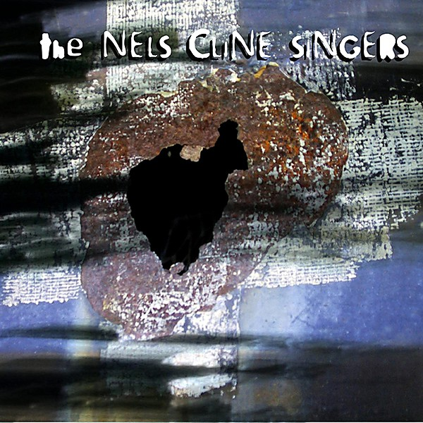

# Instrumentals

By **The Nels Cline Singers**

## Album Data

- **Catalog:** Beets
- **Format:** Digital, Album
- **Album:** Instrumentals
- **Artist:** The Nels Cline Singers
- **Albumartist:** The Nels Cline Singers
- **Genre:** Free Jazz
- **MusicBrainz Album Artist ID:** [fd23ad56-2afd-4173-90d9-2a8c1024d66f](https://musicbrainz.org/artist/fd23ad56-2afd-4173-90d9-2a8c1024d66f)
- **MusicBrainz Album ID:** [fb4be65b-1b16-4413-834a-b71db8d64fad](https://musicbrainz.org/release/fb4be65b-1b16-4413-834a-b71db8d64fad)
- **MusicBrainz Release Group ID:** [45b34a80-f846-37e1-b850-9aafa6a96a86](https://musicbrainz.org/release-group/45b34a80-f846-37e1-b850-9aafa6a96a86)
- **Year:** 2002
- **Catalog #:** 
- **Label:** Cryptogramophone
- **Total Tracks:** 09

## Album Tracks

### Track 01 - A Mug Like Mine

- **Artist:** The Nels Cline Singers
- **Format:** MP3
- **Genre:** Free Jazz
- **Length:** 9:03
- **MusicBrainz Track ID:** [c43979e7-ced2-4daa-aee3-10a0bbf9ede3](https://musicbrainz.org/recording/c43979e7-ced2-4daa-aee3-10a0bbf9ede3)
- **Title:** A Mug Like Mine
- **Track:** 01
- **Year:** 2002

### Track 02 - Cause for Concern

- **Artist:** The Nels Cline Singers
- **Format:** MP3
- **Genre:** Free Jazz
- **Length:** 4:22
- **MusicBrainz Track ID:** [56eeeac0-2aff-42df-bfed-6e9de9a46b5a](https://musicbrainz.org/recording/56eeeac0-2aff-42df-bfed-6e9de9a46b5a)
- **Title:** Cause for Concern
- **Track:** 02
- **Year:** 2002

### Track 03 - Suspended Head

- **Artist:** The Nels Cline Singers
- **Format:** MP3
- **Genre:** Jazz
- **Length:** 6:41
- **MusicBrainz Track ID:** [798913a3-489c-4829-aa18-9cffca530934](https://musicbrainz.org/recording/798913a3-489c-4829-aa18-9cffca530934)
- **Title:** Suspended Head
- **Track:** 03
- **Year:** 2002

### Track 04 - Harbor Child

- **Artist:** The Nels Cline Singers
- **Format:** MP3
- **Genre:** Free Jazz
- **Length:** 6:10
- **MusicBrainz Track ID:** [afbb6629-61a7-486e-a754-91aa48d36705](https://musicbrainz.org/recording/afbb6629-61a7-486e-a754-91aa48d36705)
- **Title:** Harbor Child
- **Track:** 04
- **Year:** 2002

### Track 05 - Lowered Boom

- **Artist:** The Nels Cline Singers
- **Format:** MP3
- **Genre:** Free Jazz
- **Length:** 6:46
- **MusicBrainz Track ID:** [cd3714e8-f487-4bde-96a2-6af0219ba914](https://musicbrainz.org/recording/cd3714e8-f487-4bde-96a2-6af0219ba914)
- **Title:** Lowered Boom
- **Track:** 05
- **Year:** 2002

### Track 06 - Lucia

- **Artist:** The Nels Cline Singers
- **Format:** MP3
- **Genre:** Jazz
- **Length:** 12:37
- **MusicBrainz Track ID:** [3c805765-6d69-46d9-b325-cb787d18f629](https://musicbrainz.org/recording/3c805765-6d69-46d9-b325-cb787d18f629)
- **Title:** Lucia
- **Track:** 06
- **Year:** 2002

### Track 07 - Ghost of the Pinata

- **Artist:** The Nels Cline Singers
- **Format:** MP3
- **Genre:** Jazz Fusion
- **Length:** 7:46
- **MusicBrainz Track ID:** [274b8198-f4a7-4b85-9756-58dfaae5e4d6](https://musicbrainz.org/recording/274b8198-f4a7-4b85-9756-58dfaae5e4d6)
- **Title:** Ghost of the Pinata
- **Track:** 07
- **Year:** 2002

### Track 08 - Blood Drawing

- **Artist:** The Nels Cline Singers
- **Format:** MP3
- **Genre:** Free Jazz
- **Length:** 15:26
- **MusicBrainz Track ID:** [7486fecd-32f6-4999-9380-187186ce0fe4](https://musicbrainz.org/recording/7486fecd-32f6-4999-9380-187186ce0fe4)
- **Title:** Blood Drawing
- **Track:** 08
- **Year:** 2002

### Track 09 - Slipped Away

- **Artist:** The Nels Cline Singers
- **Format:** MP3
- **Genre:** Jazz Fusion
- **Length:** 7:52
- **MusicBrainz Track ID:** [66bf59c3-331d-41ba-9494-29aaa8ed43c0](https://musicbrainz.org/recording/66bf59c3-331d-41ba-9494-29aaa8ed43c0)
- **Title:** Slipped Away
- **Track:** 09
- **Year:** 2002

