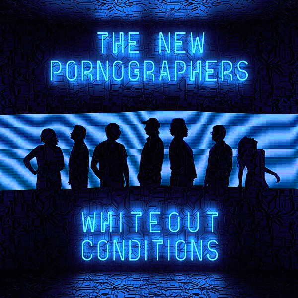

# Whiteout Conditions

By **The New Pornographers**

## Album Data

- **Catalog:** Beets
- **Format:** Digital, Album
- **Album:** Whiteout Conditions
- **Artist:** The New Pornographers
- **Albumartist:** The New Pornographers
- **Genre:** Indie Rock
- **MusicBrainz Album Artist ID:** [25b75a66-ce83-4db3-b136-395a3c3784c4](https://musicbrainz.org/artist/25b75a66-ce83-4db3-b136-395a3c3784c4)
- **MusicBrainz Album ID:** [1ab61d19-af4f-46a7-9f34-88048a927b07](https://musicbrainz.org/release/1ab61d19-af4f-46a7-9f34-88048a927b07)
- **MusicBrainz Release Group ID:** [f81fe6df-733a-42d7-9987-f0aded301b3c](https://musicbrainz.org/release-group/f81fe6df-733a-42d7-9987-f0aded301b3c)
- **Year:** 2017
- **Catalog #:** 
- **Label:** Matador Records
- **Total Tracks:** 14

## Album Tracks

### Track 01 - Twin Cinema

- **Artist:** The New Pornographers
- **Format:** ALAC
- **Genre:** Indie Rock
- **Length:** 2:59
- **MusicBrainz Track ID:** [https](https://musicbrainz.org/recording/https)
- **Title:** Twin Cinema
- **Track:** 01
- **Year:** 2005

### Track 02 - The Bones Of An Idol

- **Artist:** The New Pornographers
- **Format:** ALAC
- **Genre:** Indie Rock
- **Length:** 2:51
- **MusicBrainz Track ID:** [https](https://musicbrainz.org/recording/https)
- **Title:** The Bones Of An Idol
- **Track:** 02
- **Year:** 2005

### Track 03 - Use It

- **Artist:** The New Pornographers
- **Format:** ALAC
- **Genre:** Indie Rock
- **Length:** 3:26
- **MusicBrainz Track ID:** [https](https://musicbrainz.org/recording/https)
- **Title:** Use It
- **Track:** 03
- **Year:** 2005

### Track 04 - The Bleeding Heart Show

- **Artist:** The New Pornographers
- **Format:** ALAC
- **Genre:** Indie Rock
- **Length:** 4:27
- **MusicBrainz Track ID:** [https](https://musicbrainz.org/recording/https)
- **Title:** The Bleeding Heart Show
- **Track:** 04
- **Year:** 2005

### Track 05 - Jackie, Dressed In Cobras

- **Artist:** The New Pornographers
- **Format:** ALAC
- **Genre:** Indie Rock
- **Length:** 3:06
- **MusicBrainz Track ID:** [https](https://musicbrainz.org/recording/https)
- **Title:** Jackie, Dressed In Cobras
- **Track:** 05
- **Year:** 2005

### Track 06 - The Jessica Numbers

- **Artist:** The New Pornographers
- **Format:** ALAC
- **Genre:** Indie Rock
- **Length:** 3:06
- **MusicBrainz Track ID:** [https](https://musicbrainz.org/recording/https)
- **Title:** The Jessica Numbers
- **Track:** 06
- **Year:** 2005

### Track 07 - These Are The Fables

- **Artist:** The New Pornographers
- **Format:** ALAC
- **Genre:** Indie Rock
- **Length:** 3:29
- **MusicBrainz Track ID:** [https](https://musicbrainz.org/recording/https)
- **Title:** These Are The Fables
- **Track:** 07
- **Year:** 2005

### Track 08 - Sing Me Spanish Techno

- **Artist:** The New Pornographers
- **Format:** ALAC
- **Genre:** Indie Rock
- **Length:** 4:16
- **MusicBrainz Track ID:** [https](https://musicbrainz.org/recording/https)
- **Title:** Sing Me Spanish Techno
- **Track:** 08
- **Year:** 2005

### Track 09 - Falling Through Your Clothes

- **Artist:** The New Pornographers
- **Format:** ALAC
- **Genre:** Indie Rock
- **Length:** 2:53
- **MusicBrainz Track ID:** [https](https://musicbrainz.org/recording/https)
- **Title:** Falling Through Your Clothes
- **Track:** 09
- **Year:** 2005

### Track 10 - Broken Beads

- **Artist:** The New Pornographers
- **Format:** ALAC
- **Genre:** Indie Rock
- **Length:** 3:00
- **MusicBrainz Track ID:** [https](https://musicbrainz.org/recording/https)
- **Title:** Broken Beads
- **Track:** 10
- **Year:** 2005

### Track 11 - Three Or Four

- **Artist:** The New Pornographers
- **Format:** ALAC
- **Genre:** Indie Rock
- **Length:** 3:07
- **MusicBrainz Track ID:** [https](https://musicbrainz.org/recording/https)
- **Title:** Three Or Four
- **Track:** 11
- **Year:** 2005

### Track 12 - Star Bodies

- **Artist:** The New Pornographers
- **Format:** ALAC
- **Genre:** Indie Rock
- **Length:** 4:07
- **MusicBrainz Track ID:** [https](https://musicbrainz.org/recording/https)
- **Title:** Star Bodies
- **Track:** 12
- **Year:** 2005

### Track 13 - Streets Of Fire

- **Artist:** The New Pornographers
- **Format:** ALAC
- **Genre:** Indie Rock
- **Length:** 2:41
- **MusicBrainz Track ID:** [https](https://musicbrainz.org/recording/https)
- **Title:** Streets Of Fire
- **Track:** 13
- **Year:** 2005

### Track 14 - Stacked Crooked

- **Artist:** The New Pornographers
- **Format:** ALAC
- **Genre:** Indie Rock
- **Length:** 4:18
- **MusicBrainz Track ID:** [https](https://musicbrainz.org/recording/https)
- **Title:** Stacked Crooked
- **Track:** 14
- **Year:** 2005

## See also

- [Brill Bruisers](Brill_Bruisers.md)
- [Twin Cinema](Twin_Cinema.md)
- [Roon: Brill Bruisers](../../Roon/The_New_Pornographers/Brill_Bruisers.md)
- [Roon: Challengers](../../Roon/The_New_Pornographers/Challengers.md)
- [Roon: In The Morse Code Of Brake Lights](../../Roon/The_New_Pornographers/In_The_Morse_Code_Of_Brake_Lights.md)
- [Roon: Together](../../Roon/The_New_Pornographers/Together.md)
- [Roon: Twin Cinema](../../Roon/The_New_Pornographers/Twin_Cinema.md)
- [Roon: Whiteout Conditions](../../Roon/The_New_Pornographers/Whiteout_Conditions.md)
- [Vinyl: Brill Bruisers](../../Vinyl/The_New_Pornographers/Brill_Bruisers.md)
- [Vinyl: ](../../Vinyl/The_New_Pornographers/The_New_Pornographers.md)
- [Vinyl: Whiteout Conditions](../../Vinyl/The_New_Pornographers/Whiteout_Conditions.md)
