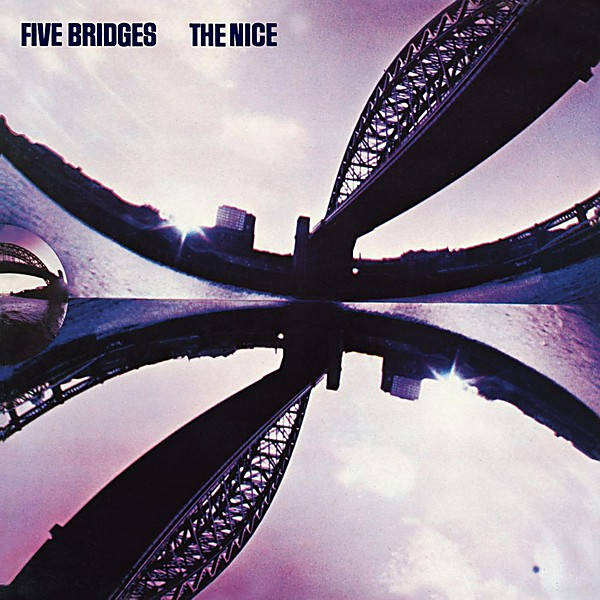

# Five Bridges

By **The Nice**

## Album Data

- **Catalog:** Beets
- **Format:** Digital, Album
- **Album:** Five Bridges
- **Artist:** The Nice
- **Albumartist:** The Nice
- **Genre:** Progressive Rock
- **MusicBrainz Album Artist ID:** 
- **MusicBrainz Album ID:** 
- **MusicBrainz Release Group ID:** 
- **Year:** 1970
- **Catalog #:** 
- **Label:** 
- **Total Tracks:** 09

## Album Tracks

### Track 01 - Fantasia 1st Bridge

- **Artist:** The Nice
- **Format:** MP3
- **Genre:** Progressive Rock
- **Length:** 6:12
- **MusicBrainz Track ID:** 
- **Title:** Fantasia 1st Bridge
- **Track:** 01
- **Year:** 1970

### Track 02 - 2nd Bridge

- **Artist:** The Nice
- **Format:** MP3
- **Genre:** Progressive Rock
- **Length:** 4:01
- **MusicBrainz Track ID:** 
- **Title:** 2nd Bridge
- **Track:** 02
- **Year:** 1970

### Track 03 - Chorale 3rd Bridge

- **Artist:** The Nice
- **Format:** MP3
- **Genre:** Progressive Rock
- **Length:** 3:34
- **MusicBrainz Track ID:** 
- **Title:** Chorale 3rd Bridge
- **Track:** 03
- **Year:** 1970

### Track 04 - High Level Fugue 4th Bridge

- **Artist:** The Nice
- **Format:** MP3
- **Genre:** Progressive Rock
- **Length:** 1:01
- **MusicBrainz Track ID:** 
- **Title:** High Level Fugue 4th Bridge
- **Track:** 04
- **Year:** 1970

### Track 05 - Finale 5th Bridge

- **Artist:** The Nice
- **Format:** MP3
- **Genre:** Progressive Rock
- **Length:** 3:30
- **MusicBrainz Track ID:** 
- **Title:** Finale 5th Bridge
- **Track:** 05
- **Year:** 1970

### Track 06 - Intermezzo 'Karelia Suite'

- **Artist:** The Nice
- **Format:** MP3
- **Genre:** Progressive Rock
- **Length:** 9:05
- **MusicBrainz Track ID:** 
- **Title:** Intermezzo 'Karelia Suite'
- **Track:** 06
- **Year:** 1970

### Track 07 - Pathetique (Symphony No. 6, 3rd Movement)

- **Artist:** The Nice
- **Format:** MP3
- **Genre:** Progressive Rock
- **Length:** 9:34
- **MusicBrainz Track ID:** 
- **Title:** Pathetique (Symphony No. 6, 3rd Movement)
- **Track:** 07
- **Year:** 1970

### Track 08 - Country Pie - Brandenburg Concerto No. 6

- **Artist:** The Nice
- **Format:** MP3
- **Genre:** Progressive Rock
- **Length:** 5:47
- **MusicBrainz Track ID:** 
- **Title:** Country Pie - Brandenburg Concerto No. 6
- **Track:** 08
- **Year:** 1970

### Track 09 - One of Those People

- **Artist:** The Nice
- **Format:** MP3
- **Genre:** Progressive Rock
- **Length:** 3:14
- **MusicBrainz Track ID:** 
- **Title:** One of Those People
- **Track:** 09
- **Year:** 1970

## See also

- [Ars Longa Vita Brevis](Ars_Longa_Vita_Brevis.md)
