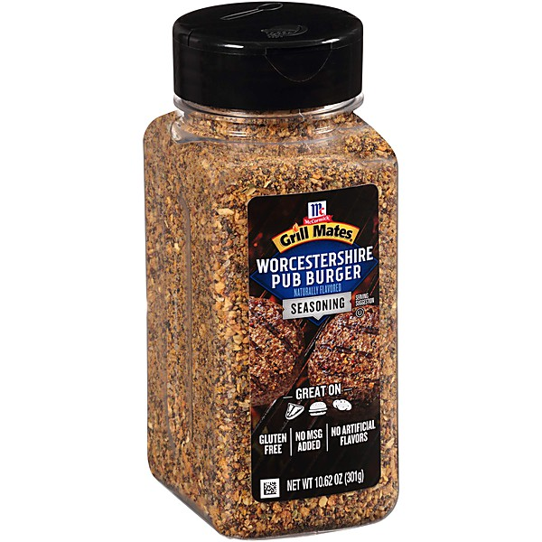

# Unknown Album

By **The Osmonds**

## Album Data

- **Catalog:** Beets
- **Format:** Digital, Album
- **Album:** Unknown Album
- **Artist:** The Osmonds
- **Albumartist:** The Osmonds
- **Genre:** Rock
- **MusicBrainz Album Artist ID:** 
- **MusicBrainz Album ID:** 
- **MusicBrainz Release Group ID:** 
- **Year:** 1971
- **Catalog #:** 
- **Label:** 
- **Total Tracks:** 00

## Album Tracks

### Track 01 - One Bad Apple

- **Artist:** The Osmonds
- **Format:** MP3
- **Genre:** Pop
- **Length:** 2:46
- **MusicBrainz Track ID:** 
- **Title:** One Bad Apple
- **Track:** 01
- **Year:** 1971

