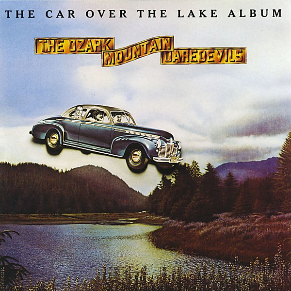

# The Car Over the Lake Album

By **The Ozark Mountain Daredevils**

## Album Data

- **Catalog:** Beets
- **Format:** Digital, Album
- **Album:** The Car Over the Lake Album
- **Artist:** The Ozark Mountain Daredevils
- **Albumartist:** The Ozark Mountain Daredevils
- **Genre:** Southern Rock
- **MusicBrainz Album Artist ID:** [24558e81-eb3f-4062-ab6a-df3773c9b09a](https://musicbrainz.org/artist/24558e81-eb3f-4062-ab6a-df3773c9b09a)
- **MusicBrainz Album ID:** [39aa7de9-cb17-483c-bc5c-032451661547](https://musicbrainz.org/release/39aa7de9-cb17-483c-bc5c-032451661547)
- **MusicBrainz Release Group ID:** [b421ebaf-649c-383e-9774-82cf22be3f7e](https://musicbrainz.org/release-group/b421ebaf-649c-383e-9774-82cf22be3f7e)
- **Year:** 1990
- **Catalog #:** PCCY-10073
- **Label:** A&M Records
- **Total Tracks:** 11

## Album Tracks

### Track 01 - Keep On Churnin'

- **Artist:** The Ozark Mountain Daredevils
- **Format:** ALAC
- **Genre:** Country Rock
- **Length:** 3:00
- **MusicBrainz Track ID:** [099c6bdf-10f2-44f0-90cd-b9c0963a7faf](https://musicbrainz.org/recording/099c6bdf-10f2-44f0-90cd-b9c0963a7faf)
- **Title:** Keep On Churnin'
- **Track:** 01
- **Year:** 1990

### Track 02 - If I Only Knew

- **Artist:** The Ozark Mountain Daredevils
- **Format:** ALAC
- **Genre:** Soft Rock
- **Length:** 3:33
- **MusicBrainz Track ID:** [3dd8d1cd-640a-4a1c-9f59-5f96d27784af](https://musicbrainz.org/recording/3dd8d1cd-640a-4a1c-9f59-5f96d27784af)
- **Title:** If I Only Knew
- **Track:** 02
- **Year:** 1990

### Track 03 - Leatherwood

- **Artist:** The Ozark Mountain Daredevils
- **Format:** ALAC
- **Genre:** Southern Rock
- **Length:** 4:04
- **MusicBrainz Track ID:** [2c58777b-b1ef-4723-8582-b59fa18f1aec](https://musicbrainz.org/recording/2c58777b-b1ef-4723-8582-b59fa18f1aec)
- **Title:** Leatherwood
- **Track:** 03
- **Year:** 1990

### Track 04 - Cobblestone Mountain

- **Artist:** The Ozark Mountain Daredevils
- **Format:** ALAC
- **Genre:** Southern Rock
- **Length:** 2:29
- **MusicBrainz Track ID:** [d02e672c-8baf-48f4-864c-0bb0aef4ac88](https://musicbrainz.org/recording/d02e672c-8baf-48f4-864c-0bb0aef4ac88)
- **Title:** Cobblestone Mountain
- **Track:** 04
- **Year:** 1990

### Track 05 - Mr. Powell

- **Artist:** The Ozark Mountain Daredevils
- **Format:** ALAC
- **Genre:** Southern Rock
- **Length:** 3:17
- **MusicBrainz Track ID:** [33ec0ccd-b36c-4dc9-84ad-70dc2b79762b](https://musicbrainz.org/recording/33ec0ccd-b36c-4dc9-84ad-70dc2b79762b)
- **Title:** Mr. Powell
- **Track:** 05
- **Year:** 1990

### Track 06 - Gypsy Forest

- **Artist:** The Ozark Mountain Daredevils
- **Format:** ALAC
- **Genre:** Southern Rock
- **Length:** 2:56
- **MusicBrainz Track ID:** [cfd42e40-b652-437d-8e67-9630c89c2f27](https://musicbrainz.org/recording/cfd42e40-b652-437d-8e67-9630c89c2f27)
- **Title:** Gypsy Forest
- **Track:** 06
- **Year:** 1990

### Track 07 - Thin Ice

- **Artist:** The Ozark Mountain Daredevils
- **Format:** ALAC
- **Genre:** Southern Rock
- **Length:** 3:00
- **MusicBrainz Track ID:** [b0205072-6d7a-4c7e-8b39-f1467ddb92af](https://musicbrainz.org/recording/b0205072-6d7a-4c7e-8b39-f1467ddb92af)
- **Title:** Thin Ice
- **Track:** 07
- **Year:** 1990

### Track 08 - From Time to Time

- **Artist:** The Ozark Mountain Daredevils
- **Format:** ALAC
- **Genre:** Southern Rock
- **Length:** 4:01
- **MusicBrainz Track ID:** [659c1b35-db6d-4aed-94fb-a5324da07d79](https://musicbrainz.org/recording/659c1b35-db6d-4aed-94fb-a5324da07d79)
- **Title:** From Time to Time
- **Track:** 08
- **Year:** 1990

### Track 09 - Southern Cross

- **Artist:** The Ozark Mountain Daredevils
- **Format:** ALAC
- **Genre:** Southern Rock
- **Length:** 3:36
- **MusicBrainz Track ID:** [1b4d1ab7-1629-490d-9d3a-b3a73ee79583](https://musicbrainz.org/recording/1b4d1ab7-1629-490d-9d3a-b3a73ee79583)
- **Title:** Southern Cross
- **Track:** 09
- **Year:** 1990

### Track 10 - Out on the Sea

- **Artist:** The Ozark Mountain Daredevils
- **Format:** ALAC
- **Genre:** Southern Rock
- **Length:** 3:44
- **MusicBrainz Track ID:** [a4a68ca2-daf9-489e-86c0-a45088cef59a](https://musicbrainz.org/recording/a4a68ca2-daf9-489e-86c0-a45088cef59a)
- **Title:** Out on the Sea
- **Track:** 10
- **Year:** 1990

### Track 11 - Whippoorwill

- **Artist:** The Ozark Mountain Daredevils
- **Format:** ALAC
- **Genre:** Southern Rock
- **Length:** 5:23
- **MusicBrainz Track ID:** [bbae8fb0-88c9-493e-bd23-395793e0acc6](https://musicbrainz.org/recording/bbae8fb0-88c9-493e-bd23-395793e0acc6)
- **Title:** Whippoorwill
- **Track:** 11
- **Year:** 1990

## See also

- [It'll Shine When It Shines](Itll_Shine_When_It_Shines.md)
- [Vinyl: It'll Shine When It Shines](../../Vinyl/The_Ozark_Mountain_Daredevils/Itll_Shine_When_It_Shines.md)
- [Vinyl: ](../../Vinyl/The_Ozark_Mountain_Daredevils/The_Ozark_Mountain_Daredevils_index.md)
- [Vinyl: The Ozark Mountain Daredevils](../../Vinyl/The_Ozark_Mountain_Daredevils/The_Ozark_Mountain_Daredevils.md)
