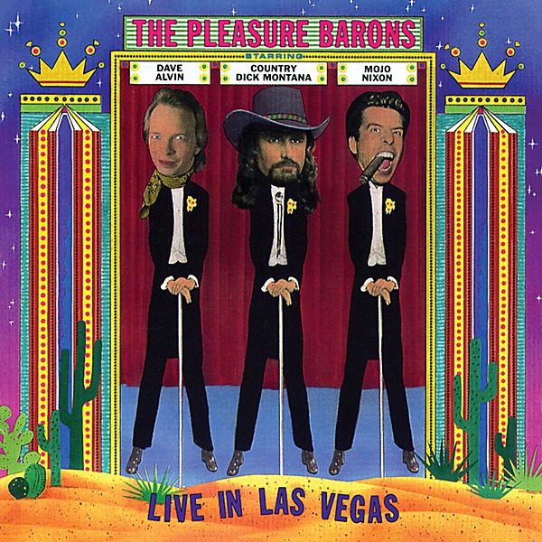

# Live in Las Vegas

By **The Pleasure Barons**

## Album Data

- **Catalog:** Beets
- **Format:** Digital, Album
- **Album:** Live in Las Vegas
- **Artist:** The Pleasure Barons
- **Albumartist:** The Pleasure Barons
- **Genre:** Rock
- **MusicBrainz Album Artist ID:** [744af590-701f-4170-8239-4e872df2efb0](https://musicbrainz.org/artist/744af590-701f-4170-8239-4e872df2efb0)
- **MusicBrainz Album ID:** [00ec23ce-64de-4a07-80a8-8551d1d78d67](https://musicbrainz.org/release/00ec23ce-64de-4a07-80a8-8551d1d78d67)
- **MusicBrainz Release Group ID:** [147c363f-e792-3596-8775-c2207ae7ac35](https://musicbrainz.org/release-group/147c363f-e792-3596-8775-c2207ae7ac35)
- **Year:** 1993
- **Catalog #:** HCD 8044
- **Label:** HighTone Records
- **Total Tracks:** 11

## Album Tracks

### Track 01 - Closing Time

- **Artist:** The Pleasure Barons
- **Format:** MP3
- **Genre:** Rock
- **Length:** 4:52
- **MusicBrainz Track ID:** [5ab059b0-36ac-4d53-bd5c-b86d30845d72](https://musicbrainz.org/recording/5ab059b0-36ac-4d53-bd5c-b86d30845d72)
- **Title:** Closing Time
- **Track:** 01
- **Year:** 1993

### Track 02 - Take a Letter Maria

- **Artist:** The Pleasure Barons
- **Format:** MP3
- **Genre:** Rock
- **Length:** 3:59
- **MusicBrainz Track ID:** [cfffbd81-b42f-4911-be8d-abe92b016eee](https://musicbrainz.org/recording/cfffbd81-b42f-4911-be8d-abe92b016eee)
- **Title:** Take a Letter Maria
- **Track:** 02
- **Year:** 1993

### Track 03 - Who Do You Love

- **Artist:** The Pleasure Barons
- **Format:** MP3
- **Genre:** Rock
- **Length:** 3:27
- **MusicBrainz Track ID:** [1b1c844a-0997-4ba6-8ec6-af820f74b331](https://musicbrainz.org/recording/1b1c844a-0997-4ba6-8ec6-af820f74b331)
- **Title:** Who Do You Love
- **Track:** 03
- **Year:** 1993

### Track 04 - Louisiana Lip Lock

- **Artist:** The Pleasure Barons
- **Format:** MP3
- **Genre:** Rock
- **Length:** 6:28
- **MusicBrainz Track ID:** [4ea07f03-d256-4e44-8e13-8e4791c149dc](https://musicbrainz.org/recording/4ea07f03-d256-4e44-8e13-8e4791c149dc)
- **Title:** Louisiana Lip Lock
- **Track:** 04
- **Year:** 1993

### Track 05 - Debbie Gibson is Pregnant

- **Artist:** The Pleasure Barons
- **Format:** MP3
- **Genre:** Rock
- **Length:** 2:40
- **MusicBrainz Track ID:** [72a0c838-0e0a-4911-a8b9-90b66a17b7dc](https://musicbrainz.org/recording/72a0c838-0e0a-4911-a8b9-90b66a17b7dc)
- **Title:** Debbie Gibson is Pregnant
- **Track:** 05
- **Year:** 1993

### Track 06 - Games People Play

- **Artist:** The Pleasure Barons
- **Format:** MP3
- **Genre:** Rock
- **Length:** 4:55
- **MusicBrainz Track ID:** [d6ef538c-1c0d-46a5-9357-ec138c4b1c44](https://musicbrainz.org/recording/d6ef538c-1c0d-46a5-9357-ec138c4b1c44)
- **Title:** Games People Play
- **Track:** 06
- **Year:** 1993

### Track 07 - Jackson

- **Artist:** The Pleasure Barons
- **Format:** MP3
- **Genre:** Rock
- **Length:** 3:03
- **MusicBrainz Track ID:** [75211ec4-f967-497a-ad44-7dc6e7946bae](https://musicbrainz.org/recording/75211ec4-f967-497a-ad44-7dc6e7946bae)
- **Title:** Jackson
- **Track:** 07
- **Year:** 1993

### Track 08 - Amos Moses

- **Artist:** The Pleasure Barons
- **Format:** MP3
- **Genre:** Rock
- **Length:** 3:51
- **MusicBrainz Track ID:** [27f30fc3-ceb3-44e6-96cd-fe0b14b6be9c](https://musicbrainz.org/recording/27f30fc3-ceb3-44e6-96cd-fe0b14b6be9c)
- **Title:** Amos Moses
- **Track:** 08
- **Year:** 1993

### Track 09 - Gangster of Love

- **Artist:** The Pleasure Barons
- **Format:** MP3
- **Genre:** Rock
- **Length:** 6:13
- **MusicBrainz Track ID:** [64299cbe-ed2b-4d77-9335-e487af7c4c93](https://musicbrainz.org/recording/64299cbe-ed2b-4d77-9335-e487af7c4c93)
- **Title:** Gangster of Love
- **Track:** 09
- **Year:** 1993

### Track 10 - Elvis Is Everywhere

- **Artist:** The Pleasure Barons
- **Format:** MP3
- **Genre:** Rock
- **Length:** 11:01
- **MusicBrainz Track ID:** [f935ace6-9be3-4bcf-9f21-8f4c27e1a34b](https://musicbrainz.org/recording/f935ace6-9be3-4bcf-9f21-8f4c27e1a34b)
- **Title:** Elvis Is Everywhere
- **Track:** 10
- **Year:** 1993

### Track 11 - The Definitive Tom Jones Medley

- **Artist:** The Pleasure Barons
- **Format:** MP3
- **Genre:** Rock
- **Length:** 6:20
- **MusicBrainz Track ID:** [461557c9-3e9e-405c-aa66-31e95749f7c3](https://musicbrainz.org/recording/461557c9-3e9e-405c-aa66-31e95749f7c3)
- **Title:** The Definitive Tom Jones Medley
- **Track:** 11
- **Year:** 1993

