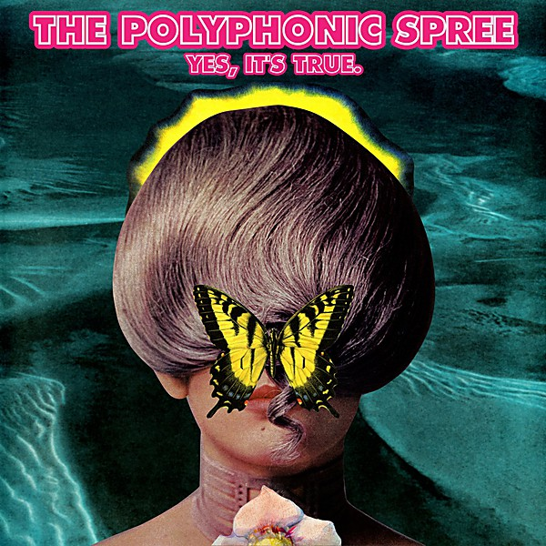

# Yes, It's True

By **The Polyphonic Spree**

## Album Data

- **Catalog:** Beets
- **Format:** Digital, Album
- **Album:** Yes, It's True
- **Artist:** The Polyphonic Spree
- **Albumartist:** The Polyphonic Spree
- **Genre:** Neo-Psychedelia
- **MusicBrainz Album Artist ID:** 
- **MusicBrainz Album ID:** 
- **MusicBrainz Release Group ID:** 
- **Year:** 2013
- **Catalog #:** 
- **Label:** 
- **Total Tracks:** 11

## Album Tracks

### Track 01 - You Don't Know Me

- **Artist:** The Polyphonic Spree
- **Format:** ALAC
- **Genre:** Psychedelic Pop
- **Length:** 3:24
- **MusicBrainz Track ID:** 
- **Title:** You Don't Know Me
- **Track:** 01
- **Year:** 2013

### Track 02 - Popular by Design

- **Artist:** The Polyphonic Spree
- **Format:** ALAC
- **Genre:** Psychedelic Pop
- **Length:** 4:13
- **MusicBrainz Track ID:** 
- **Title:** Popular by Design
- **Track:** 02
- **Year:** 2013

### Track 03 - Hold Yourself Up

- **Artist:** The Polyphonic Spree
- **Format:** ALAC
- **Genre:** Neo-Psychedelia
- **Length:** 4:23
- **MusicBrainz Track ID:** 
- **Title:** Hold Yourself Up
- **Track:** 03
- **Year:** 2013

### Track 04 - Carefully Try

- **Artist:** The Polyphonic Spree
- **Format:** ALAC
- **Genre:** Neo-Psychedelia
- **Length:** 3:54
- **MusicBrainz Track ID:** 
- **Title:** Carefully Try
- **Track:** 04
- **Year:** 2013

### Track 05 - You're Golden

- **Artist:** The Polyphonic Spree
- **Format:** ALAC
- **Genre:** Neo-Psychedelia
- **Length:** 4:08
- **MusicBrainz Track ID:** 
- **Title:** You're Golden
- **Track:** 05
- **Year:** 2013

### Track 06 - Heart Talk

- **Artist:** The Polyphonic Spree
- **Format:** ALAC
- **Genre:** Neo-Psychedelia
- **Length:** 3:42
- **MusicBrainz Track ID:** 
- **Title:** Heart Talk
- **Track:** 06
- **Year:** 2013

### Track 07 - Blurry up the Lines

- **Artist:** The Polyphonic Spree
- **Format:** ALAC
- **Genre:** Neo-Psychedelia
- **Length:** 4:25
- **MusicBrainz Track ID:** 
- **Title:** Blurry up the Lines
- **Track:** 07
- **Year:** 2013

### Track 08 - Let Them Be

- **Artist:** The Polyphonic Spree
- **Format:** ALAC
- **Genre:** Neo-Psychedelia
- **Length:** 3:13
- **MusicBrainz Track ID:** 
- **Title:** Let Them Be
- **Track:** 08
- **Year:** 2013

### Track 09 - Raise Your Head

- **Artist:** The Polyphonic Spree
- **Format:** ALAC
- **Genre:** Neo-Psychedelia
- **Length:** 5:17
- **MusicBrainz Track ID:** 
- **Title:** Raise Your Head
- **Track:** 09
- **Year:** 2013

### Track 10 - What Would You Do?

- **Artist:** The Polyphonic Spree
- **Format:** ALAC
- **Genre:** Neo-Psychedelia
- **Length:** 4:36
- **MusicBrainz Track ID:** 
- **Title:** What Would You Do?
- **Track:** 10
- **Year:** 2013

### Track 11 - Battlefield

- **Artist:** The Polyphonic Spree
- **Format:** ALAC
- **Genre:** Neo-Psychedelia
- **Length:** 7:27
- **MusicBrainz Track ID:** 
- **Title:** Battlefield
- **Track:** 11
- **Year:** 2013

## See also

- [The Fragile Army](The_Fragile_Army.md)
- [Together We’re Heavy](Together_We’re_Heavy.md)
- [CD: ](../../CD/The_Polyphonic_Spree/The_Polyphonic_Spree.md)
- [CD: "Yes, It's True"](../../CD/The_Polyphonic_Spree/Yes__Its_True.md)
- [Roon: The Fragile Army](../../Roon/The_Polyphonic_Spree/The_Fragile_Army.md)
- [Roon: Together We're Heavy](../../Roon/The_Polyphonic_Spree/Together_Were_Heavy.md)
