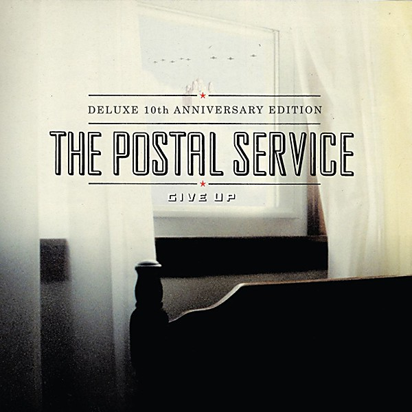

# Give Up

By **The Postal Service**

## Album Data

- **Catalog:** Beets
- **Format:** Digital, Album
- **Album:** Give Up
- **Artist:** The Postal Service
- **Albumartist:** The Postal Service
- **Genre:** Indietronica
- **MusicBrainz Album Artist ID:** [https](https://musicbrainz.org/artist/https)
- **MusicBrainz Album ID:** [https](https://musicbrainz.org/release/https)
- **MusicBrainz Release Group ID:** 
- **Year:** 2003
- **Catalog #:** 
- **Label:** Sub Pop
- **Total Tracks:** 10

## Album Tracks

### Track 01 - The District Sleeps Alone Tonight

- **Artist:** The Postal Service
- **Format:** MP3
- **Genre:** Indietronica
- **Length:** 4:44
- **MusicBrainz Track ID:** [https](https://musicbrainz.org/recording/https)
- **Title:** The District Sleeps Alone Tonight
- **Track:** 01
- **Year:** 2003

### Track 02 - Such Great Heights

- **Artist:** The Postal Service
- **Format:** MP3
- **Genre:** Indietronica
- **Length:** 4:26
- **MusicBrainz Track ID:** [https](https://musicbrainz.org/recording/https)
- **Title:** Such Great Heights
- **Track:** 02
- **Year:** 2003

### Track 03 - Sleeping In

- **Artist:** The Postal Service
- **Format:** MP3
- **Genre:** Indietronica
- **Length:** 4:21
- **MusicBrainz Track ID:** [https](https://musicbrainz.org/recording/https)
- **Title:** Sleeping In
- **Track:** 03
- **Year:** 2003

### Track 04 - Nothing Better

- **Artist:** The Postal Service
- **Format:** MP3
- **Genre:** Indietronica
- **Length:** 3:46
- **MusicBrainz Track ID:** [https](https://musicbrainz.org/recording/https)
- **Title:** Nothing Better
- **Track:** 04
- **Year:** 2003

### Track 05 - Recycled Air

- **Artist:** The Postal Service
- **Format:** MP3
- **Genre:** Indietronica
- **Length:** 4:29
- **MusicBrainz Track ID:** [https](https://musicbrainz.org/recording/https)
- **Title:** Recycled Air
- **Track:** 05
- **Year:** 2003

### Track 06 - Clark Gable

- **Artist:** The Postal Service
- **Format:** MP3
- **Genre:** Indietronica
- **Length:** 4:54
- **MusicBrainz Track ID:** [https](https://musicbrainz.org/recording/https)
- **Title:** Clark Gable
- **Track:** 06
- **Year:** 2003

### Track 07 - We Will Become Silhouettes

- **Artist:** The Postal Service
- **Format:** MP3
- **Genre:** Indietronica
- **Length:** 5:00
- **MusicBrainz Track ID:** [https](https://musicbrainz.org/recording/https)
- **Title:** We Will Become Silhouettes
- **Track:** 07
- **Year:** 2003

### Track 08 - This Place Is A Prison

- **Artist:** The Postal Service
- **Format:** MP3
- **Genre:** Emo
- **Length:** 3:54
- **MusicBrainz Track ID:** [https](https://musicbrainz.org/recording/https)
- **Title:** This Place Is A Prison
- **Track:** 08
- **Year:** 2003

### Track 09 - Brand New Colony

- **Artist:** The Postal Service
- **Format:** MP3
- **Genre:** Indietronica
- **Length:** 4:12
- **MusicBrainz Track ID:** [https](https://musicbrainz.org/recording/https)
- **Title:** Brand New Colony
- **Track:** 09
- **Year:** 2003

### Track 10 - Natural Anthem

- **Artist:** The Postal Service
- **Format:** MP3
- **Genre:** Indietronica
- **Length:** 5:07
- **MusicBrainz Track ID:** [https](https://musicbrainz.org/recording/https)
- **Title:** Natural Anthem
- **Track:** 10
- **Year:** 2003

