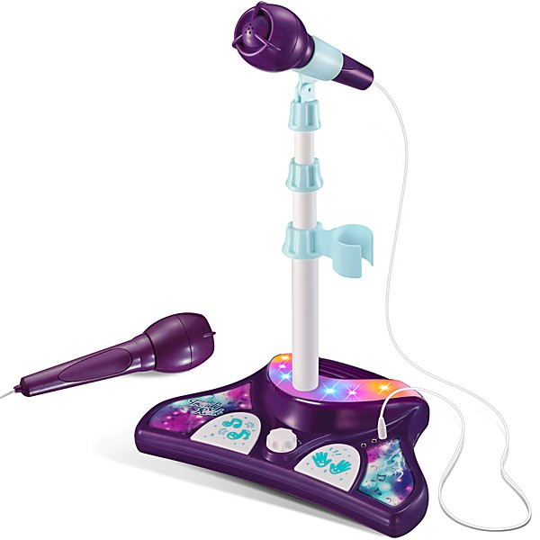

# Pretenders II [Disc 2]

By **The Pretenders**

## Album Data

- **Catalog:** Beets
- **Format:** Digital, Album
- **Album:** Pretenders II [Disc 2]
- **Artist:** The Pretenders
- **Albumartist:** The Pretenders
- **Genre:** New Wave
- **MusicBrainz Album Artist ID:** 
- **MusicBrainz Album ID:** 
- **MusicBrainz Release Group ID:** 
- **Year:** 1981
- **Catalog #:** 
- **Label:** 
- **Total Tracks:** 20

## Album Tracks

### Track 01 - Talk Of The Town (Demo)

- **Artist:** The Pretenders
- **Format:** ALAC
- **Genre:** Rock
- **Length:** 2:46
- **MusicBrainz Track ID:** 
- **Title:** Talk Of The Town (Demo)
- **Track:** 01
- **Year:** 1981

### Track 02 - I Go To Sleep (Guitar Version - Outtake)

- **Artist:** The Pretenders
- **Format:** ALAC
- **Genre:** New Wave
- **Length:** 2:58
- **MusicBrainz Track ID:** 
- **Title:** I Go To Sleep (Guitar Version - Outtake)
- **Track:** 02
- **Year:** 1981

### Track 03 - Pack It Up (Radio Mix - Outtake)

- **Artist:** The Pretenders
- **Format:** ALAC
- **Genre:** New Wave
- **Length:** 3:51
- **MusicBrainz Track ID:** 
- **Title:** Pack It Up (Radio Mix - Outtake)
- **Track:** 03
- **Year:** 1981

### Track 04 - In The Sticks ("Day After Day" B-Side)

- **Artist:** The Pretenders
- **Format:** ALAC
- **Genre:** New Wave
- **Length:** 2:39
- **MusicBrainz Track ID:** 
- **Title:** In The Sticks ("Day After Day" B-Side)
- **Track:** 04
- **Year:** 1981

### Track 05 - What You Gonna Do About It (from Flexi-Single)

- **Artist:** The Pretenders
- **Format:** ALAC
- **Genre:** New Wave
- **Length:** 2:44
- **MusicBrainz Track ID:** 
- **Title:** What You Gonna Do About It (from Flexi-Single)
- **Track:** 05
- **Year:** 1981

### Track 06 - The Wait (Live At The Santa Monica Civic, 4 September, 1981)

- **Artist:** The Pretenders
- **Format:** ALAC
- **Genre:** New Wave
- **Length:** 3:22
- **MusicBrainz Track ID:** 
- **Title:** The Wait (Live At The Santa Monica Civic, 4 September, 1981)
- **Track:** 06
- **Year:** 1981

### Track 07 - The Adultress (Live At The Santa Monica Civic, 4 September, 1981)

- **Artist:** The Pretenders
- **Format:** ALAC
- **Genre:** New Wave
- **Length:** 4:05
- **MusicBrainz Track ID:** 
- **Title:** The Adultress (Live At The Santa Monica Civic, 4 September, 1981)
- **Track:** 07
- **Year:** 1981

### Track 08 - Message Of Love (Live At The Santa Monica Civic, 4 September, 1981)

- **Artist:** The Pretenders
- **Format:** ALAC
- **Genre:** New Wave
- **Length:** 3:28
- **MusicBrainz Track ID:** 
- **Title:** Message Of Love (Live At The Santa Monica Civic, 4 September, 1981)
- **Track:** 08
- **Year:** 1981

### Track 09 - Louie Louie (Live At The Santa Monica Civic, 4 September, 1981)

- **Artist:** The Pretenders
- **Format:** ALAC
- **Genre:** New Wave
- **Length:** 3:42
- **MusicBrainz Track ID:** 
- **Title:** Louie Louie (Live At The Santa Monica Civic, 4 September, 1981)
- **Track:** 09
- **Year:** 1981

### Track 10 - Talk Of The Town (Live At The Santa Monica Civic, 4 September, 1981)

- **Artist:** The Pretenders
- **Format:** ALAC
- **Genre:** New Wave
- **Length:** 3:17
- **MusicBrainz Track ID:** 
- **Title:** Talk Of The Town (Live At The Santa Monica Civic, 4 September, 1981)
- **Track:** 10
- **Year:** 1981

### Track 11 - Birds Of Paradise (Live At The Santa Monica Civic, 4 September, 1981)

- **Artist:** The Pretenders
- **Format:** ALAC
- **Genre:** New Wave
- **Length:** 4:17
- **MusicBrainz Track ID:** 
- **Title:** Birds Of Paradise (Live At The Santa Monica Civic, 4 September, 1981)
- **Track:** 11
- **Year:** 1981

### Track 12 - The English Roses (Live At The Santa Monica Civic, 4 September, 1981)

- **Artist:** The Pretenders
- **Format:** ALAC
- **Genre:** New Wave
- **Length:** 4:51
- **MusicBrainz Track ID:** 
- **Title:** The English Roses (Live At The Santa Monica Civic, 4 September, 1981)
- **Track:** 12
- **Year:** 1981

### Track 13 - Up The Neck (Live At The Santa Monica Civic, 4 September, 1981)

- **Artist:** The Pretenders
- **Format:** ALAC
- **Genre:** New Wave
- **Length:** 5:57
- **MusicBrainz Track ID:** 
- **Title:** Up The Neck (Live At The Santa Monica Civic, 4 September, 1981)
- **Track:** 13
- **Year:** 1981

### Track 14 - Bad Boys Get Spanked (Live At The Santa Monica Civic, 4 September, 1981)

- **Artist:** The Pretenders
- **Format:** ALAC
- **Genre:** New Wave
- **Length:** 3:02
- **MusicBrainz Track ID:** 
- **Title:** Bad Boys Get Spanked (Live At The Santa Monica Civic, 4 September, 1981)
- **Track:** 14
- **Year:** 1981

### Track 15 - Stop Your Sobbing (Live At The Santa Monica Civic, 4 September, 1981)

- **Artist:** The Pretenders
- **Format:** ALAC
- **Genre:** New Wave
- **Length:** 3:26
- **MusicBrainz Track ID:** 
- **Title:** Stop Your Sobbing (Live At The Santa Monica Civic, 4 September, 1981)
- **Track:** 15
- **Year:** 1981

### Track 16 - Private Life (Live At The Santa Monica Civic, 4 September, 1981)

- **Artist:** The Pretenders
- **Format:** ALAC
- **Genre:** New Wave
- **Length:** 7:04
- **MusicBrainz Track ID:** 
- **Title:** Private Life (Live At The Santa Monica Civic, 4 September, 1981)
- **Track:** 16
- **Year:** 1981

### Track 17 - Kid (Live At The Santa Monica Civic, 4 September, 1981)

- **Artist:** The Pretenders
- **Format:** ALAC
- **Genre:** New Wave
- **Length:** 3:48
- **MusicBrainz Track ID:** 
- **Title:** Kid (Live At The Santa Monica Civic, 4 September, 1981)
- **Track:** 17
- **Year:** 1981

### Track 18 - Day After Day (Live At The Santa Monica Civic, 4 September, 1981)

- **Artist:** The Pretenders
- **Format:** ALAC
- **Genre:** New Wave
- **Length:** 4:41
- **MusicBrainz Track ID:** 
- **Title:** Day After Day (Live At The Santa Monica Civic, 4 September, 1981)
- **Track:** 18
- **Year:** 1981

### Track 19 - Brass In Pocket (Live At The Santa Monica Civic, 4 September, 1981)

- **Artist:** The Pretenders
- **Format:** ALAC
- **Genre:** New Wave
- **Length:** 3:11
- **MusicBrainz Track ID:** 
- **Title:** Brass In Pocket (Live At The Santa Monica Civic, 4 September, 1981)
- **Track:** 19
- **Year:** 1981

### Track 20 - Higher And Higher (Live At The Santa Monica Civic, 4 September, 1981)

- **Artist:** The Pretenders
- **Format:** ALAC
- **Genre:** New Wave
- **Length:** 4:17
- **MusicBrainz Track ID:** 
- **Title:** Higher And Higher (Live At The Santa Monica Civic, 4 September, 1981)
- **Track:** 20
- **Year:** 1981

## See also

- [Pretenders](Pretenders.md)
