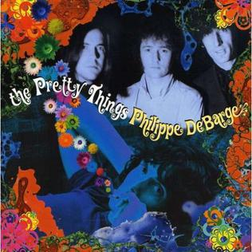

# The Pretty Things

By **The Pretty Things**

## Album Data

- **Catalog:** Beets
- **Format:** Digital, Album
- **Album:** The Pretty Things
- **Artist:** The Pretty Things
- **Albumartist:** The Pretty Things
- **Genre:** Psychedelic Rock
- **MusicBrainz Album Artist ID:** [https](https://musicbrainz.org/artist/https)
- **MusicBrainz Album ID:** [https](https://musicbrainz.org/release/https)
- **MusicBrainz Release Group ID:** 
- **Year:** 1965
- **Catalog #:** 
- **Label:** MadfishMusic
- **Total Tracks:** 18

## Album Tracks

### Track 01 - Roadrunner

- **Artist:** The Pretty Things
- **Format:** ALAC
- **Genre:** Psychedelic Rock
- **Length:** 3:11
- **MusicBrainz Track ID:** [https](https://musicbrainz.org/recording/https)
- **Title:** Roadrunner
- **Track:** 01
- **Year:** 1965

### Track 02 - Judgement Day

- **Artist:** The Pretty Things
- **Format:** ALAC
- **Genre:** Freakbeat
- **Length:** 2:46
- **MusicBrainz Track ID:** [https](https://musicbrainz.org/recording/https)
- **Title:** Judgement Day
- **Track:** 02
- **Year:** 1965

### Track 03 - 13 Chester Street

- **Artist:** The Pretty Things
- **Format:** ALAC
- **Genre:** Freakbeat
- **Length:** 2:22
- **MusicBrainz Track ID:** [https](https://musicbrainz.org/recording/https)
- **Title:** 13 Chester Street
- **Track:** 03
- **Year:** 1965

### Track 04 - Big City

- **Artist:** The Pretty Things
- **Format:** ALAC
- **Genre:** Rhythm And Blues
- **Length:** 2:01
- **MusicBrainz Track ID:** [https](https://musicbrainz.org/recording/https)
- **Title:** Big City
- **Track:** 04
- **Year:** 1965

### Track 05 - Unknown Blues

- **Artist:** The Pretty Things
- **Format:** ALAC
- **Genre:** Freakbeat
- **Length:** 3:48
- **MusicBrainz Track ID:** [https](https://musicbrainz.org/recording/https)
- **Title:** Unknown Blues
- **Track:** 05
- **Year:** 1965

### Track 06 - Mama, Keep Your Big Mouth Shut

- **Artist:** The Pretty Things
- **Format:** ALAC
- **Genre:** Freakbeat
- **Length:** 3:04
- **MusicBrainz Track ID:** [https](https://musicbrainz.org/recording/https)
- **Title:** Mama, Keep Your Big Mouth Shut
- **Track:** 06
- **Year:** 1965

### Track 07 - Honey, I Need

- **Artist:** The Pretty Things
- **Format:** ALAC
- **Genre:** Freakbeat
- **Length:** 1:59
- **MusicBrainz Track ID:** [https](https://musicbrainz.org/recording/https)
- **Title:** Honey, I Need
- **Track:** 07
- **Year:** 1965

### Track 08 - Oh Baby Doll

- **Artist:** The Pretty Things
- **Format:** ALAC
- **Genre:** Freakbeat
- **Length:** 3:01
- **MusicBrainz Track ID:** [https](https://musicbrainz.org/recording/https)
- **Title:** Oh Baby Doll
- **Track:** 08
- **Year:** 1965

### Track 09 - She's Fine She's Mine

- **Artist:** The Pretty Things
- **Format:** ALAC
- **Genre:** Freakbeat
- **Length:** 4:24
- **MusicBrainz Track ID:** [https](https://musicbrainz.org/recording/https)
- **Title:** She's Fine She's Mine
- **Track:** 09
- **Year:** 1965

### Track 10 - Don't Lie To Me

- **Artist:** The Pretty Things
- **Format:** ALAC
- **Genre:** Freakbeat
- **Length:** 3:53
- **MusicBrainz Track ID:** [https](https://musicbrainz.org/recording/https)
- **Title:** Don't Lie To Me
- **Track:** 10
- **Year:** 1965

### Track 11 - The Moon Is Rising

- **Artist:** The Pretty Things
- **Format:** ALAC
- **Genre:** Freakbeat
- **Length:** 2:33
- **MusicBrainz Track ID:** [https](https://musicbrainz.org/recording/https)
- **Title:** The Moon Is Rising
- **Track:** 11
- **Year:** 1965

### Track 12 - Pretty Thing

- **Artist:** The Pretty Things
- **Format:** ALAC
- **Genre:** Freakbeat
- **Length:** 1:38
- **MusicBrainz Track ID:** [https](https://musicbrainz.org/recording/https)
- **Title:** Pretty Thing
- **Track:** 12
- **Year:** 1965

### Track 13 - Rosalyn

- **Artist:** The Pretty Things
- **Format:** ALAC
- **Genre:** Freakbeat
- **Length:** 2:20
- **MusicBrainz Track ID:** [https](https://musicbrainz.org/recording/https)
- **Title:** Rosalyn
- **Track:** 13
- **Year:** 1965

### Track 14 - Big Boss Man

- **Artist:** The Pretty Things
- **Format:** ALAC
- **Genre:** Rock
- **Length:** 2:38
- **MusicBrainz Track ID:** [https](https://musicbrainz.org/recording/https)
- **Title:** Big Boss Man
- **Track:** 14
- **Year:** 1965

### Track 15 - Don't Bring Me Down

- **Artist:** The Pretty Things
- **Format:** ALAC
- **Genre:** Psychedelic Rock
- **Length:** 2:10
- **MusicBrainz Track ID:** [https](https://musicbrainz.org/recording/https)
- **Title:** Don't Bring Me Down
- **Track:** 15
- **Year:** 1965

### Track 16 - We'll Be Together

- **Artist:** The Pretty Things
- **Format:** ALAC
- **Genre:** Freakbeat
- **Length:** 2:10
- **MusicBrainz Track ID:** [https](https://musicbrainz.org/recording/https)
- **Title:** We'll Be Together
- **Track:** 16
- **Year:** 1965

### Track 17 - I Can Never Say

- **Artist:** The Pretty Things
- **Format:** ALAC
- **Genre:** Psychedelic Rock
- **Length:** 2:36
- **MusicBrainz Track ID:** [https](https://musicbrainz.org/recording/https)
- **Title:** I Can Never Say
- **Track:** 17
- **Year:** 1965

### Track 18 - Get Yourself Home

- **Artist:** The Pretty Things
- **Format:** ALAC
- **Genre:** Freakbeat
- **Length:** 2:14
- **MusicBrainz Track ID:** [https](https://musicbrainz.org/recording/https)
- **Title:** Get Yourself Home
- **Track:** 18
- **Year:** 1965

## See also

- [Get the Picture?](Get_the_Picture.md)
- [CD: The Pretty Things / Get The Picture? (Disc 1)](../../CD/The_Pretty_Things/The_Pretty_Things_-_Get_The_Picture_Disc_1.md)
- [CD: The Pretty Things / Get The Picture? (Disc 2)](../../CD/The_Pretty_Things/The_Pretty_Things_-_Get_The_Picture_Disc_2.md)
- [CD: ](../../CD/The_Pretty_Things/The_Pretty_Things.md)
- [Roon: Get The Picture?](../../Roon/The_Pretty_Things/Get_The_Picture.md)
- [Roon: Greatest Hits](../../Roon/The_Pretty_Things/Greatest_Hits.md)
