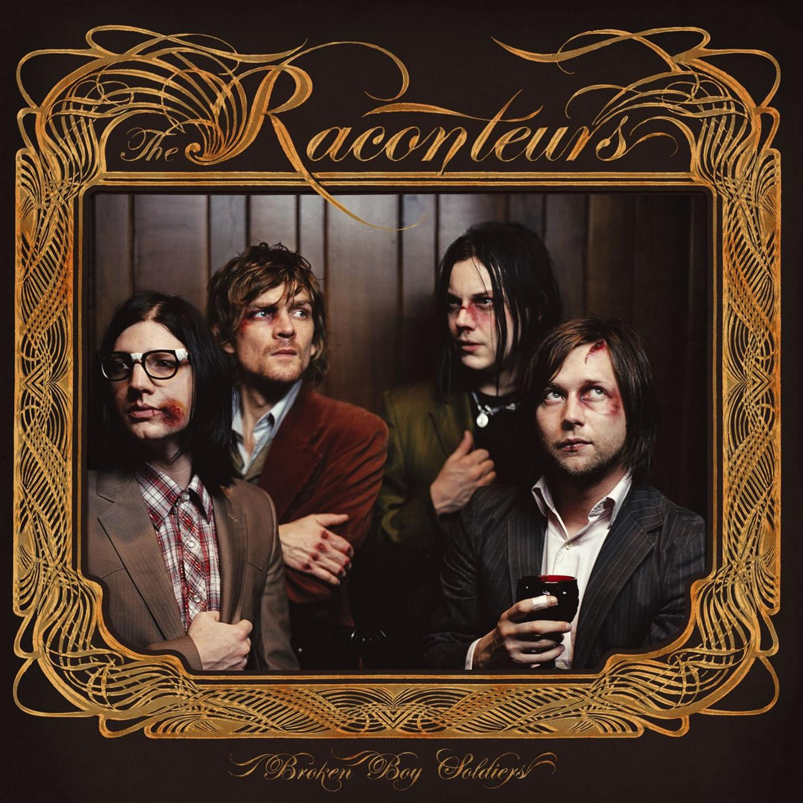

# Broken Boy Soldiers

By **The Raconteurs**

## Album Data

- **Catalog:** Beets
- **Format:** Digital, Album
- **Album:** Broken Boy Soldiers
- **Artist:** The Raconteurs
- **Albumartist:** The Raconteurs
- **Genre:** Indie Rock
- **MusicBrainz Album Artist ID:** [be407b02-f3e6-4ed5-9489-f8e5f0ab36dc](https://musicbrainz.org/artist/be407b02-f3e6-4ed5-9489-f8e5f0ab36dc)
- **MusicBrainz Album ID:** [0d6ea51b-d4bc-4e87-8db6-0f5110602594](https://musicbrainz.org/release/0d6ea51b-d4bc-4e87-8db6-0f5110602594)
- **MusicBrainz Release Group ID:** [16d852cc-b287-352a-bacd-1069e101fb2e](https://musicbrainz.org/release-group/16d852cc-b287-352a-bacd-1069e101fb2e)
- **Year:** 2006
- **Catalog #:** 
- **Label:** Third Man Records
- **Total Tracks:** 14

## Album Tracks

### Track 01 - Consoler Of The Lonely

- **Artist:** The Raconteurs
- **Format:** AAC
- **Genre:** alternative rock
- **Length:** 3:25
- **MusicBrainz Track ID:** [https](https://musicbrainz.org/recording/https)
- **Title:** Consoler Of The Lonely
- **Track:** 01
- **Year:** 2008

### Track 02 - Salute Your Solution

- **Artist:** The Raconteurs
- **Format:** AAC
- **Genre:** alternative rock
- **Length:** 3:01
- **MusicBrainz Track ID:** [https](https://musicbrainz.org/recording/https)
- **Title:** Salute Your Solution
- **Track:** 02
- **Year:** 2008

### Track 03 - You Don't Understand Me

- **Artist:** The Raconteurs
- **Format:** AAC
- **Genre:** alternative rock
- **Length:** 4:53
- **MusicBrainz Track ID:** [https](https://musicbrainz.org/recording/https)
- **Title:** You Don't Understand Me
- **Track:** 03
- **Year:** 2008

### Track 04 - Old Enough

- **Artist:** The Raconteurs
- **Format:** AAC
- **Genre:** alternative rock
- **Length:** 3:57
- **MusicBrainz Track ID:** [https](https://musicbrainz.org/recording/https)
- **Title:** Old Enough
- **Track:** 04
- **Year:** 2008

### Track 05 - The Switch and The Spur

- **Artist:** The Raconteurs
- **Format:** AAC
- **Genre:** alternative rock
- **Length:** 4:25
- **MusicBrainz Track ID:** [https](https://musicbrainz.org/recording/https)
- **Title:** The Switch and The Spur
- **Track:** 05
- **Year:** 2008

### Track 06 - Hold Up

- **Artist:** The Raconteurs
- **Format:** AAC
- **Genre:** alternative rock
- **Length:** 3:26
- **MusicBrainz Track ID:** [https](https://musicbrainz.org/recording/https)
- **Title:** Hold Up
- **Track:** 06
- **Year:** 2008

### Track 07 - Top Yourself

- **Artist:** The Raconteurs
- **Format:** AAC
- **Genre:** alternative rock
- **Length:** 4:25
- **MusicBrainz Track ID:** [https](https://musicbrainz.org/recording/https)
- **Title:** Top Yourself
- **Track:** 07
- **Year:** 2008

### Track 08 - Many Shades Of Black

- **Artist:** The Raconteurs
- **Format:** AAC
- **Genre:** alternative rock
- **Length:** 4:24
- **MusicBrainz Track ID:** [https](https://musicbrainz.org/recording/https)
- **Title:** Many Shades Of Black
- **Track:** 08
- **Year:** 2008

### Track 09 - Five on the Five

- **Artist:** The Raconteurs
- **Format:** AAC
- **Genre:** alternative rock
- **Length:** 3:33
- **MusicBrainz Track ID:** [https](https://musicbrainz.org/recording/https)
- **Title:** Five on the Five
- **Track:** 09
- **Year:** 2008

### Track 10 - Attention

- **Artist:** The Raconteurs
- **Format:** AAC
- **Genre:** alternative rock
- **Length:** 3:40
- **MusicBrainz Track ID:** [https](https://musicbrainz.org/recording/https)
- **Title:** Attention
- **Track:** 10
- **Year:** 2008

### Track 11 - Pull This Blanket Off

- **Artist:** The Raconteurs
- **Format:** AAC
- **Genre:** alternative rock
- **Length:** 1:59
- **MusicBrainz Track ID:** [https](https://musicbrainz.org/recording/https)
- **Title:** Pull This Blanket Off
- **Track:** 11
- **Year:** 2008

### Track 12 - Rich Kid Blues

- **Artist:** The Raconteurs
- **Format:** AAC
- **Genre:** alternative rock
- **Length:** 4:34
- **MusicBrainz Track ID:** [https](https://musicbrainz.org/recording/https)
- **Title:** Rich Kid Blues
- **Track:** 12
- **Year:** 2008

### Track 13 - These Stones Will Shout

- **Artist:** The Raconteurs
- **Format:** AAC
- **Genre:** alternative rock
- **Length:** 3:52
- **MusicBrainz Track ID:** [https](https://musicbrainz.org/recording/https)
- **Title:** These Stones Will Shout
- **Track:** 13
- **Year:** 2008

### Track 14 - Carolina Drama

- **Artist:** The Raconteurs
- **Format:** AAC
- **Genre:** alternative rock
- **Length:** 5:55
- **MusicBrainz Track ID:** [https](https://musicbrainz.org/recording/https)
- **Title:** Carolina Drama
- **Track:** 14
- **Year:** 2008

## See also

- [Consolers of the Lonely](Consolers_of_the_Lonely.md)
- [Roon: Broken Boy Soldiers](../../Roon/The_Raconteurs/Broken_Boy_Soldiers.md)
- [Roon: Consolers of the Lonely](../../Roon/The_Raconteurs/Consolers_of_the_Lonely.md)
- [Roon: Help Us Stranger](../../Roon/The_Raconteurs/Help_Us_Stranger.md)
- [Roon: Old Enough (feat. Ricky Skaggs and Ashley Monroe)](../../Roon/The_Raconteurs/Old_Enough_feat_Ricky_Skaggs_and_Ashley_Monroe.md)
- [Roon: Salute Your Solution](../../Roon/The_Raconteurs/Salute_Your_Solution.md)
- [Vinyl: Broken Boy Soldiers](../../Vinyl/The_Raconteurs/Broken_Boy_Soldiers.md)
- [Vinyl: Consolers Of The Lonely](../../Vinyl/The_Raconteurs/Consolers_Of_The_Lonely.md)
- [Vinyl: ](../../Vinyl/The_Raconteurs/The_Raconteurs.md)
