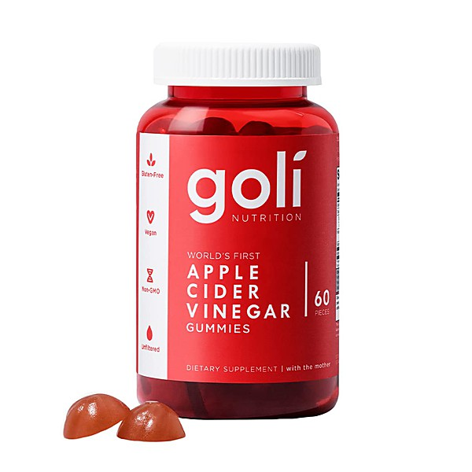

# Live On Sunset Strip

By **The Raspberries**

## Album Data

- **Catalog:** Beets
- **Format:** Digital, Album
- **Album:** Live On Sunset Strip
- **Artist:** The Raspberries
- **Albumartist:** The Raspberries
- **Genre:** Power Pop
- **MusicBrainz Album Artist ID:** 
- **MusicBrainz Album ID:** 
- **MusicBrainz Release Group ID:** 
- **Year:** 2007
- **Catalog #:** 
- **Label:** 
- **Total Tracks:** 13

## Album Tracks

### Track 01 - I Wanna Be With You

- **Artist:** The Raspberries
- **Format:** ALAC
- **Genre:** Rock And Roll
- **Length:** 3:49
- **MusicBrainz Track ID:** 
- **Title:** I Wanna Be With You
- **Track:** 01
- **Year:** 2007

### Track 02 - Tonight

- **Artist:** The Raspberries
- **Format:** ALAC
- **Genre:** Rock And Roll
- **Length:** 3:41
- **MusicBrainz Track ID:** 
- **Title:** Tonight
- **Track:** 02
- **Year:** 2007

### Track 03 - Overnight Sensation (Hit Record)

- **Artist:** The Raspberries
- **Format:** ALAC
- **Genre:** Power Pop
- **Length:** 5:51
- **MusicBrainz Track ID:** 
- **Title:** Overnight Sensation (Hit Record)
- **Track:** 03
- **Year:** 2007

### Track 04 - Let's Pretend

- **Artist:** The Raspberries
- **Format:** ALAC
- **Genre:** Power Pop
- **Length:** 3:58
- **MusicBrainz Track ID:** 
- **Title:** Let's Pretend
- **Track:** 04
- **Year:** 2007

### Track 05 - I Don't Know What I Want

- **Artist:** The Raspberries
- **Format:** ALAC
- **Genre:** Power Pop
- **Length:** 4:22
- **MusicBrainz Track ID:** 
- **Title:** I Don't Know What I Want
- **Track:** 05
- **Year:** 2007

### Track 06 - Should I Wait

- **Artist:** The Raspberries
- **Format:** ALAC
- **Genre:** Rock
- **Length:** 3:58
- **MusicBrainz Track ID:** 
- **Title:** Should I Wait
- **Track:** 06
- **Year:** 2007

### Track 07 - Party's Over

- **Artist:** The Raspberries
- **Format:** ALAC
- **Genre:** Power Pop
- **Length:** 4:18
- **MusicBrainz Track ID:** 
- **Title:** Party's Over
- **Track:** 07
- **Year:** 2007

### Track 08 - Don't Want To Say Goodbye

- **Artist:** The Raspberries
- **Format:** ALAC
- **Genre:** Power Pop
- **Length:** 5:05
- **MusicBrainz Track ID:** 
- **Title:** Don't Want To Say Goodbye
- **Track:** 08
- **Year:** 2007

### Track 09 - Hard To Get Over A Heartbreak

- **Artist:** The Raspberries
- **Format:** ALAC
- **Genre:** Power Pop
- **Length:** 3:57
- **MusicBrainz Track ID:** 
- **Title:** Hard To Get Over A Heartbreak
- **Track:** 09
- **Year:** 2007

### Track 10 - Nobody Knows

- **Artist:** The Raspberries
- **Format:** ALAC
- **Genre:** Power Pop
- **Length:** 2:29
- **MusicBrainz Track ID:** 
- **Title:** Nobody Knows
- **Track:** 10
- **Year:** 2007

### Track 11 - Ecstasy

- **Artist:** The Raspberries
- **Format:** ALAC
- **Genre:** Power Pop
- **Length:** 4:17
- **MusicBrainz Track ID:** 
- **Title:** Ecstasy
- **Track:** 11
- **Year:** 2007

### Track 12 - I'm A Rocker

- **Artist:** The Raspberries
- **Format:** ALAC
- **Genre:** Power Pop
- **Length:** 6:40
- **MusicBrainz Track ID:** 
- **Title:** I'm A Rocker
- **Track:** 12
- **Year:** 2007

### Track 13 - Go All The Way

- **Artist:** The Raspberries
- **Format:** ALAC
- **Genre:** Power Pop
- **Length:** 4:38
- **MusicBrainz Track ID:** 
- **Title:** Go All The Way
- **Track:** 13
- **Year:** 2007

## See also

- [Roon: Greatest](../../Roon/The_Raspberries/Greatest.md)
- [Roon: Raspberries](../../Roon/The_Raspberries/Raspberries.md)
