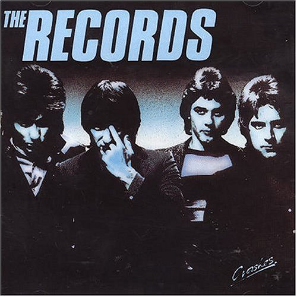

# Crashes

By **The Records**

## Album Data

- **Catalog:** Beets
- **Format:** Digital, Album
- **Album:** Crashes
- **Artist:** The Records
- **Albumartist:** The Records
- **Genre:** Power Pop
- **MusicBrainz Album Artist ID:** 
- **MusicBrainz Album ID:** 
- **MusicBrainz Release Group ID:** 
- **Year:** 2004
- **Catalog #:** 
- **Label:** 
- **Total Tracks:** 16

## Album Tracks

### Track 01 - Hearts In Her Eyes

- **Artist:** The Records
- **Format:** ALAC
- **Genre:** Power Pop
- **Length:** 3:21
- **MusicBrainz Track ID:** 
- **Title:** Hearts In Her Eyes
- **Track:** 01
- **Year:** 2004

### Track 02 - Girl In Golden Disc

- **Artist:** The Records
- **Format:** ALAC
- **Genre:** Power Pop
- **Length:** 3:44
- **MusicBrainz Track ID:** 
- **Title:** Girl In Golden Disc
- **Track:** 02
- **Year:** 2004

### Track 03 - Rumour Sets The Woods Alight

- **Artist:** The Records
- **Format:** ALAC
- **Genre:** Power Pop
- **Length:** 3:04
- **MusicBrainz Track ID:** 
- **Title:** Rumour Sets The Woods Alight
- **Track:** 03
- **Year:** 2004

### Track 04 - I Don't Remember Your Name

- **Artist:** The Records
- **Format:** ALAC
- **Genre:** Power Pop
- **Length:** 3:33
- **MusicBrainz Track ID:** 
- **Title:** I Don't Remember Your Name
- **Track:** 04
- **Year:** 2004

### Track 05 - The Same Mistakes

- **Artist:** The Records
- **Format:** ALAC
- **Genre:** Power Pop
- **Length:** 4:12
- **MusicBrainz Track ID:** 
- **Title:** The Same Mistakes
- **Track:** 05
- **Year:** 2004

### Track 06 - Man With A Girlproof Heart

- **Artist:** The Records
- **Format:** ALAC
- **Genre:** Power Pop
- **Length:** 2:48
- **MusicBrainz Track ID:** 
- **Title:** Man With A Girlproof Heart
- **Track:** 06
- **Year:** 2004

### Track 07 - Hearts Will Be Broken

- **Artist:** The Records
- **Format:** ALAC
- **Genre:** Power Pop
- **Length:** 3:48
- **MusicBrainz Track ID:** 
- **Title:** Hearts Will Be Broken
- **Track:** 07
- **Year:** 2004

### Track 08 - Spent A Week With You Last Night

- **Artist:** The Records
- **Format:** ALAC
- **Genre:** Power Pop
- **Length:** 3:11
- **MusicBrainz Track ID:** 
- **Title:** Spent A Week With You Last Night
- **Track:** 08
- **Year:** 2004

### Track 09 - The Worriers

- **Artist:** The Records
- **Format:** ALAC
- **Genre:** Power Pop
- **Length:** 3:28
- **MusicBrainz Track ID:** 
- **Title:** The Worriers
- **Track:** 09
- **Year:** 2004

### Track 10 - Guitars In The Sky

- **Artist:** The Records
- **Format:** ALAC
- **Genre:** Power Pop
- **Length:** 4:14
- **MusicBrainz Track ID:** 
- **Title:** Guitars In The Sky
- **Track:** 10
- **Year:** 2004

### Track 11 - Injury Time

- **Artist:** The Records
- **Format:** ALAC
- **Genre:** Power Pop
- **Length:** 3:08
- **MusicBrainz Track ID:** 
- **Title:** Injury Time
- **Track:** 11
- **Year:** 2004

### Track 12 - Vamp

- **Artist:** The Records
- **Format:** ALAC
- **Genre:** Power Pop
- **Length:** 3:11
- **MusicBrainz Track ID:** 
- **Title:** Vamp
- **Track:** 12
- **Year:** 2004

### Track 13 - So Sorry

- **Artist:** The Records
- **Format:** ALAC
- **Genre:** Power Pop
- **Length:** 2:50
- **MusicBrainz Track ID:** 
- **Title:** So Sorry
- **Track:** 13
- **Year:** 2004

### Track 14 - Faces At The Window

- **Artist:** The Records
- **Format:** ALAC
- **Genre:** Power Pop
- **Length:** 3:39
- **MusicBrainz Track ID:** 
- **Title:** Faces At The Window
- **Track:** 14
- **Year:** 2004

### Track 15 - The Same Mistakes (Unreleased Version)

- **Artist:** The Records
- **Format:** ALAC
- **Genre:** Power Pop
- **Length:** 4:00
- **MusicBrainz Track ID:** 
- **Title:** The Same Mistakes (Unreleased Version)
- **Track:** 15
- **Year:** 2004

### Track 16 - Man With A Girlproof Heart (Unreleased Version)

- **Artist:** The Records
- **Format:** ALAC
- **Genre:** Power Pop
- **Length:** 3:02
- **MusicBrainz Track ID:** 
- **Title:** Man With A Girlproof Heart (Unreleased Version)
- **Track:** 16
- **Year:** 2004

## See also

- [Shades in Bed](Shades_in_Bed.md)
