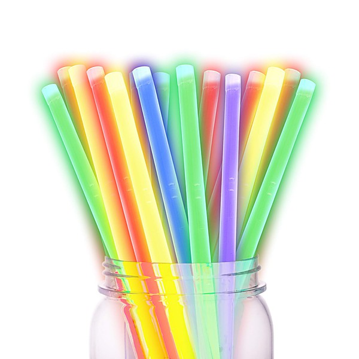

# Dirty Magazine

By **The Redlight District**

## Album Data

- **Catalog:** Beets
- **Format:** Digital, Album
- **Album:** Dirty Magazine
- **Artist:** The Redlight District
- **Albumartist:** The Redlight District
- **Genre:** Rock
- **MusicBrainz Album Artist ID:** [73c1749e-e1e5-4d7c-bc8b-adfdec903559](https://musicbrainz.org/artist/73c1749e-e1e5-4d7c-bc8b-adfdec903559)
- **MusicBrainz Album ID:** [6f6c8e19-939c-4c4a-afcb-20929c70f8ac](https://musicbrainz.org/release/6f6c8e19-939c-4c4a-afcb-20929c70f8ac)
- **MusicBrainz Release Group ID:** [febc87d9-2ab9-4249-8fc1-2931e85a3850](https://musicbrainz.org/release-group/febc87d9-2ab9-4249-8fc1-2931e85a3850)
- **Year:** 2015
- **Catalog #:** 
- **Label:** 
- **Total Tracks:** 04

## Album Tracks

### Track 01 - What's My Name

- **Artist:** The Redlight District
- **Format:** ALAC
- **Genre:** Rock
- **Length:** 5:25
- **MusicBrainz Track ID:** [bfebc965-8511-429b-bee5-39ee9f781dde](https://musicbrainz.org/recording/bfebc965-8511-429b-bee5-39ee9f781dde)
- **Title:** What's My Name
- **Track:** 01
- **Year:** 2015

### Track 02 - Ride

- **Artist:** The Redlight District
- **Format:** ALAC
- **Genre:** Rock
- **Length:** 5:29
- **MusicBrainz Track ID:** [545ac1e8-8bd4-45e8-9361-1f820259238b](https://musicbrainz.org/recording/545ac1e8-8bd4-45e8-9361-1f820259238b)
- **Title:** Ride
- **Track:** 02
- **Year:** 2015

### Track 03 - Red Wine on the Window Sill / The Return of Adam to Paradise

- **Artist:** The Redlight District
- **Format:** ALAC
- **Genre:** Rock
- **Length:** 8:54
- **MusicBrainz Track ID:** [fb902955-700b-4491-afb6-6a0d4bc432c5](https://musicbrainz.org/recording/fb902955-700b-4491-afb6-6a0d4bc432c5)
- **Title:** Red Wine on the Window Sill / The Return of Adam to Paradise
- **Track:** 03
- **Year:** 2015

### Track 04 - District Lines

- **Artist:** The Redlight District
- **Format:** ALAC
- **Genre:** Rock
- **Length:** 7:44
- **MusicBrainz Track ID:** [76a65f68-adc4-4407-bff7-be823de99ed3](https://musicbrainz.org/recording/76a65f68-adc4-4407-bff7-be823de99ed3)
- **Title:** District Lines
- **Track:** 04
- **Year:** 2015

## See also

- [Roon: Dirty Magazine](../../Roon/The_Redlight_District/Dirty_Magazine.md)
