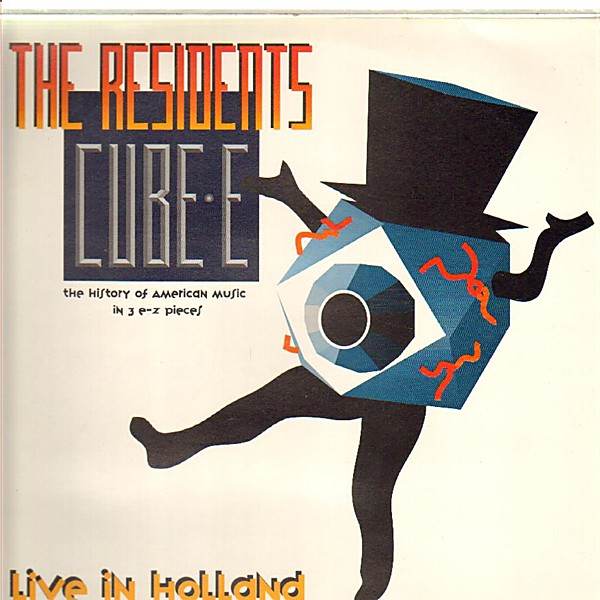

# Cube-E Live in Holland

By **The Residents**

## Album Data

- **Catalog:** Beets
- **Format:** Digital, Album
- **Album:** Cube-E Live in Holland
- **Artist:** The Residents
- **Albumartist:** The Residents
- **Genre:** Post-Punk
- **MusicBrainz Album Artist ID:** 
- **MusicBrainz Album ID:** 
- **MusicBrainz Release Group ID:** 
- **Year:** 0000
- **Catalog #:** 
- **Label:** Euroralph (For409)
- **Total Tracks:** 00

## Album Tracks

### Track 06 - Bach is Dead

- **Artist:** The Residents
- **Format:** MP3
- **Genre:** Electronic
- **Length:** 1:11
- **MusicBrainz Track ID:** 
- **Title:** Bach is Dead
- **Track:** 06
- **Year:** 1978

## See also

- [Duck Stab](Duck_Stab.md)
- [Wormwood](Wormwood.md)
