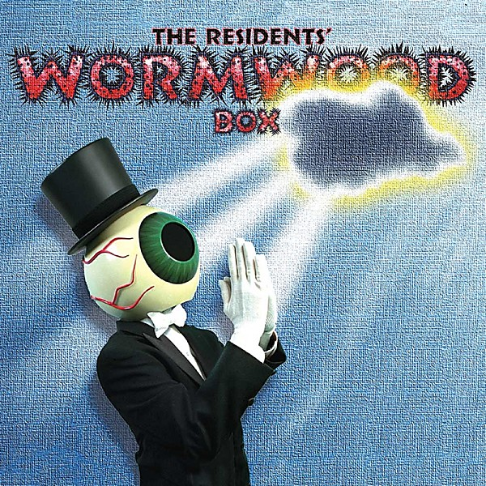

# Wormwood

By **The Residents**

## Album Data

- **Catalog:** Beets
- **Format:** Digital, Album
- **Album:** Wormwood
- **Artist:** The Residents
- **Albumartist:** The Residents
- **Genre:** Post-Punk
- **MusicBrainz Album Artist ID:** 
- **MusicBrainz Album ID:** 
- **MusicBrainz Release Group ID:** 
- **Year:** 1998
- **Catalog #:** 
- **Label:** 
- **Total Tracks:** 00

## Album Tracks

### Track 01 - God's Magic Finger

- **Artist:** The Residents
- **Format:** MP3
- **Genre:** Psychedelic Rock
- **Length:** 2:49
- **MusicBrainz Track ID:** 
- **Title:** God's Magic Finger
- **Track:** 01
- **Year:** 1998

## See also

- [Cube-E Live in Holland](Cube-E_Live_in_Holland.md)
- [Duck Stab](Duck_Stab.md)
