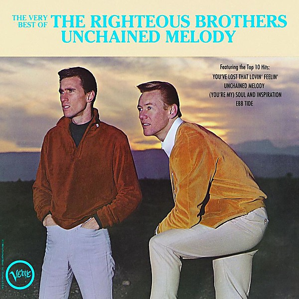

# The Very Best of The Righteous Brothers

By **The Righteous Brothers**

## Album Data

- **Catalog:** Beets
- **Format:** Digital, Album
- **Album:** The Very Best of The Righteous Brothers
- **Artist:** The Righteous Brothers
- **Albumartist:** The Righteous Brothers
- **Genre:** Soul
- **MusicBrainz Album Artist ID:** [1ac3366a-a0e9-4a55-8f6e-796fce32a3b2](https://musicbrainz.org/artist/1ac3366a-a0e9-4a55-8f6e-796fce32a3b2)
- **MusicBrainz Album ID:** [f1ff60d7-3b00-48f8-aecb-81e25e73e34c](https://musicbrainz.org/release/f1ff60d7-3b00-48f8-aecb-81e25e73e34c)
- **MusicBrainz Release Group ID:** [ca052c0d-794e-313d-a77b-5c2fb29813f1](https://musicbrainz.org/release-group/ca052c0d-794e-313d-a77b-5c2fb29813f1)
- **Year:** 1990
- **Catalog #:** 847 248-2
- **Label:** Verve
- **Total Tracks:** 12

## Album Tracks

### Track 01 - You’ve Lost That Lovin’ Feelin’

- **Artist:** The Righteous Brothers
- **Format:** MP3
- **Genre:** Soul
- **Length:** 3:48
- **MusicBrainz Track ID:** [60fe605c-7c44-4b98-82b1-41c0bfd9b96b](https://musicbrainz.org/recording/60fe605c-7c44-4b98-82b1-41c0bfd9b96b)
- **Title:** You’ve Lost That Lovin’ Feelin’
- **Track:** 01
- **Year:** 1990

### Track 02 - Unchained Melody

- **Artist:** The Righteous Brothers
- **Format:** MP3
- **Genre:** Soul
- **Length:** 3:38
- **MusicBrainz Track ID:** [4d78b3d1-42a2-4a50-8475-29e7cf5b5e64](https://musicbrainz.org/recording/4d78b3d1-42a2-4a50-8475-29e7cf5b5e64)
- **Title:** Unchained Melody
- **Track:** 02
- **Year:** 1990

### Track 03 - (You’re My) Soul and Inspiration

- **Artist:** The Righteous Brothers
- **Format:** MP3
- **Genre:** Soul
- **Length:** 3:24
- **MusicBrainz Track ID:** [127217f5-82bd-46be-b085-41f646dd3a4f](https://musicbrainz.org/recording/127217f5-82bd-46be-b085-41f646dd3a4f)
- **Title:** (You’re My) Soul and Inspiration
- **Track:** 03
- **Year:** 1990

### Track 04 - Ebb Tide

- **Artist:** The Righteous Brothers
- **Format:** MP3
- **Genre:** Blue-Eyed Soul
- **Length:** 2:50
- **MusicBrainz Track ID:** [2e0ca4ed-7c0c-4765-978f-26b1e5ed7799](https://musicbrainz.org/recording/2e0ca4ed-7c0c-4765-978f-26b1e5ed7799)
- **Title:** Ebb Tide
- **Track:** 04
- **Year:** 1990

### Track 05 - Just Once in My Life

- **Artist:** The Righteous Brothers
- **Format:** MP3
- **Genre:** Blue-Eyed Soul
- **Length:** 3:51
- **MusicBrainz Track ID:** [d1bdae4d-c35d-48a8-9839-3c3f1d8b6a5e](https://musicbrainz.org/recording/d1bdae4d-c35d-48a8-9839-3c3f1d8b6a5e)
- **Title:** Just Once in My Life
- **Track:** 05
- **Year:** 1990

### Track 06 - The White Cliffs of Dover

- **Artist:** The Righteous Brothers
- **Format:** MP3
- **Genre:** Blue-Eyed Soul
- **Length:** 2:20
- **MusicBrainz Track ID:** [8d0404e2-aec4-4727-8fd3-a5adb118a421](https://musicbrainz.org/recording/8d0404e2-aec4-4727-8fd3-a5adb118a421)
- **Title:** The White Cliffs of Dover
- **Track:** 06
- **Year:** 1990

### Track 07 - He

- **Artist:** The Righteous Brothers
- **Format:** MP3
- **Genre:** Soul
- **Length:** 3:03
- **MusicBrainz Track ID:** [04c03ef4-27d7-4839-8404-87cf158a99fb](https://musicbrainz.org/recording/04c03ef4-27d7-4839-8404-87cf158a99fb)
- **Title:** He
- **Track:** 07
- **Year:** 1990

### Track 08 - Hung on You

- **Artist:** The Righteous Brothers
- **Format:** MP3
- **Genre:** Soul
- **Length:** 3:26
- **MusicBrainz Track ID:** [cc9e1971-c235-4714-b3ab-833383ad23d6](https://musicbrainz.org/recording/cc9e1971-c235-4714-b3ab-833383ad23d6)
- **Title:** Hung on You
- **Track:** 08
- **Year:** 1990

### Track 09 - Little Latin Lupe Lu

- **Artist:** The Righteous Brothers
- **Format:** MP3
- **Genre:** Blue-Eyed Soul
- **Length:** 2:21
- **MusicBrainz Track ID:** [e2fe1a39-9dd6-48bd-8d66-f927e43785b9](https://musicbrainz.org/recording/e2fe1a39-9dd6-48bd-8d66-f927e43785b9)
- **Title:** Little Latin Lupe Lu
- **Track:** 09
- **Year:** 1990

### Track 10 - Go Ahead and Cry

- **Artist:** The Righteous Brothers
- **Format:** MP3
- **Genre:** Soul
- **Length:** 2:38
- **MusicBrainz Track ID:** [edfb0d21-1603-4d84-83ec-f8d015dd540d](https://musicbrainz.org/recording/edfb0d21-1603-4d84-83ec-f8d015dd540d)
- **Title:** Go Ahead and Cry
- **Track:** 10
- **Year:** 1990

### Track 11 - See That Girl

- **Artist:** The Righteous Brothers
- **Format:** MP3
- **Genre:** Blue-Eyed Soul
- **Length:** 3:13
- **MusicBrainz Track ID:** [5e8a27ba-f87e-4829-b451-e3d5db382b55](https://musicbrainz.org/recording/5e8a27ba-f87e-4829-b451-e3d5db382b55)
- **Title:** See That Girl
- **Track:** 11
- **Year:** 1990

### Track 12 - On This Side of Goodbye

- **Artist:** The Righteous Brothers
- **Format:** MP3
- **Genre:** Soul
- **Length:** 3:10
- **MusicBrainz Track ID:** [6a2563d2-4fa1-4a7d-bfbb-4f4e8f1f4e89](https://musicbrainz.org/recording/6a2563d2-4fa1-4a7d-bfbb-4f4e8f1f4e89)
- **Title:** On This Side of Goodbye
- **Track:** 12
- **Year:** 1990

