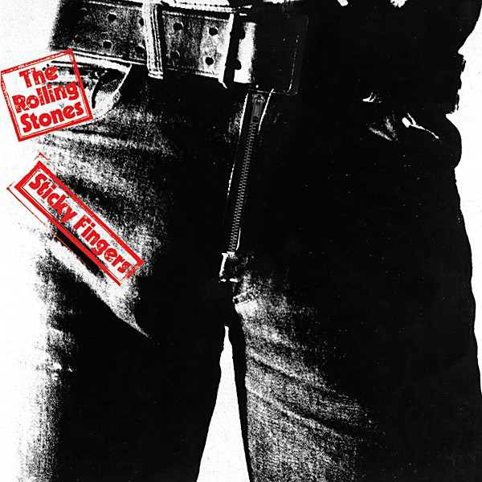

# Sticky Fingers

By **The Rolling Stones**

## Album Data

- **Catalog:** Beets
- **Format:** Digital, Album
- **Album:** Sticky Fingers
- **Artist:** The Rolling Stones
- **Albumartist:** The Rolling Stones
- **Genre:** Rock And Roll
- **MusicBrainz Album Artist ID:** 
- **MusicBrainz Album ID:** 
- **MusicBrainz Release Group ID:** 
- **Year:** 1971
- **Catalog #:** 
- **Label:** 
- **Total Tracks:** 00

## Album Tracks

### Track 01 - Brown Sugar

- **Artist:** The Rolling Stones
- **Format:** AAC
- **Genre:** Rock
- **Length:** 3:50
- **MusicBrainz Track ID:** 
- **Title:** Brown Sugar
- **Track:** 01
- **Year:** 1971

## See also

- [Beggars Banquet](Beggars_Banquet.md)
- [Let It Bleed](Let_It_Bleed.md)
- [Sweet Summer Sun](Sweet_Summer_Sun.md)
- [Their Satanic Majesties Request](Their_Satanic_Majesties_Request.md)
- [Roon: Beggars Banquet (50th Anniversary Edition)](../../Roon/The_Rolling_Stones/Beggars_Banquet_50th_Anniversary_Edition.md)
- [Roon: Their Satanic Majesties Request (50th Anniversary Edition) (50th Anniversary Special Edition / Remastered)](../../Roon/The_Rolling_Stones/Their_Satanic_Majesties_Request_50th_Anniversary_Edition_50th_Anniversary_Special_Edition_-_Remastered.md)
- [Roon: Their Satanic Majesties Request (50th Anniversary Special Edition / Remastered)](../../Roon/The_Rolling_Stones/Their_Satanic_Majesties_Request_50th_Anniversary_Special_Edition_-_Remastered.md)
- [Vinyl: 12 x 5](../../Vinyl/The_Rolling_Stones/12_x_5.md)
- [Vinyl: Aftermath](../../Vinyl/The_Rolling_Stones/Aftermath.md)
- [Vinyl: Between The Buttons](../../Vinyl/The_Rolling_Stones/Between_The_Buttons.md)
- [Vinyl: England's Newest Hit Makers](../../Vinyl/The_Rolling_Stones/Englands_Newest_Hit_Makers.md)
- [Vinyl: Goats Head Soup](../../Vinyl/The_Rolling_Stones/Goats_Head_Soup.md)
- [Vinyl: Got Live If You Want It!](../../Vinyl/The_Rolling_Stones/Got_Live_If_You_Want_It!.md)
- [Vinyl: It's Only Rock 'N Roll](../../Vinyl/The_Rolling_Stones/Its_Only_Rock_N_Roll.md)
- [Vinyl: Jumpin' Jack Flash](../../Vinyl/The_Rolling_Stones/Jumpin_Jack_Flash.md)
- [Vinyl: Out Of Our Heads](../../Vinyl/The_Rolling_Stones/Out_Of_Our_Heads.md)
- [Vinyl: "Paint It, Black"](../../Vinyl/The_Rolling_Stones/Paint_It__Black.md)
- [Vinyl: Some Girls](../../Vinyl/The_Rolling_Stones/Some_Girls.md)
- [Vinyl: Steel Wheels](../../Vinyl/The_Rolling_Stones/Steel_Wheels.md)
- [Vinyl: Sticky Fingers](../../Vinyl/The_Rolling_Stones/Sticky_Fingers.md)
- [Vinyl: ](../../Vinyl/The_Rolling_Stones/The_Rolling_Stones.md)
- [Vinyl: "The Rolling Stones, Now!"](../../Vinyl/The_Rolling_Stones/The_Rolling_Stones__Now!.md)
- [Vinyl: "Through The Past, Darkly (Big Hits Vol. 2)"](../../Vinyl/The_Rolling_Stones/Through_The_Past__Darkly_Big_Hits_Vol_2.md)
