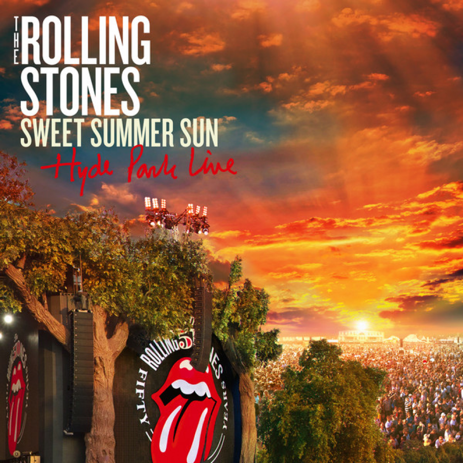

# Sweet Summer Sun

By **The Rolling Stones**

## Album Data

- **Catalog:** Beets
- **Format:** Digital, Album
- **Album:** Sweet Summer Sun
- **Artist:** The Rolling Stones
- **Albumartist:** The Rolling Stones
- **Genre:** Rock
- **MusicBrainz Album Artist ID:** [b071f9fa-14b0-4217-8e97-eb41da73f598](https://musicbrainz.org/artist/b071f9fa-14b0-4217-8e97-eb41da73f598)
- **MusicBrainz Album ID:** [47b80a04-f0c0-4fc4-9944-4a1e05395d9a](https://musicbrainz.org/release/47b80a04-f0c0-4fc4-9944-4a1e05395d9a)
- **MusicBrainz Release Group ID:** [2e277a2d-c883-47f4-929e-389cea0e887b](https://musicbrainz.org/release-group/2e277a2d-c883-47f4-929e-389cea0e887b)
- **Year:** 2014
- **Catalog #:** 90022
- **Label:** ABKCO
- **Total Tracks:** 10

## Album Tracks

### Track 01 - Sing This All Together

- **Artist:** The Rolling Stones
- **Format:** AAC
- **Genre:** Psychedelic Rock
- **Length:** 3:51
- **MusicBrainz Track ID:** [88c84bfe-bfa9-42a4-aac3-7b7d61944ad1](https://musicbrainz.org/recording/88c84bfe-bfa9-42a4-aac3-7b7d61944ad1)
- **Title:** Sing This All Together
- **Track:** 01
- **Year:** 2002

### Track 02 - Citadel

- **Artist:** The Rolling Stones
- **Format:** AAC
- **Genre:** Psychedelic Rock
- **Length:** 2:54
- **MusicBrainz Track ID:** [422283d8-a32b-43e3-b872-4b76b47528e9](https://musicbrainz.org/recording/422283d8-a32b-43e3-b872-4b76b47528e9)
- **Title:** Citadel
- **Track:** 02
- **Year:** 2002

### Track 03 - In Another Land

- **Artist:** The Rolling Stones
- **Format:** AAC
- **Genre:** Psychedelic Rock
- **Length:** 3:19
- **MusicBrainz Track ID:** [2699e232-e48d-42ea-a9ba-1122db9fca14](https://musicbrainz.org/recording/2699e232-e48d-42ea-a9ba-1122db9fca14)
- **Title:** In Another Land
- **Track:** 03
- **Year:** 2002

### Track 04 - 2000 Man

- **Artist:** The Rolling Stones
- **Format:** AAC
- **Genre:** Psychedelic Rock
- **Length:** 3:12
- **MusicBrainz Track ID:** [63b716a0-ba82-4bc6-919e-0390ec9e0fe2](https://musicbrainz.org/recording/63b716a0-ba82-4bc6-919e-0390ec9e0fe2)
- **Title:** 2000 Man
- **Track:** 04
- **Year:** 2002

### Track 05 - Sing This All Together (See What Happens)

- **Artist:** The Rolling Stones
- **Format:** AAC
- **Genre:** Psychedelic Rock
- **Length:** 8:48
- **MusicBrainz Track ID:** [d9997905-de72-4b2d-9cc9-92d3077df2e5](https://musicbrainz.org/recording/d9997905-de72-4b2d-9cc9-92d3077df2e5)
- **Title:** Sing This All Together (See What Happens)
- **Track:** 05
- **Year:** 2002

### Track 06 - She’s a Rainbow

- **Artist:** The Rolling Stones
- **Format:** AAC
- **Genre:** Psychedelic Rock
- **Length:** 4:42
- **MusicBrainz Track ID:** [a7035f83-e2c9-4111-ac9f-dfdcab30772d](https://musicbrainz.org/recording/a7035f83-e2c9-4111-ac9f-dfdcab30772d)
- **Title:** She’s a Rainbow
- **Track:** 06
- **Year:** 2002

### Track 07 - The Lantern

- **Artist:** The Rolling Stones
- **Format:** AAC
- **Genre:** Psychedelic Rock
- **Length:** 4:28
- **MusicBrainz Track ID:** [65c76da6-ecb0-424d-b913-f8dca8aefe42](https://musicbrainz.org/recording/65c76da6-ecb0-424d-b913-f8dca8aefe42)
- **Title:** The Lantern
- **Track:** 07
- **Year:** 2002

### Track 08 - Gomper

- **Artist:** The Rolling Stones
- **Format:** AAC
- **Genre:** Psychedelic Rock
- **Length:** 5:16
- **MusicBrainz Track ID:** [f95caaa2-d4a2-4cf6-84c0-ca0dae663a3e](https://musicbrainz.org/recording/f95caaa2-d4a2-4cf6-84c0-ca0dae663a3e)
- **Title:** Gomper
- **Track:** 08
- **Year:** 2002

### Track 09 - 2000 Light Years From Home

- **Artist:** The Rolling Stones
- **Format:** AAC
- **Genre:** Space Rock
- **Length:** 4:51
- **MusicBrainz Track ID:** [ccf44f0f-e5c6-453d-8fb1-62783e8be42e](https://musicbrainz.org/recording/ccf44f0f-e5c6-453d-8fb1-62783e8be42e)
- **Title:** 2000 Light Years From Home
- **Track:** 09
- **Year:** 2002

### Track 10 - On With the Show

- **Artist:** The Rolling Stones
- **Format:** AAC
- **Genre:** Rock And Roll
- **Length:** 3:46
- **MusicBrainz Track ID:** [9609168e-584c-45ed-b1dc-7542dd943938](https://musicbrainz.org/recording/9609168e-584c-45ed-b1dc-7542dd943938)
- **Title:** On With the Show
- **Track:** 10
- **Year:** 2002

## See also

- [Beggars Banquet](Beggars_Banquet.md)
- [Let It Bleed](Let_It_Bleed.md)
- [Sticky Fingers](Sticky_Fingers.md)
- [Their Satanic Majesties Request](Their_Satanic_Majesties_Request.md)
- [Roon: Beggars Banquet (50th Anniversary Edition)](../../Roon/The_Rolling_Stones/Beggars_Banquet_50th_Anniversary_Edition.md)
- [Roon: Their Satanic Majesties Request (50th Anniversary Edition) (50th Anniversary Special Edition / Remastered)](../../Roon/The_Rolling_Stones/Their_Satanic_Majesties_Request_50th_Anniversary_Edition_50th_Anniversary_Special_Edition_-_Remastered.md)
- [Roon: Their Satanic Majesties Request (50th Anniversary Special Edition / Remastered)](../../Roon/The_Rolling_Stones/Their_Satanic_Majesties_Request_50th_Anniversary_Special_Edition_-_Remastered.md)
- [Vinyl: 12 x 5](../../Vinyl/The_Rolling_Stones/12_x_5.md)
- [Vinyl: Aftermath](../../Vinyl/The_Rolling_Stones/Aftermath.md)
- [Vinyl: Between The Buttons](../../Vinyl/The_Rolling_Stones/Between_The_Buttons.md)
- [Vinyl: England's Newest Hit Makers](../../Vinyl/The_Rolling_Stones/Englands_Newest_Hit_Makers.md)
- [Vinyl: Goats Head Soup](../../Vinyl/The_Rolling_Stones/Goats_Head_Soup.md)
- [Vinyl: Got Live If You Want It!](../../Vinyl/The_Rolling_Stones/Got_Live_If_You_Want_It!.md)
- [Vinyl: It's Only Rock 'N Roll](../../Vinyl/The_Rolling_Stones/Its_Only_Rock_N_Roll.md)
- [Vinyl: Jumpin' Jack Flash](../../Vinyl/The_Rolling_Stones/Jumpin_Jack_Flash.md)
- [Vinyl: Out Of Our Heads](../../Vinyl/The_Rolling_Stones/Out_Of_Our_Heads.md)
- [Vinyl: "Paint It, Black"](../../Vinyl/The_Rolling_Stones/Paint_It__Black.md)
- [Vinyl: Some Girls](../../Vinyl/The_Rolling_Stones/Some_Girls.md)
- [Vinyl: Steel Wheels](../../Vinyl/The_Rolling_Stones/Steel_Wheels.md)
- [Vinyl: Sticky Fingers](../../Vinyl/The_Rolling_Stones/Sticky_Fingers.md)
- [Vinyl: ](../../Vinyl/The_Rolling_Stones/The_Rolling_Stones.md)
- [Vinyl: "The Rolling Stones, Now!"](../../Vinyl/The_Rolling_Stones/The_Rolling_Stones__Now!.md)
- [Vinyl: "Through The Past, Darkly (Big Hits Vol. 2)"](../../Vinyl/The_Rolling_Stones/Through_The_Past__Darkly_Big_Hits_Vol_2.md)
