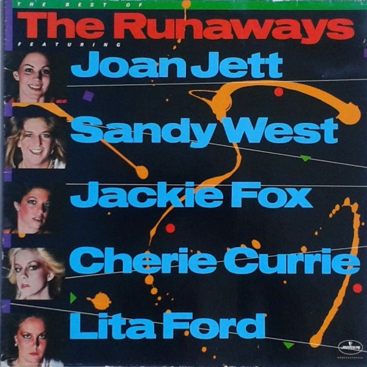

# The Best of the Runaways

By **The Runaways**

## Album Data

- **Catalog:** Beets
- **Format:** Digital, Album
- **Album:** The Best of the Runaways
- **Artist:** The Runaways
- **Albumartist:** The Runaways
- **Genre:** Surf Rock
- **MusicBrainz Album Artist ID:** 
- **MusicBrainz Album ID:** 
- **MusicBrainz Release Group ID:** 
- **Year:** 1976
- **Catalog #:** 
- **Label:** 
- **Total Tracks:** 12

## Album Tracks

### Track 01 - Cherry Bomb

- **Artist:** The Runaways
- **Format:** ALAC
- **Genre:** Punk Rock
- **Length:** 2:20
- **MusicBrainz Track ID:** 
- **Title:** Cherry Bomb
- **Track:** 01
- **Year:** 1976

### Track 02 - Blackmail

- **Artist:** The Runaways
- **Format:** ALAC
- **Genre:** Punk Rock
- **Length:** 2:42
- **MusicBrainz Track ID:** 
- **Title:** Blackmail
- **Track:** 02
- **Year:** 1976

### Track 03 - Secrets

- **Artist:** The Runaways
- **Format:** ALAC
- **Genre:** Punk Rock
- **Length:** 2:45
- **MusicBrainz Track ID:** 
- **Title:** Secrets
- **Track:** 03
- **Year:** 1976

### Track 04 - I Love Playin' With Fire

- **Artist:** The Runaways
- **Format:** ALAC
- **Genre:** Punk Rock
- **Length:** 3:22
- **MusicBrainz Track ID:** 
- **Title:** I Love Playin' With Fire
- **Track:** 04
- **Year:** 1977

### Track 05 - Born To Be Bad

- **Artist:** The Runaways
- **Format:** ALAC
- **Genre:** Riot Grrrl
- **Length:** 4:32
- **MusicBrainz Track ID:** 
- **Title:** Born To Be Bad
- **Track:** 05
- **Year:** 1977

### Track 06 - Take It Or Leave It

- **Artist:** The Runaways
- **Format:** ALAC
- **Genre:** Punk Rock
- **Length:** 3:27
- **MusicBrainz Track ID:** 
- **Title:** Take It Or Leave It
- **Track:** 06
- **Year:** 1977

### Track 07 - Queens Of Noise [Live]

- **Artist:** The Runaways
- **Format:** ALAC
- **Genre:** Punk Rock
- **Length:** 3:24
- **MusicBrainz Track ID:** 
- **Title:** Queens Of Noise [Live]
- **Track:** 07
- **Year:** 1977

### Track 08 - You Drive Me Wild [Live]

- **Artist:** The Runaways
- **Format:** ALAC
- **Genre:** Surf Rock
- **Length:** 3:17
- **MusicBrainz Track ID:** 
- **Title:** You Drive Me Wild [Live]
- **Track:** 08
- **Year:** 1977

### Track 09 - Neon Angels On The Road To Ruin [Live]

- **Artist:** The Runaways
- **Format:** ALAC
- **Genre:** Surf Rock
- **Length:** 3:35
- **MusicBrainz Track ID:** 
- **Title:** Neon Angels On The Road To Ruin [Live]
- **Track:** 09
- **Year:** 1977

### Track 10 - Wasted

- **Artist:** The Runaways
- **Format:** ALAC
- **Genre:** Punk Rock
- **Length:** 3:27
- **MusicBrainz Track ID:** 
- **Title:** Wasted
- **Track:** 10
- **Year:** 1977

### Track 11 - Wait For Me

- **Artist:** The Runaways
- **Format:** ALAC
- **Genre:** Riot Grrrl
- **Length:** 4:57
- **MusicBrainz Track ID:** 
- **Title:** Wait For Me
- **Track:** 11
- **Year:** 1977

### Track 12 - Waitin' For The Night

- **Artist:** The Runaways
- **Format:** ALAC
- **Genre:** Punk Rock
- **Length:** 5:02
- **MusicBrainz Track ID:** 
- **Title:** Waitin' For The Night
- **Track:** 12
- **Year:** 1977

