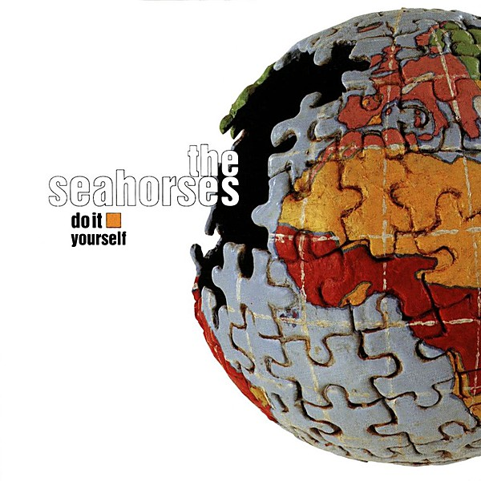

# Do It Yourself

By **The Seahorses**

## Album Data

- **Catalog:** Beets
- **Format:** Digital, Album
- **Album:** Do It Yourself
- **Artist:** The Seahorses
- **Albumartist:** The Seahorses
- **Genre:** Britpop
- **MusicBrainz Album Artist ID:** [b8a92c4e-9f24-4ed5-9c0b-c353e19c01cd](https://musicbrainz.org/artist/b8a92c4e-9f24-4ed5-9c0b-c353e19c01cd)
- **MusicBrainz Album ID:** [2930d8d9-a313-4842-b932-065797417d6a](https://musicbrainz.org/release/2930d8d9-a313-4842-b932-065797417d6a)
- **MusicBrainz Release Group ID:** [85291aba-ee97-32ff-92f2-c65a0830a442](https://musicbrainz.org/release-group/85291aba-ee97-32ff-92f2-c65a0830a442)
- **Year:** 1997
- **Catalog #:** GEFD-25134
- **Label:** Geffen Records
- **Total Tracks:** 11

## Album Tracks

### Track 01 - I Want You to Know

- **Artist:** The Seahorses
- **Format:** ALAC
- **Genre:** Britpop
- **Length:** 4:51
- **MusicBrainz Track ID:** [6c68df91-e37c-4a18-bc2b-63bb262ad2f5](https://musicbrainz.org/recording/6c68df91-e37c-4a18-bc2b-63bb262ad2f5)
- **Title:** I Want You to Know
- **Track:** 01
- **Year:** 1997

### Track 02 - Blinded by the Sun

- **Artist:** The Seahorses
- **Format:** ALAC
- **Genre:** Indie Rock
- **Length:** 4:38
- **MusicBrainz Track ID:** [5b12dc45-a211-4efe-bd72-d171a811d4cd](https://musicbrainz.org/recording/5b12dc45-a211-4efe-bd72-d171a811d4cd)
- **Title:** Blinded by the Sun
- **Track:** 02
- **Year:** 1997

### Track 03 - Suicide Drive

- **Artist:** The Seahorses
- **Format:** ALAC
- **Genre:** Indie Rock
- **Length:** 3:31
- **MusicBrainz Track ID:** [b1e108c3-5210-44eb-afbe-d4bbe20e0346](https://musicbrainz.org/recording/b1e108c3-5210-44eb-afbe-d4bbe20e0346)
- **Title:** Suicide Drive
- **Track:** 03
- **Year:** 1997

### Track 04 - The Boy in the Picture

- **Artist:** The Seahorses
- **Format:** ALAC
- **Genre:** Britpop
- **Length:** 2:53
- **MusicBrainz Track ID:** [e94f989c-7bf3-4681-8198-2f55673e8c12](https://musicbrainz.org/recording/e94f989c-7bf3-4681-8198-2f55673e8c12)
- **Title:** The Boy in the Picture
- **Track:** 04
- **Year:** 1997

### Track 05 - Love Is the Law

- **Artist:** The Seahorses
- **Format:** ALAC
- **Genre:** Indie Rock
- **Length:** 7:43
- **MusicBrainz Track ID:** [70162e6f-5566-4719-8258-19ccae92f284](https://musicbrainz.org/recording/70162e6f-5566-4719-8258-19ccae92f284)
- **Title:** Love Is the Law
- **Track:** 05
- **Year:** 1997

### Track 06 - Happiness Is Eggshaped

- **Artist:** The Seahorses
- **Format:** ALAC
- **Genre:** Indie Rock
- **Length:** 3:45
- **MusicBrainz Track ID:** [3dd2f95a-1eb0-47d2-b3d5-f2531de47792](https://musicbrainz.org/recording/3dd2f95a-1eb0-47d2-b3d5-f2531de47792)
- **Title:** Happiness Is Eggshaped
- **Track:** 06
- **Year:** 1997

### Track 07 - Love Me and Leave Me

- **Artist:** The Seahorses
- **Format:** ALAC
- **Genre:** Britpop
- **Length:** 3:55
- **MusicBrainz Track ID:** [d18bf8df-3e83-4f82-98ed-834797b60d19](https://musicbrainz.org/recording/d18bf8df-3e83-4f82-98ed-834797b60d19)
- **Title:** Love Me and Leave Me
- **Track:** 07
- **Year:** 1997

### Track 08 - Round the Universe

- **Artist:** The Seahorses
- **Format:** ALAC
- **Genre:** Britpop
- **Length:** 3:46
- **MusicBrainz Track ID:** [28efc5f0-d39f-4912-a1f7-0325ee1eaca9](https://musicbrainz.org/recording/28efc5f0-d39f-4912-a1f7-0325ee1eaca9)
- **Title:** Round the Universe
- **Track:** 08
- **Year:** 1997

### Track 09 - 1999

- **Artist:** The Seahorses
- **Format:** ALAC
- **Genre:** Indie Rock
- **Length:** 3:24
- **MusicBrainz Track ID:** [d1f5fb28-e2aa-4b7c-a1fe-ccf30c5f1ae1](https://musicbrainz.org/recording/d1f5fb28-e2aa-4b7c-a1fe-ccf30c5f1ae1)
- **Title:** 1999
- **Track:** 09
- **Year:** 1997

### Track 10 - Standing on Your Head

- **Artist:** The Seahorses
- **Format:** ALAC
- **Genre:** Britpop
- **Length:** 4:39
- **MusicBrainz Track ID:** [6bd5ec62-08ca-4bc8-ad5c-f2560a4dce6b](https://musicbrainz.org/recording/6bd5ec62-08ca-4bc8-ad5c-f2560a4dce6b)
- **Title:** Standing on Your Head
- **Track:** 10
- **Year:** 1997

### Track 11 - Hello

- **Artist:** The Seahorses
- **Format:** ALAC
- **Genre:** Indie Rock
- **Length:** 2:22
- **MusicBrainz Track ID:** [89bb0b2e-2ff1-4e7b-be67-a862d927396f](https://musicbrainz.org/recording/89bb0b2e-2ff1-4e7b-be67-a862d927396f)
- **Title:** Hello
- **Track:** 11
- **Year:** 1997

