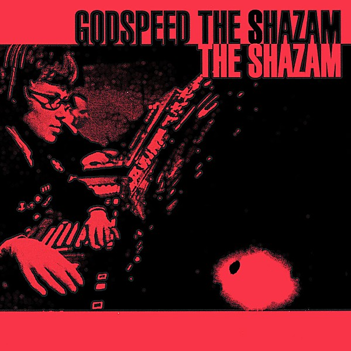

# Godspeed the Shazam

By **The Shazam**

## Album Data

- **Catalog:** Beets
- **Format:** Digital, Album
- **Album:** Godspeed the Shazam
- **Artist:** The Shazam
- **Albumartist:** The Shazam
- **Genre:** Surf Rock
- **MusicBrainz Album Artist ID:** [48416ae7-446f-4149-926e-2728fddb4764](https://musicbrainz.org/artist/48416ae7-446f-4149-926e-2728fddb4764)
- **MusicBrainz Album ID:** [8e883d26-3d2b-4206-87b7-2a89ba69c334](https://musicbrainz.org/release/8e883d26-3d2b-4206-87b7-2a89ba69c334)
- **MusicBrainz Release Group ID:** [16612e55-4247-35fd-b05c-d3c4e453d1f7](https://musicbrainz.org/release-group/16612e55-4247-35fd-b05c-d3c4e453d1f7)
- **Year:** 1999
- **Catalog #:** NL 080
- **Label:** Not Lame Recordings
- **Total Tracks:** 12

## Album Tracks

### Track 01 - Rockin' and Rollin' (With My) Rock 'n' Roll Rock 'n' Roller

- **Artist:** The Shazam
- **Format:** MP3
- **Genre:** Indie Rock
- **Length:** 3:04
- **MusicBrainz Track ID:** [f59a8d81-16d7-48bb-abe0-e1c252c94848](https://musicbrainz.org/recording/f59a8d81-16d7-48bb-abe0-e1c252c94848)
- **Title:** Rockin' and Rollin' (With My) Rock 'n' Roll Rock 'n' Roller
- **Track:** 01
- **Year:** 2002

### Track 02 - We Think Yer Dead

- **Artist:** The Shazam
- **Format:** MP3
- **Genre:** Indie Rock
- **Length:** 3:05
- **MusicBrainz Track ID:** [88af23ed-b1e4-4f42-932d-badfaedd4f23](https://musicbrainz.org/recording/88af23ed-b1e4-4f42-932d-badfaedd4f23)
- **Title:** We Think Yer Dead
- **Track:** 02
- **Year:** 2002

### Track 03 - Gettin' Higher

- **Artist:** The Shazam
- **Format:** MP3
- **Genre:** Power Pop
- **Length:** 3:14
- **MusicBrainz Track ID:** [41e47ca8-5262-4b96-bc66-c68618c72ee2](https://musicbrainz.org/recording/41e47ca8-5262-4b96-bc66-c68618c72ee2)
- **Title:** Gettin' Higher
- **Track:** 03
- **Year:** 2002

### Track 04 - Goodbye American Man

- **Artist:** The Shazam
- **Format:** MP3
- **Genre:** Indie Rock
- **Length:** 3:24
- **MusicBrainz Track ID:** [b24c41ba-8954-4d15-be14-8729125394f0](https://musicbrainz.org/recording/b24c41ba-8954-4d15-be14-8729125394f0)
- **Title:** Goodbye American Man
- **Track:** 04
- **Year:** 2002

### Track 05 - Fallin' All Around Me

- **Artist:** The Shazam
- **Format:** MP3
- **Genre:** Indie Rock
- **Length:** 3:35
- **MusicBrainz Track ID:** [4cc87476-eaff-4691-bff7-0eede40760ae](https://musicbrainz.org/recording/4cc87476-eaff-4691-bff7-0eede40760ae)
- **Title:** Fallin' All Around Me
- **Track:** 05
- **Year:** 2002

### Track 06 - The Not Quite Right Kid

- **Artist:** The Shazam
- **Format:** MP3
- **Genre:** Indie Rock
- **Length:** 4:21
- **MusicBrainz Track ID:** [bb00e694-2d95-45ff-b7bb-1c94a3989425](https://musicbrainz.org/recording/bb00e694-2d95-45ff-b7bb-1c94a3989425)
- **Title:** The Not Quite Right Kid
- **Track:** 06
- **Year:** 2002

### Track 07 - Squeeze the Day

- **Artist:** The Shazam
- **Format:** MP3
- **Genre:** Indie Rock
- **Length:** 3:28
- **MusicBrainz Track ID:** [dcaefb7d-45ef-497e-8081-5813b0333f90](https://musicbrainz.org/recording/dcaefb7d-45ef-497e-8081-5813b0333f90)
- **Title:** Squeeze the Day
- **Track:** 07
- **Year:** 2002

### Track 08 - Turnaround

- **Artist:** The Shazam
- **Format:** MP3
- **Genre:** Power Pop
- **Length:** 3:04
- **MusicBrainz Track ID:** [25543820-c683-418a-adf4-7c3411fa33f2](https://musicbrainz.org/recording/25543820-c683-418a-adf4-7c3411fa33f2)
- **Title:** Turnaround
- **Track:** 08
- **Year:** 2002

### Track 09 - New Thing Baby

- **Artist:** The Shazam
- **Format:** MP3
- **Genre:** Indie Rock
- **Length:** 2:46
- **MusicBrainz Track ID:** [16ebd287-c497-47d4-baa0-2b638018e84b](https://musicbrainz.org/recording/16ebd287-c497-47d4-baa0-2b638018e84b)
- **Title:** New Thing Baby
- **Track:** 09
- **Year:** 2002

### Track 10 - Not Lost Anymore

- **Artist:** The Shazam
- **Format:** MP3
- **Genre:** Indie Rock
- **Length:** 3:02
- **MusicBrainz Track ID:** [9c3fd7c0-dca8-48aa-aaf3-e059c3090fb3](https://musicbrainz.org/recording/9c3fd7c0-dca8-48aa-aaf3-e059c3090fb3)
- **Title:** Not Lost Anymore
- **Track:** 10
- **Year:** 2002

### Track 11 - You Know Who

- **Artist:** The Shazam
- **Format:** MP3
- **Genre:** Indie Rock
- **Length:** 3:23
- **MusicBrainz Track ID:** [c645359c-7c86-4106-869f-d38ca293eb05](https://musicbrainz.org/recording/c645359c-7c86-4106-869f-d38ca293eb05)
- **Title:** You Know Who
- **Track:** 11
- **Year:** 2002

### Track 12 - Nine Times

- **Artist:** The Shazam
- **Format:** MP3
- **Genre:** Indie Rock
- **Length:** 3:15
- **MusicBrainz Track ID:** [33d53ab1-54a4-4aa4-9fe8-46f27738f37c](https://musicbrainz.org/recording/33d53ab1-54a4-4aa4-9fe8-46f27738f37c)
- **Title:** Nine Times
- **Track:** 12
- **Year:** 2002

## See also

- [Meteor](Meteor.md)
- [Tomorrow the World](Tomorrow_the_World.md)
- [Roon: Godspeed the Shazam](../../Roon/The_Shazam/Godspeed_the_Shazam.md)
- [Roon: Tomorrow the World](../../Roon/The_Shazam/Tomorrow_the_World.md)
