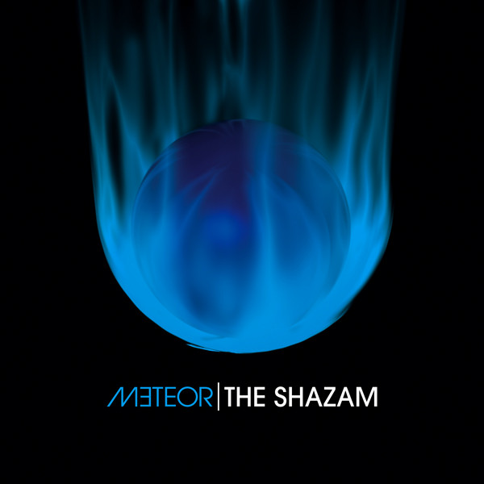

# Meteor

By **The Shazam**

## Album Data

- **Catalog:** Beets
- **Format:** Digital, Album
- **Album:** Meteor
- **Artist:** The Shazam
- **Albumartist:** The Shazam
- **Genre:** Indie Rock
- **MusicBrainz Album Artist ID:** 
- **MusicBrainz Album ID:** 
- **MusicBrainz Release Group ID:** 
- **Year:** 2009
- **Catalog #:** 
- **Label:** 
- **Total Tracks:** 11

## Album Tracks

### Track 01 - So Awesome

- **Artist:** The Shazam
- **Format:** MP3
- **Genre:** Indie Rock
- **Length:** 3:45
- **MusicBrainz Track ID:** 
- **Title:** So Awesome
- **Track:** 01
- **Year:** 2009

## See also

- [Godspeed the Shazam](Godspeed_the_Shazam.md)
- [Tomorrow the World](Tomorrow_the_World.md)
- [Roon: Godspeed the Shazam](../../Roon/The_Shazam/Godspeed_the_Shazam.md)
- [Roon: Tomorrow the World](../../Roon/The_Shazam/Tomorrow_the_World.md)
