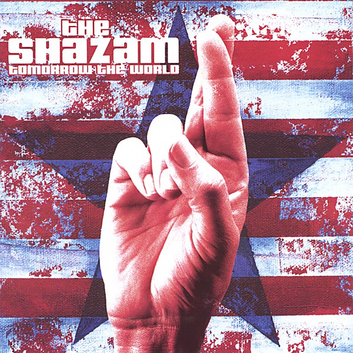

# Tomorrow the World

By The Shazam

## Album Data

- Catalog: Beets
- Format: Digital, Album
- Album: Tomorrow the World
- Artist: The Shazam
- Albumartist: The Shazam
- Genre: Indie Rock
- MusicBrainz Album Artist ID: 48416ae7-446f-4149-926e-2728fddb4764
- MusicBrainz Album ID: fc944bbc-73ad-469b-ab5c-6eeffbafae7d
- MusicBrainz Release Group ID: 1b96b5c2-7a52-39e8-b29e-fccbc9e3f19a
- Year: 2002

