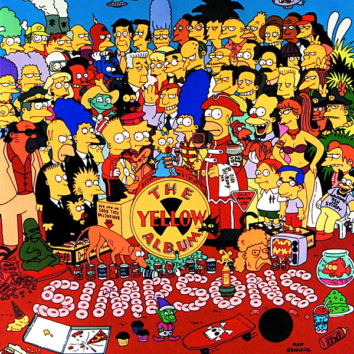

# The Yellow Album

By **The Simpsons**

## Album Data

- **Catalog:** Beets
- **Format:** Digital, Album
- **Album:** The Yellow Album
- **Artist:** The Simpsons
- **Albumartist:** The Simpsons
- **Genre:** Humor
- **MusicBrainz Album Artist ID:** [eca1f8ea-52af-4e33-959a-12a59e12adab](https://musicbrainz.org/artist/eca1f8ea-52af-4e33-959a-12a59e12adab)
- **MusicBrainz Album ID:** [a55a759b-703d-434a-b5ee-8ba457ccf6db](https://musicbrainz.org/release/a55a759b-703d-434a-b5ee-8ba457ccf6db)
- **MusicBrainz Release Group ID:** [221e1fcc-8f09-314a-aa63-97199dc6062f](https://musicbrainz.org/release-group/221e1fcc-8f09-314a-aa63-97199dc6062f)
- **Year:** 1998
- **Catalog #:** GEFD 24480
- **Label:** Geffen Records
- **Total Tracks:** 10

## Album Tracks

### Track 01 - Love?

- **Artist:** The Simpsons
- **Format:** ALAC
- **Genre:** Comedy
- **Length:** 3:50
- **MusicBrainz Track ID:** [8a07acc7-d483-4a05-9c90-ac8ed0400d71](https://musicbrainz.org/recording/8a07acc7-d483-4a05-9c90-ac8ed0400d71)
- **Title:** Love?
- **Track:** 01
- **Year:** 1998

### Track 02 - Sisters Are Doin’ It for Themselves

- **Artist:** The Simpsons
- **Format:** ALAC
- **Genre:** Humor
- **Length:** 4:00
- **MusicBrainz Track ID:** [23897e78-68a8-4e47-997c-6201c207a3cc](https://musicbrainz.org/recording/23897e78-68a8-4e47-997c-6201c207a3cc)
- **Title:** Sisters Are Doin’ It for Themselves
- **Track:** 02
- **Year:** 1998

### Track 03 - Funny How Time Slips Away

- **Artist:** The Simpsons
- **Format:** ALAC
- **Genre:** Humor
- **Length:** 4:06
- **MusicBrainz Track ID:** [3775c7f1-5633-4f75-b0fd-9cd0def09718](https://musicbrainz.org/recording/3775c7f1-5633-4f75-b0fd-9cd0def09718)
- **Title:** Funny How Time Slips Away
- **Track:** 03
- **Year:** 1998

### Track 04 - Twenty-Four Hours a Day

- **Artist:** The Simpsons
- **Format:** ALAC
- **Genre:** Humor
- **Length:** 4:24
- **MusicBrainz Track ID:** [41897f96-6ac7-4648-9e2b-d472d5f9f963](https://musicbrainz.org/recording/41897f96-6ac7-4648-9e2b-d472d5f9f963)
- **Title:** Twenty-Four Hours a Day
- **Track:** 04
- **Year:** 1998

### Track 05 - Ten Commandments of Bart

- **Artist:** The Simpsons
- **Format:** ALAC
- **Genre:** Humor
- **Length:** 6:08
- **MusicBrainz Track ID:** [9b6bcf89-7439-4b0c-acd3-f84350ce5701](https://musicbrainz.org/recording/9b6bcf89-7439-4b0c-acd3-f84350ce5701)
- **Title:** Ten Commandments of Bart
- **Track:** 05
- **Year:** 1998

### Track 06 - I Just Can’t Help Myself

- **Artist:** The Simpsons
- **Format:** ALAC
- **Genre:** Humor
- **Length:** 4:58
- **MusicBrainz Track ID:** [4a72405a-6a1d-45f8-97c1-a363c769635d](https://musicbrainz.org/recording/4a72405a-6a1d-45f8-97c1-a363c769635d)
- **Title:** I Just Can’t Help Myself
- **Track:** 06
- **Year:** 1998

### Track 07 - She’s Comin’ Out Swingin’

- **Artist:** The Simpsons
- **Format:** ALAC
- **Genre:** Humor
- **Length:** 6:37
- **MusicBrainz Track ID:** [382691fd-4bba-4afa-857b-2a924a9a8aba](https://musicbrainz.org/recording/382691fd-4bba-4afa-857b-2a924a9a8aba)
- **Title:** She’s Comin’ Out Swingin’
- **Track:** 07
- **Year:** 1998

### Track 08 - Anyone Else

- **Artist:** The Simpsons
- **Format:** ALAC
- **Genre:** Humor
- **Length:** 3:56
- **MusicBrainz Track ID:** [0a2661f6-347d-4632-9db8-939293a8db36](https://musicbrainz.org/recording/0a2661f6-347d-4632-9db8-939293a8db36)
- **Title:** Anyone Else
- **Track:** 08
- **Year:** 1998

### Track 09 - Every Summer With You

- **Artist:** The Simpsons
- **Format:** ALAC
- **Genre:** Comedy
- **Length:** 3:36
- **MusicBrainz Track ID:** [e052debe-1624-4371-9638-c9cc97b69c8d](https://musicbrainz.org/recording/e052debe-1624-4371-9638-c9cc97b69c8d)
- **Title:** Every Summer With You
- **Track:** 09
- **Year:** 1998

### Track 10 - Hail to Thee, Kamp Krusty

- **Artist:** The Simpsons
- **Format:** ALAC
- **Genre:** Rock
- **Length:** 5:00
- **MusicBrainz Track ID:** [23828b80-60b6-4de5-9cf3-af2c0fbee8b8](https://musicbrainz.org/recording/23828b80-60b6-4de5-9cf3-af2c0fbee8b8)
- **Title:** Hail to Thee, Kamp Krusty
- **Track:** 10
- **Year:** 1998

