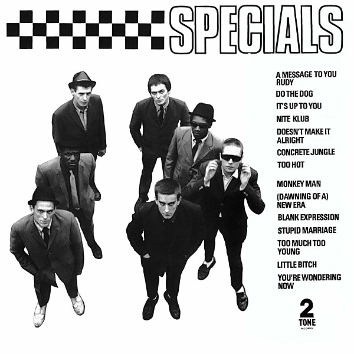

# The Specials

By **The Specials**

## Album Data

- **Catalog:** Beets
- **Format:** Digital, Album
- **Album:** The Specials
- **Artist:** The Specials
- **Albumartist:** The Specials
- **Genre:** Ska
- **MusicBrainz Album Artist ID:** [07eb40a2-2914-439c-a01d-15a685b84ddf](https://musicbrainz.org/artist/07eb40a2-2914-439c-a01d-15a685b84ddf)
- **MusicBrainz Album ID:** [1b9af604-27c8-4528-b753-8f3396e362d4](https://musicbrainz.org/release/1b9af604-27c8-4528-b753-8f3396e362d4)
- **MusicBrainz Release Group ID:** [9c02ca99-df9a-3e48-8b7a-fabb599d19a3](https://musicbrainz.org/release-group/9c02ca99-df9a-3e48-8b7a-fabb599d19a3)
- **Year:** 1979
- **Catalog #:** VK 41265
- **Label:** Chrysalis
- **Total Tracks:** 15

## Album Tracks

### Track 01 - A Message to You Rudy

- **Artist:** The Specials
- **Format:** ALAC
- **Genre:** Ska
- **Length:** 2:53
- **MusicBrainz Track ID:** [5bf665ee-79ff-4be8-b2d6-db608e379113](https://musicbrainz.org/recording/5bf665ee-79ff-4be8-b2d6-db608e379113)
- **Title:** A Message to You Rudy
- **Track:** 01
- **Year:** 1979

### Track 02 - Do the Dog

- **Artist:** The Specials
- **Format:** ALAC
- **Genre:** Ska
- **Length:** 2:11
- **MusicBrainz Track ID:** [4aa1ad2b-f5d7-4524-b244-3bbe27b5c926](https://musicbrainz.org/recording/4aa1ad2b-f5d7-4524-b244-3bbe27b5c926)
- **Title:** Do the Dog
- **Track:** 02
- **Year:** 1979

### Track 03 - It’s Up to You

- **Artist:** The Specials
- **Format:** ALAC
- **Genre:** Ska
- **Length:** 3:25
- **MusicBrainz Track ID:** [29b00f08-bc1f-4906-9192-c82a95d1ee55](https://musicbrainz.org/recording/29b00f08-bc1f-4906-9192-c82a95d1ee55)
- **Title:** It’s Up to You
- **Track:** 03
- **Year:** 1979

### Track 04 - Nite Klub

- **Artist:** The Specials
- **Format:** ALAC
- **Genre:** 2 Tone
- **Length:** 3:24
- **MusicBrainz Track ID:** [7cd565e1-3a5b-46a8-a678-c87761766fcd](https://musicbrainz.org/recording/7cd565e1-3a5b-46a8-a678-c87761766fcd)
- **Title:** Nite Klub
- **Track:** 04
- **Year:** 1979

### Track 05 - Doesn’t Make It Alright

- **Artist:** The Specials
- **Format:** ALAC
- **Genre:** Ska
- **Length:** 3:26
- **MusicBrainz Track ID:** [7bb0bceb-553f-479e-9e14-be2ba391fe04](https://musicbrainz.org/recording/7bb0bceb-553f-479e-9e14-be2ba391fe04)
- **Title:** Doesn’t Make It Alright
- **Track:** 05
- **Year:** 1979

### Track 06 - Concrete Jungle

- **Artist:** The Specials
- **Format:** ALAC
- **Genre:** Ska
- **Length:** 3:21
- **MusicBrainz Track ID:** [fd195f78-d1f3-46bb-a3f7-9c8b81bc17b2](https://musicbrainz.org/recording/fd195f78-d1f3-46bb-a3f7-9c8b81bc17b2)
- **Title:** Concrete Jungle
- **Track:** 06
- **Year:** 1979

### Track 07 - Too Hot

- **Artist:** The Specials
- **Format:** ALAC
- **Genre:** Ska
- **Length:** 3:11
- **MusicBrainz Track ID:** [4ddda571-4ef0-4fba-a946-3c9aeddb67af](https://musicbrainz.org/recording/4ddda571-4ef0-4fba-a946-3c9aeddb67af)
- **Title:** Too Hot
- **Track:** 07
- **Year:** 1979

### Track 08 - Monkey Man

- **Artist:** The Specials
- **Format:** ALAC
- **Genre:** Ska
- **Length:** 2:45
- **MusicBrainz Track ID:** [c01e16e3-08d0-43d1-bcb0-e087d9725cb1](https://musicbrainz.org/recording/c01e16e3-08d0-43d1-bcb0-e087d9725cb1)
- **Title:** Monkey Man
- **Track:** 08
- **Year:** 1979

### Track 09 - (Dawning of a) New Era

- **Artist:** The Specials
- **Format:** ALAC
- **Genre:** Ska
- **Length:** 2:26
- **MusicBrainz Track ID:** [1001a0dc-6ce1-4495-8482-8105321eb555](https://musicbrainz.org/recording/1001a0dc-6ce1-4495-8482-8105321eb555)
- **Title:** (Dawning of a) New Era
- **Track:** 09
- **Year:** 1979

### Track 10 - Blank Expression

- **Artist:** The Specials
- **Format:** ALAC
- **Genre:** 2 Tone
- **Length:** 2:44
- **MusicBrainz Track ID:** [128582d0-a4fa-40d4-b723-6417f67318d9](https://musicbrainz.org/recording/128582d0-a4fa-40d4-b723-6417f67318d9)
- **Title:** Blank Expression
- **Track:** 10
- **Year:** 1979

### Track 11 - Stupid Marriage

- **Artist:** The Specials
- **Format:** ALAC
- **Genre:** 2 Tone
- **Length:** 3:51
- **MusicBrainz Track ID:** [b60a4497-8b35-4abc-90ea-a55826c825ea](https://musicbrainz.org/recording/b60a4497-8b35-4abc-90ea-a55826c825ea)
- **Title:** Stupid Marriage
- **Track:** 11
- **Year:** 1979

### Track 12 - Too Much Too Young

- **Artist:** The Specials
- **Format:** ALAC
- **Genre:** Ska
- **Length:** 2:16
- **MusicBrainz Track ID:** [6c45ceaf-c1cb-498e-9e7b-92884d977afd](https://musicbrainz.org/recording/6c45ceaf-c1cb-498e-9e7b-92884d977afd)
- **Title:** Too Much Too Young
- **Track:** 12
- **Year:** 1979

### Track 13 - Gangsters

- **Artist:** The Specials
- **Format:** ALAC
- **Genre:** 2 Tone
- **Length:** 2:46
- **MusicBrainz Track ID:** [598fcca2-e33e-47a6-9d61-bc9a8d6895ba](https://musicbrainz.org/recording/598fcca2-e33e-47a6-9d61-bc9a8d6895ba)
- **Title:** Gangsters
- **Track:** 13
- **Year:** 1979

### Track 14 - Little Bitch

- **Artist:** The Specials
- **Format:** ALAC
- **Genre:** 2 Tone
- **Length:** 2:33
- **MusicBrainz Track ID:** [75177366-95ef-4d16-8592-50b38b52f537](https://musicbrainz.org/recording/75177366-95ef-4d16-8592-50b38b52f537)
- **Title:** Little Bitch
- **Track:** 14
- **Year:** 1979

### Track 15 - You’re Wondering Now

- **Artist:** The Specials
- **Format:** ALAC
- **Genre:** Ska
- **Length:** 2:37
- **MusicBrainz Track ID:** [8a40fd4d-056a-48c9-b291-680fee94f06f](https://musicbrainz.org/recording/8a40fd4d-056a-48c9-b291-680fee94f06f)
- **Title:** You’re Wondering Now
- **Track:** 15
- **Year:** 1979

