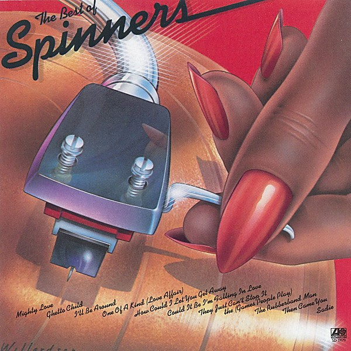

# The Best of Spinners

By **The Spinners**

## Album Data

- **Catalog:** Beets
- **Format:** Digital, Album
- **Album:** The Best of Spinners
- **Artist:** The Spinners
- **Albumartist:** The Spinners
- **Genre:** Soul
- **MusicBrainz Album Artist ID:** [fd2b6371-5b61-4068-8baa-9c333c97dfd7](https://musicbrainz.org/artist/fd2b6371-5b61-4068-8baa-9c333c97dfd7)
- **MusicBrainz Album ID:** [c77da45e-5805-4a77-af6e-b08b41128218](https://musicbrainz.org/release/c77da45e-5805-4a77-af6e-b08b41128218)
- **MusicBrainz Release Group ID:** [ba3feba9-d8a2-3a74-be78-4990e957103b](https://musicbrainz.org/release-group/ba3feba9-d8a2-3a74-be78-4990e957103b)
- **Year:** 1987
- **Catalog #:** 19179-2
- **Label:** Atlantic
- **Total Tracks:** 10

## Album Tracks

### Track 01 - I'll Be Around

- **Artist:** The Spinners
- **Format:** MP3
- **Genre:** Soul
- **Length:** 3:12
- **MusicBrainz Track ID:** [ec9be67e-4364-4daa-9849-6ab7d10d8a6c](https://musicbrainz.org/recording/ec9be67e-4364-4daa-9849-6ab7d10d8a6c)
- **Title:** I'll Be Around
- **Track:** 01
- **Year:** 1987

### Track 02 - How Could I Let You Get Away

- **Artist:** The Spinners
- **Format:** MP3
- **Genre:** Soul
- **Length:** 3:48
- **MusicBrainz Track ID:** [945783ae-22f0-4494-89e9-c0f866803e3c](https://musicbrainz.org/recording/945783ae-22f0-4494-89e9-c0f866803e3c)
- **Title:** How Could I Let You Get Away
- **Track:** 02
- **Year:** 1987

### Track 03 - One of a Kind (Love Affair)

- **Artist:** The Spinners
- **Format:** MP3
- **Genre:** Soul
- **Length:** 3:22
- **MusicBrainz Track ID:** [abbc2ed9-100f-4204-aa9d-b364803f65da](https://musicbrainz.org/recording/abbc2ed9-100f-4204-aa9d-b364803f65da)
- **Title:** One of a Kind (Love Affair)
- **Track:** 03
- **Year:** 1987

### Track 04 - Mighty Love

- **Artist:** The Spinners
- **Format:** MP3
- **Genre:** Soul
- **Length:** 4:59
- **MusicBrainz Track ID:** [0d37853b-0806-42af-a81c-bd4319015ac8](https://musicbrainz.org/recording/0d37853b-0806-42af-a81c-bd4319015ac8)
- **Title:** Mighty Love
- **Track:** 04
- **Year:** 1987

### Track 05 - Ghetto Child

- **Artist:** The Spinners
- **Format:** MP3
- **Genre:** Soul
- **Length:** 3:49
- **MusicBrainz Track ID:** [c6572d22-8210-45c1-abdf-bb8aecfd2879](https://musicbrainz.org/recording/c6572d22-8210-45c1-abdf-bb8aecfd2879)
- **Title:** Ghetto Child
- **Track:** 05
- **Year:** 1987

### Track 07 - Sadie

- **Artist:** The Spinners
- **Format:** MP3
- **Genre:** Uk Garage
- **Length:** 3:33
- **MusicBrainz Track ID:** [13fb8a45-86ff-447c-b9a5-b60b0c57fe49](https://musicbrainz.org/recording/13fb8a45-86ff-447c-b9a5-b60b0c57fe49)
- **Title:** Sadie
- **Track:** 07
- **Year:** 1987

### Track 08 - Could It Be I'm Falling in Love

- **Artist:** The Spinners
- **Format:** MP3
- **Genre:** Soul
- **Length:** 4:15
- **MusicBrainz Track ID:** [2bf3981f-2966-4418-98bd-e93edc1ea59e](https://musicbrainz.org/recording/2bf3981f-2966-4418-98bd-e93edc1ea59e)
- **Title:** Could It Be I'm Falling in Love
- **Track:** 08
- **Year:** 1987

### Track 09 - They Just Can't Stop It The (Games People Play)

- **Artist:** The Spinners
- **Format:** MP3
- **Genre:** Soul
- **Length:** 3:30
- **MusicBrainz Track ID:** [5371b824-478e-4222-bca2-703e56d2b18c](https://musicbrainz.org/recording/5371b824-478e-4222-bca2-703e56d2b18c)
- **Title:** They Just Can't Stop It The (Games People Play)
- **Track:** 09
- **Year:** 1987

### Track 10 - The Rubberband Man

- **Artist:** The Spinners
- **Format:** MP3
- **Genre:** Soul
- **Length:** 3:37
- **MusicBrainz Track ID:** [0c9e0b6c-2bca-4e15-8b32-8456ac2bb3ea](https://musicbrainz.org/recording/0c9e0b6c-2bca-4e15-8b32-8456ac2bb3ea)
- **Title:** The Rubberband Man
- **Track:** 10
- **Year:** 1987

### Track 06 - Then Came You

- **Artist:** Dionne Warwick & The Spinners
- **Format:** MP3
- **Genre:** Soul
- **Length:** 4:00
- **MusicBrainz Track ID:** [15efd38b-6cb4-4b38-8c01-900ce9ddd344](https://musicbrainz.org/recording/15efd38b-6cb4-4b38-8c01-900ce9ddd344)
- **Title:** Then Came You
- **Track:** 06
- **Year:** 1987

