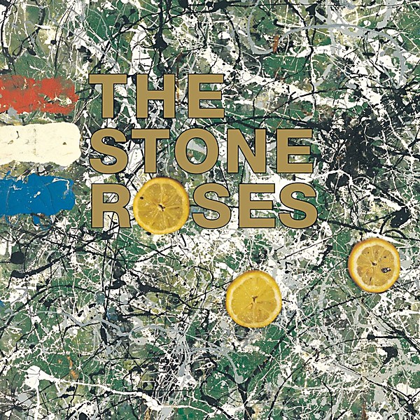

# The Stone Roses

By **The Stone Roses**

## Album Data

- **Catalog:** Beets
- **Format:** Digital, Album
- **Album:** The Stone Roses
- **Artist:** The Stone Roses
- **Albumartist:** The Stone Roses
- **Genre:** Madchester
- **MusicBrainz Album Artist ID:** [b5fa29f1-6c22-4321-a488-b5f363b06b06](https://musicbrainz.org/artist/b5fa29f1-6c22-4321-a488-b5f363b06b06)
- **MusicBrainz Album ID:** [33d23a2c-7c45-4b47-b063-420698ce6db6](https://musicbrainz.org/release/33d23a2c-7c45-4b47-b063-420698ce6db6)
- **MusicBrainz Release Group ID:** [88b86fe0-26f5-3949-817a-8082145e704d](https://musicbrainz.org/release-group/88b86fe0-26f5-3949-817a-8082145e704d)
- **Year:** 2009
- **Catalog #:** 01241-41844-2
- **Label:** Silvertone Records
- **Total Tracks:** 15

## Album Tracks

### Track 01 - I Wanna Be Adored

- **Artist:** The Stone Roses
- **Format:** ALAC
- **Genre:** Madchester
- **Length:** 4:53
- **MusicBrainz Track ID:** [1e2f2c52-d064-4e43-8a1e-3bbfd8ecb977](https://musicbrainz.org/recording/1e2f2c52-d064-4e43-8a1e-3bbfd8ecb977)
- **Title:** I Wanna Be Adored
- **Track:** 01
- **Year:** 2002

### Track 02 - She Bangs the Drums

- **Artist:** The Stone Roses
- **Format:** ALAC
- **Genre:** Madchester
- **Length:** 3:50
- **MusicBrainz Track ID:** [377f90b3-6230-45a8-9d15-196a3124d4ee](https://musicbrainz.org/recording/377f90b3-6230-45a8-9d15-196a3124d4ee)
- **Title:** She Bangs the Drums
- **Track:** 02
- **Year:** 2002

### Track 03 - Ten Storey Love Song

- **Artist:** The Stone Roses
- **Format:** ALAC
- **Genre:** Madchester
- **Length:** 4:23
- **MusicBrainz Track ID:** [d61b72de-6634-4b4f-8e23-2cd4fe7bc94e](https://musicbrainz.org/recording/d61b72de-6634-4b4f-8e23-2cd4fe7bc94e)
- **Title:** Ten Storey Love Song
- **Track:** 03
- **Year:** 2002

### Track 04 - Waterfall

- **Artist:** The Stone Roses
- **Format:** ALAC
- **Genre:** Madchester
- **Length:** 4:39
- **MusicBrainz Track ID:** [e980335b-1142-4fd4-9887-011dcd11b265](https://musicbrainz.org/recording/e980335b-1142-4fd4-9887-011dcd11b265)
- **Title:** Waterfall
- **Track:** 04
- **Year:** 2002

### Track 05 - Made of Stone

- **Artist:** The Stone Roses
- **Format:** ALAC
- **Genre:** Madchester
- **Length:** 4:16
- **MusicBrainz Track ID:** [cff3b1d2-746e-4424-a857-a0b03fbb0283](https://musicbrainz.org/recording/cff3b1d2-746e-4424-a857-a0b03fbb0283)
- **Title:** Made of Stone
- **Track:** 05
- **Year:** 2002

### Track 06 - Love Spreads

- **Artist:** The Stone Roses
- **Format:** ALAC
- **Genre:** Madchester
- **Length:** 5:47
- **MusicBrainz Track ID:** [ee2e5d2f-f39f-4616-a4fd-17054d2842f8](https://musicbrainz.org/recording/ee2e5d2f-f39f-4616-a4fd-17054d2842f8)
- **Title:** Love Spreads
- **Track:** 06
- **Year:** 2002

### Track 07 - What the World Is Waiting For

- **Artist:** The Stone Roses
- **Format:** ALAC
- **Genre:** Madchester
- **Length:** 3:51
- **MusicBrainz Track ID:** [91ce6314-ef0e-4b88-8189-8876aabd9077](https://musicbrainz.org/recording/91ce6314-ef0e-4b88-8189-8876aabd9077)
- **Title:** What the World Is Waiting For
- **Track:** 07
- **Year:** 2002

### Track 08 - Sally Cinnamon

- **Artist:** The Stone Roses
- **Format:** ALAC
- **Genre:** Madchester
- **Length:** 3:25
- **MusicBrainz Track ID:** [b794da10-a7ca-45c1-8940-b7ed8d1e56a0](https://musicbrainz.org/recording/b794da10-a7ca-45c1-8940-b7ed8d1e56a0)
- **Title:** Sally Cinnamon
- **Track:** 08
- **Year:** 2002

### Track 09 - Fools Gold

- **Artist:** The Stone Roses
- **Format:** ALAC
- **Genre:** Madchester
- **Length:** 9:54
- **MusicBrainz Track ID:** [dfc3104d-ccd8-42e1-9b1e-6abba204d098](https://musicbrainz.org/recording/dfc3104d-ccd8-42e1-9b1e-6abba204d098)
- **Title:** Fools Gold
- **Track:** 09
- **Year:** 2002

### Track 10 - Begging You

- **Artist:** The Stone Roses
- **Format:** ALAC
- **Genre:** Madchester
- **Length:** 4:53
- **MusicBrainz Track ID:** [6483d84f-c8ef-4b37-bbb8-74d27a34d3c9](https://musicbrainz.org/recording/6483d84f-c8ef-4b37-bbb8-74d27a34d3c9)
- **Title:** Begging You
- **Track:** 10
- **Year:** 2002

### Track 11 - Elephant Stone

- **Artist:** The Stone Roses
- **Format:** ALAC
- **Genre:** Madchester
- **Length:** 4:51
- **MusicBrainz Track ID:** [ff22da94-0510-4ff7-a435-01eb47fb287b](https://musicbrainz.org/recording/ff22da94-0510-4ff7-a435-01eb47fb287b)
- **Title:** Elephant Stone
- **Track:** 11
- **Year:** 2002

### Track 12 - Breaking Into Heaven

- **Artist:** The Stone Roses
- **Format:** ALAC
- **Genre:** Madchester
- **Length:** 6:59
- **MusicBrainz Track ID:** [4c1974d1-7ebf-4225-b40c-d3846b8f30f8](https://musicbrainz.org/recording/4c1974d1-7ebf-4225-b40c-d3846b8f30f8)
- **Title:** Breaking Into Heaven
- **Track:** 12
- **Year:** 2002

### Track 13 - One Love

- **Artist:** The Stone Roses
- **Format:** ALAC
- **Genre:** Madchester
- **Length:** 3:35
- **MusicBrainz Track ID:** [8c530f39-b8a7-41eb-a3ee-9d6369e0f572](https://musicbrainz.org/recording/8c530f39-b8a7-41eb-a3ee-9d6369e0f572)
- **Title:** One Love
- **Track:** 13
- **Year:** 2002

### Track 14 - This Is the One

- **Artist:** The Stone Roses
- **Format:** ALAC
- **Genre:** Madchester
- **Length:** 5:00
- **MusicBrainz Track ID:** [1e4a228d-c600-4ca4-ba5d-c638a2cca1ee](https://musicbrainz.org/recording/1e4a228d-c600-4ca4-ba5d-c638a2cca1ee)
- **Title:** This Is the One
- **Track:** 14
- **Year:** 2002

### Track 15 - I Am the Resurrection

- **Artist:** The Stone Roses
- **Format:** ALAC
- **Genre:** Madchester
- **Length:** 8:13
- **MusicBrainz Track ID:** [1ec9cfaf-d62d-4723-89fc-80e25b984c2c](https://musicbrainz.org/recording/1ec9cfaf-d62d-4723-89fc-80e25b984c2c)
- **Title:** I Am the Resurrection
- **Track:** 15
- **Year:** 2002

## See also

- [The Very Best of the Stone Roses](The_Very_Best_of_the_Stone_Roses.md)
- [Turns Into Stone](Turns_Into_Stone.md)
- [Roon: The Stone Roses (Remastered)](../../Roon/The_Stone_Roses/The_Stone_Roses_Remastered.md)
- [Roon: The Very Best of the Stone Roses](../../Roon/The_Stone_Roses/The_Very_Best_of_the_Stone_Roses.md)
