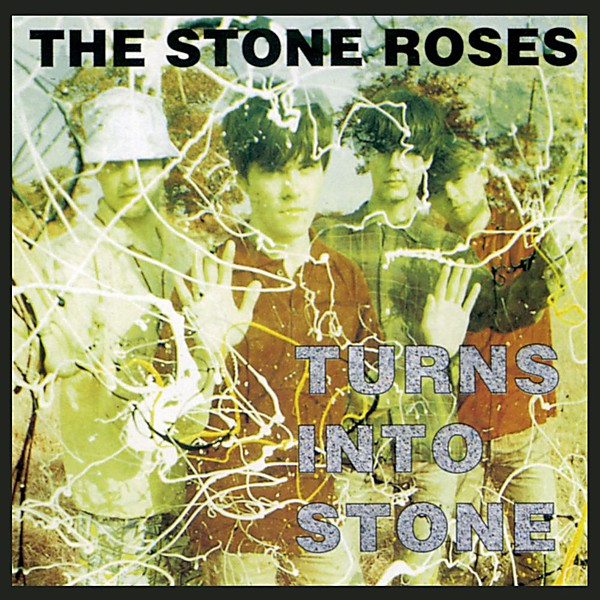

# Turns Into Stone

By **The Stone Roses**

## Album Data

- **Catalog:** Beets
- **Format:** Digital, Album
- **Album:** Turns Into Stone
- **Artist:** The Stone Roses
- **Albumartist:** The Stone Roses
- **Genre:** Madchester
- **MusicBrainz Album Artist ID:** [b5fa29f1-6c22-4321-a488-b5f363b06b06](https://musicbrainz.org/artist/b5fa29f1-6c22-4321-a488-b5f363b06b06)
- **MusicBrainz Album ID:** [7f89d0a3-ed50-388f-a183-3b3386ed0595](https://musicbrainz.org/release/7f89d0a3-ed50-388f-a183-3b3386ed0595)
- **MusicBrainz Release Group ID:** [566a63ab-2a71-38d3-bb82-f774df03fc51](https://musicbrainz.org/release-group/566a63ab-2a71-38d3-bb82-f774df03fc51)
- **Year:** 1992
- **Catalog #:** 01241-41507-2
- **Label:** Silvertone Records
- **Total Tracks:** 11

## Album Tracks

### Track 01 - Elephant Stone

- **Artist:** The Stone Roses
- **Format:** ALAC
- **Genre:** Madchester
- **Length:** 4:53
- **MusicBrainz Track ID:** [ff22da94-0510-4ff7-a435-01eb47fb287b](https://musicbrainz.org/recording/ff22da94-0510-4ff7-a435-01eb47fb287b)
- **Title:** Elephant Stone
- **Track:** 01
- **Year:** 1992

### Track 02 - The Hardest Thing in the World

- **Artist:** The Stone Roses
- **Format:** ALAC
- **Genre:** Madchester
- **Length:** 2:42
- **MusicBrainz Track ID:** [86d97094-a033-466e-9925-22b76d635e6e](https://musicbrainz.org/recording/86d97094-a033-466e-9925-22b76d635e6e)
- **Title:** The Hardest Thing in the World
- **Track:** 02
- **Year:** 1992

### Track 03 - Going Down

- **Artist:** The Stone Roses
- **Format:** ALAC
- **Genre:** Madchester
- **Length:** 2:48
- **MusicBrainz Track ID:** [6dbb9096-62e0-4f71-9a16-eb58965c0142](https://musicbrainz.org/recording/6dbb9096-62e0-4f71-9a16-eb58965c0142)
- **Title:** Going Down
- **Track:** 03
- **Year:** 1992

### Track 04 - Mersey Paradise

- **Artist:** The Stone Roses
- **Format:** ALAC
- **Genre:** Madchester
- **Length:** 2:43
- **MusicBrainz Track ID:** [fe41e375-34f4-4441-b37e-60ba62e9be97](https://musicbrainz.org/recording/fe41e375-34f4-4441-b37e-60ba62e9be97)
- **Title:** Mersey Paradise
- **Track:** 04
- **Year:** 1992

### Track 05 - Standing Here

- **Artist:** The Stone Roses
- **Format:** ALAC
- **Genre:** Madchester
- **Length:** 5:08
- **MusicBrainz Track ID:** [69ae297d-a3e8-4c5a-8264-dcd33ed9d9b7](https://musicbrainz.org/recording/69ae297d-a3e8-4c5a-8264-dcd33ed9d9b7)
- **Title:** Standing Here
- **Track:** 05
- **Year:** 1992

### Track 06 - Where Angels Play

- **Artist:** The Stone Roses
- **Format:** ALAC
- **Genre:** Madchester
- **Length:** 4:12
- **MusicBrainz Track ID:** [a4ac9044-e83b-4647-b20c-1b1f3ebf4626](https://musicbrainz.org/recording/a4ac9044-e83b-4647-b20c-1b1f3ebf4626)
- **Title:** Where Angels Play
- **Track:** 06
- **Year:** 1992

### Track 07 - Simone

- **Artist:** The Stone Roses
- **Format:** ALAC
- **Genre:** Madchester
- **Length:** 4:24
- **MusicBrainz Track ID:** [b18b424c-671f-4642-b0b2-1a46cf5a002c](https://musicbrainz.org/recording/b18b424c-671f-4642-b0b2-1a46cf5a002c)
- **Title:** Simone
- **Track:** 07
- **Year:** 1992

### Track 08 - Fools Gold

- **Artist:** The Stone Roses
- **Format:** ALAC
- **Genre:** Madchester
- **Length:** 9:55
- **MusicBrainz Track ID:** [dfc3104d-ccd8-42e1-9b1e-6abba204d098](https://musicbrainz.org/recording/dfc3104d-ccd8-42e1-9b1e-6abba204d098)
- **Title:** Fools Gold
- **Track:** 08
- **Year:** 1992

### Track 09 - What the World Is Waiting For

- **Artist:** The Stone Roses
- **Format:** ALAC
- **Genre:** Madchester
- **Length:** 3:51
- **MusicBrainz Track ID:** [91ce6314-ef0e-4b88-8189-8876aabd9077](https://musicbrainz.org/recording/91ce6314-ef0e-4b88-8189-8876aabd9077)
- **Title:** What the World Is Waiting For
- **Track:** 09
- **Year:** 1992

### Track 10 - One Love

- **Artist:** The Stone Roses
- **Format:** ALAC
- **Genre:** Madchester
- **Length:** 7:44
- **MusicBrainz Track ID:** [c1c97078-007a-49cc-842a-1d60386c3b84](https://musicbrainz.org/recording/c1c97078-007a-49cc-842a-1d60386c3b84)
- **Title:** One Love
- **Track:** 10
- **Year:** 1992

### Track 11 - Something's Burning

- **Artist:** The Stone Roses
- **Format:** ALAC
- **Genre:** Madchester
- **Length:** 7:51
- **MusicBrainz Track ID:** [148b45ce-f719-4206-9b1c-0618e3d20c7e](https://musicbrainz.org/recording/148b45ce-f719-4206-9b1c-0618e3d20c7e)
- **Title:** Something's Burning
- **Track:** 11
- **Year:** 1992

## See also

- [The Stone Roses](The_Stone_Roses.md)
- [The Very Best of the Stone Roses](The_Very_Best_of_the_Stone_Roses.md)
- [Roon: The Stone Roses (Remastered)](../../Roon/The_Stone_Roses/The_Stone_Roses_Remastered.md)
- [Roon: The Very Best of the Stone Roses](../../Roon/The_Stone_Roses/The_Very_Best_of_the_Stone_Roses.md)
