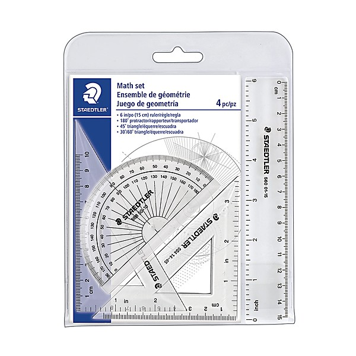

# Original John Peel Session

By **The Stranglers**

## Album Data

- **Catalog:** Beets
- **Format:** Digital, Album
- **Album:** Original John Peel Session
- **Artist:** The Stranglers
- **Albumartist:** The Stranglers
- **Genre:** Punk Rock
- **MusicBrainz Album Artist ID:** 
- **MusicBrainz Album ID:** 
- **MusicBrainz Release Group ID:** 
- **Year:** 0000
- **Catalog #:** 
- **Label:** 
- **Total Tracks:** 00

## Album Tracks

### Track 01 - Bring On The Nubiles

- **Artist:** The Stranglers
- **Format:** MP3
- **Genre:** Post-Punk
- **Length:** 2:18
- **MusicBrainz Track ID:** 
- **Title:** Bring On The Nubiles
- **Track:** 01
- **Year:** 0000

## See also

- [Vinyl: Feline](../../Vinyl/The_Stranglers/Feline.md)
- [Vinyl: ](../../Vinyl/The_Stranglers/The_Stranglers.md)
