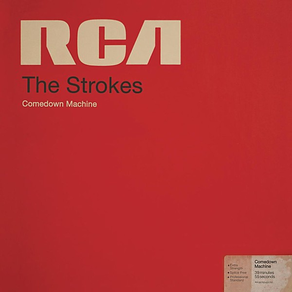

# Comedown Machine

By **The Strokes**

## Album Data

- **Catalog:** Beets
- **Format:** Digital, Album
- **Album:** Comedown Machine
- **Artist:** The Strokes
- **Albumartist:** The Strokes
- **Genre:** Indie Rock
- **MusicBrainz Album Artist ID:** [f181961b-20f7-459e-89de-920ef03c7ed0](https://musicbrainz.org/artist/f181961b-20f7-459e-89de-920ef03c7ed0)
- **MusicBrainz Album ID:** [2a0d488e-bd81-46ac-88e8-c8290618beb5](https://musicbrainz.org/release/2a0d488e-bd81-46ac-88e8-c8290618beb5)
- **MusicBrainz Release Group ID:** [461e255f-b56e-4788-b989-8ff610242b94](https://musicbrainz.org/release-group/461e255f-b56e-4788-b989-8ff610242b94)
- **Year:** 2013
- **Catalog #:** RTRADECD030
- **Label:** Rough Trade
- **Total Tracks:** 11

## Album Tracks

### Track 01 - Is This It

- **Artist:** The Strokes
- **Format:** ALAC
- **Genre:** Indie Rock
- **Length:** 2:35
- **MusicBrainz Track ID:** [824ec953-d221-4488-8c11-aff83ee7646e](https://musicbrainz.org/recording/824ec953-d221-4488-8c11-aff83ee7646e)
- **Title:** Is This It
- **Track:** 01
- **Year:** 2001

### Track 02 - The Modern Age

- **Artist:** The Strokes
- **Format:** ALAC
- **Genre:** Indie Rock
- **Length:** 3:32
- **MusicBrainz Track ID:** [51e15585-2a4d-4243-b1d6-32ec4fda85ff](https://musicbrainz.org/recording/51e15585-2a4d-4243-b1d6-32ec4fda85ff)
- **Title:** The Modern Age
- **Track:** 02
- **Year:** 2001

### Track 03 - Soma

- **Artist:** The Strokes
- **Format:** ALAC
- **Genre:** Indie Rock
- **Length:** 2:37
- **MusicBrainz Track ID:** [6b72c707-1329-44e5-842d-8c8fae3a2b4d](https://musicbrainz.org/recording/6b72c707-1329-44e5-842d-8c8fae3a2b4d)
- **Title:** Soma
- **Track:** 03
- **Year:** 2001

### Track 04 - Barely Legal

- **Artist:** The Strokes
- **Format:** ALAC
- **Genre:** Indie Rock
- **Length:** 3:58
- **MusicBrainz Track ID:** [f4e25493-e6c0-457c-85cf-144035ddeec2](https://musicbrainz.org/recording/f4e25493-e6c0-457c-85cf-144035ddeec2)
- **Title:** Barely Legal
- **Track:** 04
- **Year:** 2001

### Track 05 - Someday

- **Artist:** The Strokes
- **Format:** ALAC
- **Genre:** Indie Rock
- **Length:** 3:07
- **MusicBrainz Track ID:** [dcfe4768-b780-4581-b8cf-c1298237e7d1](https://musicbrainz.org/recording/dcfe4768-b780-4581-b8cf-c1298237e7d1)
- **Title:** Someday
- **Track:** 05
- **Year:** 2001

### Track 06 - Alone, Together

- **Artist:** The Strokes
- **Format:** ALAC
- **Genre:** Indie Rock
- **Length:** 3:12
- **MusicBrainz Track ID:** [b7bfdd1f-7b50-4498-a742-87b1b65279b5](https://musicbrainz.org/recording/b7bfdd1f-7b50-4498-a742-87b1b65279b5)
- **Title:** Alone, Together
- **Track:** 06
- **Year:** 2001

### Track 07 - Last Nite

- **Artist:** The Strokes
- **Format:** ALAC
- **Genre:** Indie Rock
- **Length:** 3:17
- **MusicBrainz Track ID:** [c988fa34-8382-43f3-87af-49dc94018c1e](https://musicbrainz.org/recording/c988fa34-8382-43f3-87af-49dc94018c1e)
- **Title:** Last Nite
- **Track:** 07
- **Year:** 2001

### Track 08 - Hard to Explain

- **Artist:** The Strokes
- **Format:** ALAC
- **Genre:** Indie Rock
- **Length:** 3:48
- **MusicBrainz Track ID:** [5105e2ef-4f42-44c5-967d-b1343d4b5827](https://musicbrainz.org/recording/5105e2ef-4f42-44c5-967d-b1343d4b5827)
- **Title:** Hard to Explain
- **Track:** 08
- **Year:** 2001

### Track 09 - New York City Cops

- **Artist:** The Strokes
- **Format:** ALAC
- **Genre:** Indie Rock
- **Length:** 2:57
- **MusicBrainz Track ID:** [501655d7-ceb5-4c76-bd42-312922d38ffa](https://musicbrainz.org/recording/501655d7-ceb5-4c76-bd42-312922d38ffa)
- **Title:** New York City Cops
- **Track:** 09
- **Year:** 2001

### Track 10 - Trying Your Luck

- **Artist:** The Strokes
- **Format:** ALAC
- **Genre:** Indie Rock
- **Length:** 3:27
- **MusicBrainz Track ID:** [4468200b-a01a-41a8-9a98-22150e0cc1be](https://musicbrainz.org/recording/4468200b-a01a-41a8-9a98-22150e0cc1be)
- **Title:** Trying Your Luck
- **Track:** 10
- **Year:** 2001

### Track 11 - Take It or Leave It

- **Artist:** The Strokes
- **Format:** ALAC
- **Genre:** Indie Rock
- **Length:** 3:16
- **MusicBrainz Track ID:** [76cdf238-fa93-49a8-a256-fd8cda83338b](https://musicbrainz.org/recording/76cdf238-fa93-49a8-a256-fd8cda83338b)
- **Title:** Take It or Leave It
- **Track:** 11
- **Year:** 2001

## See also

- [Is This It](Is_This_It.md)
- [Room On Fire](Room_On_Fire.md)
