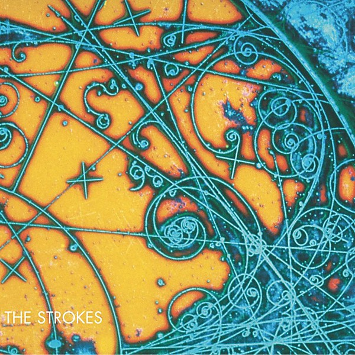

# Is This It

By **The Strokes**

## Album Data

- **Catalog:** Beets
- **Format:** Digital, Album
- **Album:** Is This It
- **Artist:** The Strokes
- **Albumartist:** The Strokes
- **Genre:** Indie Rock
- **MusicBrainz Album Artist ID:** [f181961b-20f7-459e-89de-920ef03c7ed0](https://musicbrainz.org/artist/f181961b-20f7-459e-89de-920ef03c7ed0)
- **MusicBrainz Album ID:** [9920c28f-e1a6-36a5-9fb4-31fde24b2c43](https://musicbrainz.org/release/9920c28f-e1a6-36a5-9fb4-31fde24b2c43)
- **MusicBrainz Release Group ID:** [efea26d1-a016-30f6-b8e2-bc8c02336b0a](https://musicbrainz.org/release-group/efea26d1-a016-30f6-b8e2-bc8c02336b0a)
- **Year:** 2001
- **Catalog #:** 
- **Label:** 
- **Total Tracks:** 11

## Album Tracks

### Track 02 - Reptilia

- **Artist:** The Strokes
- **Format:** AAC
- **Genre:** Indie Rock
- **Length:** 3:34
- **MusicBrainz Track ID:** 
- **Title:** Reptilia
- **Track:** 02
- **Year:** 2003

## See also

- [Comedown Machine](Comedown_Machine.md)
- [Room On Fire](Room_On_Fire.md)
