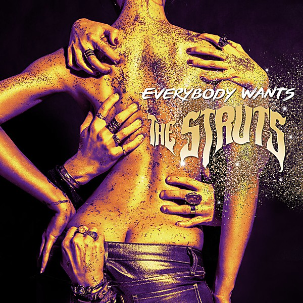

# Everybody Wants

By **The Struts**

## Album Data

- **Catalog:** Beets
- **Format:** Digital, Album
- **Album:** Everybody Wants
- **Artist:** The Struts
- **Albumartist:** The Struts
- **Genre:** Rock
- **MusicBrainz Album Artist ID:** [f0be891f-6114-448a-ac55-a11bb2961f78](https://musicbrainz.org/artist/f0be891f-6114-448a-ac55-a11bb2961f78)
- **MusicBrainz Album ID:** [cebd4f96-187a-4d62-af29-f113d2cca865](https://musicbrainz.org/release/cebd4f96-187a-4d62-af29-f113d2cca865)
- **MusicBrainz Release Group ID:** [1bf4e5ca-eddc-4693-a3cc-cf3eb8f37357](https://musicbrainz.org/release-group/1bf4e5ca-eddc-4693-a3cc-cf3eb8f37357)
- **Year:** 2016
- **Catalog #:** 
- **Label:** Interscope Records
- **Total Tracks:** 13

## Album Tracks

### Track 01 - Roll Up

- **Artist:** The Struts
- **Format:** ALAC
- **Genre:** Rock
- **Length:** 3:07
- **MusicBrainz Track ID:** [04ef8107-60aa-4759-8014-5179269f628a](https://musicbrainz.org/recording/04ef8107-60aa-4759-8014-5179269f628a)
- **Title:** Roll Up
- **Track:** 01
- **Year:** 2016

### Track 02 - Could Have Been Me

- **Artist:** The Struts
- **Format:** ALAC
- **Genre:** Glam Rock
- **Length:** 3:07
- **MusicBrainz Track ID:** [e876bd4f-4273-4c55-8183-b2b0915eb4cd](https://musicbrainz.org/recording/e876bd4f-4273-4c55-8183-b2b0915eb4cd)
- **Title:** Could Have Been Me
- **Track:** 02
- **Year:** 2016

### Track 03 - Kiss This

- **Artist:** The Struts
- **Format:** ALAC
- **Genre:** Rock
- **Length:** 2:57
- **MusicBrainz Track ID:** [dee7c9ea-da07-4f5f-bdcc-29920121077b](https://musicbrainz.org/recording/dee7c9ea-da07-4f5f-bdcc-29920121077b)
- **Title:** Kiss This
- **Track:** 03
- **Year:** 2016

### Track 04 - Put Your Money on Me

- **Artist:** The Struts
- **Format:** ALAC
- **Genre:** Rock
- **Length:** 3:33
- **MusicBrainz Track ID:** [c88d50de-a219-4a82-bd38-453b2d98f00e](https://musicbrainz.org/recording/c88d50de-a219-4a82-bd38-453b2d98f00e)
- **Title:** Put Your Money on Me
- **Track:** 04
- **Year:** 2016

### Track 05 - Mary Go Round

- **Artist:** The Struts
- **Format:** ALAC
- **Genre:** Rock
- **Length:** 3:19
- **MusicBrainz Track ID:** [838cc5bd-a8f8-451b-bd17-271430704f88](https://musicbrainz.org/recording/838cc5bd-a8f8-451b-bd17-271430704f88)
- **Title:** Mary Go Round
- **Track:** 05
- **Year:** 2016

### Track 06 - Dirty Sexy Money

- **Artist:** The Struts
- **Format:** ALAC
- **Genre:** Rock
- **Length:** 3:57
- **MusicBrainz Track ID:** [a5dd49e0-97d3-4004-94ba-093cd09f4c0e](https://musicbrainz.org/recording/a5dd49e0-97d3-4004-94ba-093cd09f4c0e)
- **Title:** Dirty Sexy Money
- **Track:** 06
- **Year:** 2016

### Track 07 - The Ol’ Switcheroo

- **Artist:** The Struts
- **Format:** ALAC
- **Genre:** Rock
- **Length:** 3:42
- **MusicBrainz Track ID:** [6538a812-2153-43a5-8901-c0bdade91d36](https://musicbrainz.org/recording/6538a812-2153-43a5-8901-c0bdade91d36)
- **Title:** The Ol’ Switcheroo
- **Track:** 07
- **Year:** 2016

### Track 08 - She Makes Me Feel Like

- **Artist:** The Struts
- **Format:** ALAC
- **Genre:** Rock
- **Length:** 2:38
- **MusicBrainz Track ID:** [68555a9c-932d-4c97-923e-01cbfa9432a9](https://musicbrainz.org/recording/68555a9c-932d-4c97-923e-01cbfa9432a9)
- **Title:** She Makes Me Feel Like
- **Track:** 08
- **Year:** 2016

### Track 09 - Young Stars

- **Artist:** The Struts
- **Format:** ALAC
- **Genre:** Rock
- **Length:** 3:23
- **MusicBrainz Track ID:** [57d7d5e0-8ade-4466-8566-05ed5a0210a5](https://musicbrainz.org/recording/57d7d5e0-8ade-4466-8566-05ed5a0210a5)
- **Title:** Young Stars
- **Track:** 09
- **Year:** 2016

### Track 10 - Black Swan

- **Artist:** The Struts
- **Format:** ALAC
- **Genre:** Rock
- **Length:** 3:24
- **MusicBrainz Track ID:** [1b6c44b7-4709-4083-bb8c-064680fce9c6](https://musicbrainz.org/recording/1b6c44b7-4709-4083-bb8c-064680fce9c6)
- **Title:** Black Swan
- **Track:** 10
- **Year:** 2016

### Track 11 - These Times Are Changing

- **Artist:** The Struts
- **Format:** ALAC
- **Genre:** Rock
- **Length:** 3:26
- **MusicBrainz Track ID:** [0cf190fc-e3fa-4bda-b31e-f9d15d2a7e60](https://musicbrainz.org/recording/0cf190fc-e3fa-4bda-b31e-f9d15d2a7e60)
- **Title:** These Times Are Changing
- **Track:** 11
- **Year:** 2016

### Track 12 - Only Just a Call Away

- **Artist:** The Struts
- **Format:** ALAC
- **Genre:** Rock
- **Length:** 3:04
- **MusicBrainz Track ID:** [57af4d27-2668-4705-888d-add5d0ad9e17](https://musicbrainz.org/recording/57af4d27-2668-4705-888d-add5d0ad9e17)
- **Title:** Only Just a Call Away
- **Track:** 12
- **Year:** 2016

### Track 13 - Where Did She Go

- **Artist:** The Struts
- **Format:** ALAC
- **Genre:** Rock
- **Length:** 3:54
- **MusicBrainz Track ID:** [6a9c4aca-2323-40e0-bc85-90ec1ec1d767](https://musicbrainz.org/recording/6a9c4aca-2323-40e0-bc85-90ec1ec1d767)
- **Title:** Where Did She Go
- **Track:** 13
- **Year:** 2016

